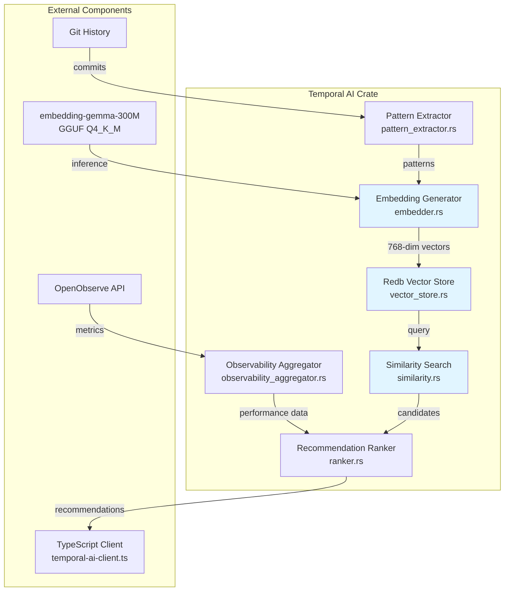
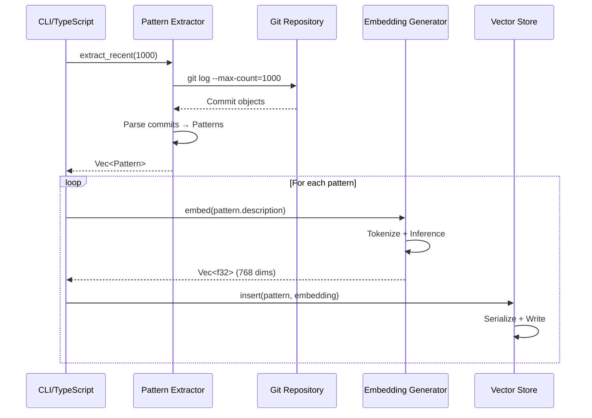
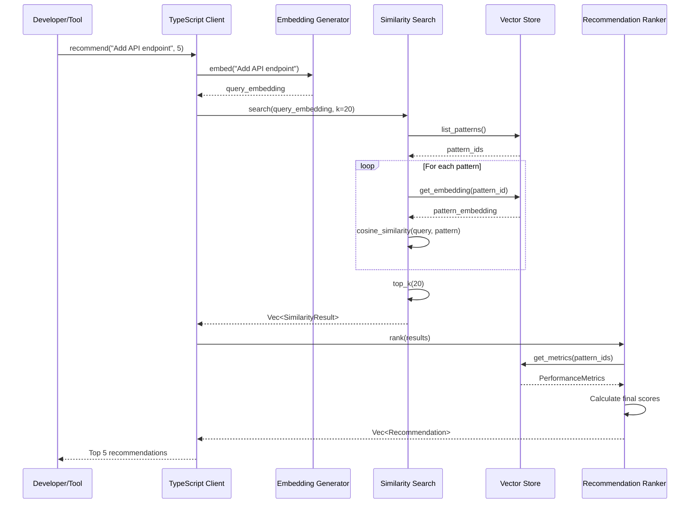

# DEV-SDS-020: Temporal AI Guidance Fabric - Software Design Specification

**Document ID**: DEV-SDS-020  
**Version**: 1.0  
**Status**: Active  
**Related PRD**: DEV-PRD-020  
**Related ADR**: DEV-ADR-018  
**Last Updated**: 2025-11-10

## 1. Overview

This document specifies the software design for the Temporal AI Guidance Fabric, an embedding-based pattern recommendation engine that analyzes Git commit history to provide context-aware development guidance.

### 1.1 Design Goals

-   **Zero External Dependencies**: All inference runs locally using CPU-only GGUF quantized models
-   **Sub-Second Latency**: Embedding generation <500ms, similarity search <100ms for 10k patterns
-   **Embedded Storage**: Single-file redb database with zero-copy reads
-   **Type Safety**: Rust core with TypeScript bindings
-   **Observable**: Full integration with existing OpenObserve/Logfire stack

### 1.2 System Architecture



## 2. Component Specifications

### 2.1 Embedding Generator (`embedder.rs`)

**Purpose**: Load and execute embedding-gemma-300M model for text → vector conversion.

**Dependencies**:

-   `llm` (rustformers): GGUF model loading and inference
-   `anyhow`: Error handling

**Interface**:

```rust
pub struct Embedder {
    model: Box<dyn llm::Model>,
    tokenizer: llm::Tokenizer,
}

impl Embedder {
    /// Load model from GGUF file
    pub fn from_gguf(model_path: impl AsRef<Path>) -> Result<Self>;

    /// Generate 768-dimensional embedding
    pub fn embed(&self, text: &str) -> Result<Vec<f32>>;

    /// Batch processing for efficiency
    pub fn embed_batch(&self, texts: &[&str]) -> Result<Vec<Vec<f32>>>;
}
```

**Implementation Details**:

-   Model file: `models/embedding-gemma-300M-Q4_K_M.gguf` (~180MB)
-   Context window: 512 tokens
-   Normalization: L2 norm applied to all output vectors
-   Thread pool: CPU cores - 1 for parallel inference
-   Memory mapping: Use mmap for zero-copy model loading

**Performance Targets**:

-   Single embedding: <500ms (P95)
-   Batch of 10: <2s (P95)
-   Memory footprint: <1GB resident

**Error Handling**:

-   `ModelLoadError`: Invalid GGUF file or unsupported architecture
-   `InferenceError`: Tokenization or forward pass failure
-   `DimensionMismatch`: Output != 768 dimensions

---

### 2.2 Pattern Extractor (`pattern_extractor.rs`)

**Purpose**: Parse Git commit history into semantic pattern descriptions.

**Dependencies**:

-   `git2`: Repository traversal
-   `regex`: Commit message parsing

**Interface**:

```rust
pub struct PatternExtractor {
    repo_path: PathBuf,
}

#[derive(Debug, Clone)]
pub struct Pattern {
    pub id: String,           // SHA-256 hash of content
    pub description: String,  // Human-readable summary
    pub file_paths: Vec<String>,
    pub commit_sha: String,
    pub timestamp: i64,
    pub tags: Vec<String>,    // Extracted from commit message
}

impl PatternExtractor {
    pub fn new(repo_path: impl AsRef<Path>) -> Result<Self>;

    /// Extract patterns from last N commits
    pub fn extract_recent(&self, count: usize) -> Result<Vec<Pattern>>;

    /// Extract patterns matching file glob
    pub fn extract_by_path(&self, glob: &str) -> Result<Vec<Pattern>>;

    /// Extract patterns from date range
    pub fn extract_by_date(&self, since: i64, until: i64) -> Result<Vec<Pattern>>;
}
```

**Pattern Description Format**:

```
<commit_type>: <file_path> - <summary>
Tags: [<tag1>, <tag2>, ...]
Diff summary: <added_lines> added, <removed_lines> removed
```

**Commit Type Classification**:

-   `feat`: New feature
-   `fix`: Bug fix
-   `refactor`: Code restructuring
-   `test`: Test additions
-   `docs`: Documentation
-   `chore`: Maintenance

**Implementation Details**:

-   Parse conventional commits format
-   Extract file extensions → language tags
-   Detect framework usage from imports (React, FastAPI, etc.)
-   Ignore merge commits and automated commits
-   Max description length: 512 characters

---

### 2.3 Redb Vector Store (`vector_store.rs`)

**Purpose**: Persistent storage for embeddings with ACID guarantees.

**Dependencies**:

-   `redb`: Embedded database
-   `serde`: Serialization

**Schema**:

```rust
const EMBEDDINGS_TABLE: TableDefinition<&str, &[u8]> =
    TableDefinition::new("embeddings");

const METADATA_TABLE: TableDefinition<&str, &str> =
    TableDefinition::new("metadata");

const METRICS_TABLE: TableDefinition<&str, &str> =
    TableDefinition::new("metrics");
```

**Table Structures**:

1. **EMBEDDINGS**: pattern_id → serialized `EmbeddingRecord`

```rust
#[derive(Serialize, Deserialize)]
struct EmbeddingRecord {
    vector: Vec<f32>,      // 768 dimensions
    norm: f32,             // Precomputed L2 norm
    created_at: i64,
}
```

2. **METADATA**: pattern_id → serialized `Pattern`

```rust
// From PatternExtractor, full pattern metadata
```

3. **METRICS**: pattern_id → serialized `PerformanceMetrics`

```rust
#[derive(Serialize, Deserialize)]
struct PerformanceMetrics {
    usage_count: u64,
    avg_relevance_score: f32,
    last_recommended: i64,
}
```

**Interface**:

```rust
pub struct VectorStore {
    db: Database,
}

impl VectorStore {
    pub fn open(db_path: impl AsRef<Path>) -> Result<Self>;

    /// Insert pattern with embedding
    pub fn insert(&self, pattern: &Pattern, embedding: Vec<f32>) -> Result<()>;

    /// Retrieve embedding by pattern ID
    pub fn get_embedding(&self, pattern_id: &str) -> Result<Option<Vec<f32>>>;

    /// Get all pattern IDs (for full scan)
    pub fn list_patterns(&self) -> Result<Vec<String>>;

    /// Update performance metrics
    pub fn update_metrics(&self, pattern_id: &str, metrics: PerformanceMetrics) -> Result<()>;

    /// Batch operations for efficiency
    pub fn insert_batch(&self, records: &[(Pattern, Vec<f32>)]) -> Result<()>;
}
```

**Storage Location**: `data/temporal-ai.redb`

**Performance Targets**:

-   Insert: <10ms (single), <500ms (batch of 100)
-   Read: <1ms (zero-copy)
-   Database size: ~500MB for 10k patterns (768 dims × 4 bytes × 10k + metadata)

---

### 2.4 Similarity Search (`similarity.rs`)

**Purpose**: Find most similar patterns using cosine similarity.

**Dependencies**: None (pure Rust implementation)

**Interface**:

```rust
pub struct SimilaritySearch<'a> {
    store: &'a VectorStore,
}

#[derive(Debug, Clone)]
pub struct SimilarityResult {
    pub pattern_id: String,
    pub score: f32,        // Cosine similarity [0, 1]
    pub pattern: Pattern,
}

impl<'a> SimilaritySearch<'a> {
    pub fn new(store: &'a VectorStore) -> Self;

    /// Find top-k most similar patterns
    pub fn search(&self, query_embedding: &[f32], k: usize) -> Result<Vec<SimilarityResult>>;

    /// Search with filters
    pub fn search_filtered(
        &self,
        query_embedding: &[f32],
        k: usize,
        filters: &SearchFilters,
    ) -> Result<Vec<SimilarityResult>>;
}

#[derive(Default)]
pub struct SearchFilters {
    pub min_score: Option<f32>,
    pub file_path_glob: Option<String>,
    pub tags: Vec<String>,
    pub since_timestamp: Option<i64>,
}
```

**Algorithm**:

```rust
fn cosine_similarity(a: &[f32], b: &[f32]) -> f32 {
    let dot_product: f32 = a.iter().zip(b).map(|(x, y)| x * y).sum();
    let norm_a: f32 = a.iter().map(|x| x * x).sum::<f32>().sqrt();
    let norm_b: f32 = b.iter().map(|x| x * x).sum::<f32>().sqrt();
    dot_product / (norm_a * norm_b)
}
```

**Optimization Strategies**:

1. **Precomputed Norms**: Store L2 norms in `EmbeddingRecord` to avoid recalculation
2. **SIMD**: Use `std::arch::x86_64` intrinsics for dot products on x86_64
3. **Top-K Heap**: Min-heap of size k to avoid sorting all results
4. **Early Termination**: Skip patterns below `min_score` threshold

**Performance Targets**:

-   Search 10k patterns: <100ms (P95)
-   Search 100k patterns: <500ms (P95)
-   Memory: O(k) for results heap

---

### 2.5 Recommendation Ranker (`ranker.rs`)

**Purpose**: Re-rank similarity results using performance metrics and context.

**Dependencies**:

-   `chrono`: Timestamp handling

**Interface**:

```rust
pub struct RecommendationRanker<'a> {
    store: &'a VectorStore,
    recency_weight: f32,    // Default: 0.2
    usage_weight: f32,      // Default: 0.3
    similarity_weight: f32, // Default: 0.5
}

#[derive(Debug, Clone)]
pub struct Recommendation {
    pub pattern: Pattern,
    pub similarity_score: f32,
    pub recency_score: f32,
    pub usage_score: f32,
    pub final_score: f32,
    pub explanation: String,
}

impl<'a> RecommendationRanker<'a> {
    pub fn new(store: &'a VectorStore) -> Self;

    /// Rank similarity results
    pub fn rank(&self, results: Vec<SimilarityResult>) -> Result<Vec<Recommendation>>;

    /// Custom weights
    pub fn with_weights(
        store: &'a VectorStore,
        recency: f32,
        usage: f32,
        similarity: f32,
    ) -> Self;
}
```

**Scoring Formula**:

```
final_score = (similarity_weight × similarity_score) +
              (recency_weight × recency_score) +
              (usage_weight × usage_score)

where:
  recency_score = exp(-λ × days_since_commit)  // λ = 0.01
  usage_score = min(1.0, usage_count / 100)
  similarity_score = cosine_similarity(query, pattern)
```

**Explanation Generation**:

```rust
fn generate_explanation(rec: &Recommendation) -> String {
    format!(
        "Pattern from {} ({}): {} - Similarity: {:.2}%, Recency: {} days ago, Used {} times",
        rec.pattern.commit_sha[..7],
        rec.pattern.tags.join(", "),
        rec.pattern.description,
        rec.similarity_score * 100.0,
        days_since(rec.pattern.timestamp),
        rec.usage_score * 100.0
    )
}
```

---

### 2.6 TypeScript Client (`temporal-ai-client.ts`)

**Purpose**: Node.js bindings for Nx tools and frontend integration.

**Dependencies**:

-   `@napi-rs/cli`: Rust ↔ Node.js FFI
-   `zod`: Runtime validation

**Interface**:

```typescript
export interface Pattern {
    id: string;
    description: string;
    filePaths: string[];
    commitSha: string;
    timestamp: number;
    tags: string[];
}

export interface Recommendation {
    pattern: Pattern;
    similarityScore: number;
    recencyScore: number;
    usageScore: number;
    finalScore: number;
    explanation: string;
}

export class TemporalAIClient {
    constructor(dbPath?: string);

    /**
     * Get recommendations for current work context
     * @param query - Description of current task
     * @param k - Number of recommendations (default: 5)
     */
    async recommend(query: string, k?: number): Promise<Recommendation[]>;

    /**
     * Refresh pattern database from Git history
     * @param commitCount - Number of recent commits to process
     */
    async refreshPatterns(commitCount: number): Promise<void>;

    /**
     * Get pattern by ID
     */
    async getPattern(id: string): Promise<Pattern | null>;
}
```

**Rust FFI Bindings** (`src/ffi.rs`):

```rust
#[napi]
pub struct TemporalAI {
    embedder: Embedder,
    store: VectorStore,
    extractor: PatternExtractor,
}

#[napi]
impl TemporalAI {
    #[napi(constructor)]
    pub fn new(db_path: Option<String>) -> Result<Self>;

    #[napi]
    pub async fn recommend(&self, query: String, k: u32) -> Result<Vec<JsRecommendation>>;

    #[napi]
    pub async fn refresh_patterns(&self, commit_count: u32) -> Result<()>;
}
```

**Usage Example**:

```typescript
import { TemporalAIClient } from "@vibespro/temporal-ai";

const client = new TemporalAIClient();

const recommendations = await client.recommend("Implement authentication middleware for FastAPI", 5);

recommendations.forEach((rec) => {
    console.log(`[${rec.finalScore.toFixed(2)}] ${rec.explanation}`);
});
```

## 3. Data Flow

### 3.1 Pattern Indexing Flow



### 3.2 Recommendation Query Flow



## 4. Database Schema Details

### 4.1 Redb Table Definitions

```rust
// crates/temporal-ai/src/schema.rs

use redb::{Database, TableDefinition};

/// Primary embedding storage
/// Key: pattern_id (SHA-256 hex string)
/// Value: MessagePack-encoded EmbeddingRecord
pub const EMBEDDINGS: TableDefinition<&str, &[u8]> =
    TableDefinition::new("embeddings_v1");

/// Pattern metadata
/// Key: pattern_id
/// Value: JSON-encoded Pattern
pub const METADATA: TableDefinition<&str, &str> =
    TableDefinition::new("metadata_v1");

/// Performance tracking
/// Key: pattern_id
/// Value: JSON-encoded PerformanceMetrics
pub const METRICS: TableDefinition<&str, &str> =
    TableDefinition::new("metrics_v1");

/// Index: file_path → [pattern_id]
pub const FILE_PATH_INDEX: TableDefinition<&str, &str> =
    TableDefinition::new("file_path_idx_v1");

/// Index: tag → [pattern_id]
pub const TAG_INDEX: TableDefinition<&str, &str> =
    TableDefinition::new("tag_idx_v1");
```

### 4.2 Record Formats

**EmbeddingRecord** (MessagePack for compactness):

```rust
#[derive(Serialize, Deserialize)]
pub struct EmbeddingRecord {
    pub vector: Vec<f32>,      // 768 elements
    pub norm: f32,             // Precomputed L2 norm
    pub created_at: i64,       // Unix timestamp
    pub version: u8,           // Schema version (1)
}

// Size: 768 × 4 + 4 + 8 + 1 = 3,085 bytes
```

**Pattern** (JSON for human readability):

```rust
#[derive(Serialize, Deserialize)]
pub struct Pattern {
    pub id: String,            // SHA-256 (64 chars)
    pub description: String,   // Max 512 chars
    pub file_paths: Vec<String>,
    pub commit_sha: String,    // Git SHA-1 (40 chars)
    pub timestamp: i64,
    pub tags: Vec<String>,
}

// Average size: ~500 bytes
```

**PerformanceMetrics** (JSON):

```rust
#[derive(Serialize, Deserialize)]
pub struct PerformanceMetrics {
    pub usage_count: u64,
    pub avg_relevance_score: f32,
    pub last_recommended: i64,
    pub feedback_scores: Vec<i8>,  // User ratings: -1, 0, 1
}

// Average size: ~100 bytes
```

### 4.3 Index Formats

**FILE_PATH_INDEX**:

-   Key: `"src/api/auth.rs"`
-   Value: JSON array of pattern IDs: `["abc123...", "def456..."]`

**TAG_INDEX**:

-   Key: `"fastapi"`
-   Value: JSON array of pattern IDs: `["abc123...", "def456..."]`

**Total Database Size Estimate** (10k patterns):

-   Embeddings: 10k × 3,085 = 30.85 MB
-   Metadata: 10k × 500 = 5 MB
-   Metrics: 10k × 100 = 1 MB
-   Indexes: ~2 MB
-   **Total: ~39 MB** (redb overhead ~20%, final ≈ 47 MB)

## 5. Implementation Phases

### Phase 3A: Specification Authoring ✅

-   [x] DEV-PRD-020 created
-   [x] DEV-SDS-020 created (this document)
-   [ ] DEV-ADR-018 status update (Proposed → Active)

### Phase 3B: Embedding Infrastructure

**Tasks**:

1. Create `crates/temporal-ai` workspace
2. Download embedding-gemma-300M model
3. Implement `embedder.rs` with llm integration
4. Implement `vector_store.rs` with redb
5. Implement `similarity.rs` with SIMD optimization
6. Implement `pattern_extractor.rs` with git2
7. Write unit tests for all components

**Files**:

-   `crates/temporal-ai/Cargo.toml`
-   `crates/temporal-ai/src/lib.rs`
-   `crates/temporal-ai/src/embedder.rs`
-   `crates/temporal-ai/src/vector_store.rs`
-   `crates/temporal-ai/src/similarity.rs`
-   `crates/temporal-ai/src/pattern_extractor.rs`
-   `crates/temporal-ai/src/schema.rs`
-   `crates/temporal-ai/tests/embedder_tests.rs`
-   `crates/temporal-ai/tests/vector_store_tests.rs`
-   `crates/temporal-ai/tests/similarity_tests.rs`
-   `scripts/download_embedding_model.sh`

**Exit Criteria**:

-   Model loads successfully (<5s cold start)
-   Embedding generation: <500ms P95
-   Vector store: insert/read operations functional
-   Similarity search: <100ms for 1k patterns
-   All tests passing

### Phase 3C: Pattern Recommendation Engine

**Tasks**:

1. Implement `ranker.rs` with scoring logic
2. Create CLI binary (`src/bin/main.rs`)
3. Build TypeScript FFI bindings (`src/ffi.rs`)
4. Create TypeScript client package
5. Write integration tests
6. Create Just recipes for common operations

**Files**:

-   `crates/temporal-ai/src/ranker.rs`
-   `crates/temporal-ai/src/bin/main.rs`
-   `crates/temporal-ai/src/ffi.rs`
-   `tools/ai/temporal-ai-client.ts`
-   `tools/ai/package.json`
-   `crates/temporal-ai/tests/integration_tests.rs`
-   `tools/ai/temporal-ai.test.ts`

**Just Recipes**:

```justfile
# Refresh pattern database from Git history
temporal-ai-refresh:
    cargo run --bin temporal-ai -- refresh --commits 1000

# Query recommendations
temporal-ai-query QUERY:
    cargo run --bin temporal-ai -- query "{{QUERY}}" --top 5

# Run TypeScript integration tests
test-temporal-ai:
    cd tools/ai && npm test
```

**Exit Criteria**:

-   CLI returns recommendations
-   TypeScript client functional
-   Recommendations include similarity + recency + usage scores
-   Integration tests passing

### Phase 3D: Observability Integration

**Tasks**:

1. Implement `observability_aggregator.rs`
2. Query OpenObserve for pattern performance metrics
3. Integrate metrics into ranking algorithm
4. Add tracing spans for all operations
5. Create dashboard queries

**Files**:

-   `crates/temporal-ai/src/observability_aggregator.rs`
-   `crates/temporal-ai/tests/observability_tests.rs`

**Observability Queries**:

```sql
-- Pattern recommendation effectiveness
SELECT
  pattern_id,
  AVG(recommendation_rank) as avg_rank,
  COUNT(*) as recommendation_count,
  AVG(user_feedback) as avg_feedback
FROM temporal_ai_recommendations
WHERE timestamp > now() - interval '7 days'
GROUP BY pattern_id
ORDER BY avg_feedback DESC
LIMIT 100;
```

**Tracing Spans**:

-   `temporal_ai.embed`: Embedding generation
-   `temporal_ai.search`: Similarity search
-   `temporal_ai.rank`: Recommendation ranking
-   `temporal_ai.refresh`: Pattern database refresh

**Exit Criteria**:

-   Metrics aggregation functional
-   Performance data influences ranking
-   All operations traced
-   Dashboard queries return valid data

## 6. Error Handling Strategy

### 6.1 Error Types

```rust
#[derive(Debug, thiserror::Error)]
pub enum TemporalAIError {
    #[error("Model loading failed: {0}")]
    ModelLoadError(String),

    #[error("Inference failed: {0}")]
    InferenceError(String),

    #[error("Database error: {0}")]
    DatabaseError(#[from] redb::Error),

    #[error("Git repository error: {0}")]
    GitError(#[from] git2::Error),

    #[error("Pattern not found: {0}")]
    PatternNotFound(String),

    #[error("Invalid embedding dimension: expected {expected}, got {actual}")]
    DimensionMismatch { expected: usize, actual: usize },

    #[error("Serialization error: {0}")]
    SerializationError(#[from] serde_json::Error),
}

pub type Result<T> = std::result::Result<T, TemporalAIError>;
```

### 6.2 Graceful Degradation

**Model Loading Failure**:

-   Retry with exponential backoff (3 attempts)
-   If persistent, log error and disable embedding features
-   Fall back to keyword-based search

**Database Corruption**:

-   Detect via redb integrity checks on startup
-   Attempt recovery using redb repair utilities
-   If unrecoverable, create new database and trigger full refresh

**Git Repository Unavailable**:

-   Cache last successful pattern extraction
-   Continue serving recommendations from existing database
-   Log warning and notify user

## 7. Performance Benchmarks

### 7.1 Target Metrics

| Operation               | Target (P50) | Target (P95) | Target (P99) |
| ----------------------- | ------------ | ------------ | ------------ |
| Model load (cold)       | 3s           | 5s           | 8s           |
| Single embedding        | 200ms        | 500ms        | 1s           |
| Batch embed (10)        | 1s           | 2s           | 3s           |
| DB insert               | 5ms          | 10ms         | 20ms         |
| DB read                 | 0.5ms        | 1ms          | 2ms          |
| Similarity search (1k)  | 30ms         | 50ms         | 100ms        |
| Similarity search (10k) | 80ms         | 150ms        | 300ms        |
| Full recommendation     | 250ms        | 500ms        | 1s           |

### 7.2 Benchmark Suite

**Location**: `crates/temporal-ai/benches/`

**Tests**:

-   `bench_embedder.rs`: Embedding generation performance
-   `bench_vector_store.rs`: Database operations
-   `bench_similarity.rs`: Search algorithms with varying dataset sizes
-   `bench_end_to_end.rs`: Full recommendation pipeline

**Run Command**:

```bash
cargo bench --package temporal-ai
```

## 8. Security Considerations

### 8.1 Threat Model

**Threats**:

1. **Model Poisoning**: Malicious GGUF file could execute arbitrary code
2. **Path Traversal**: Git repository path injection
3. **Database Injection**: Malformed pattern IDs in queries
4. **DoS**: Excessive embedding requests consume CPU

**Mitigations**:

1. Verify GGUF file hash against known-good checksums
2. Validate all file paths against repository root
3. Use redb's type-safe API (no raw SQL)
4. Rate limiting in TypeScript client (max 10 req/min)

### 8.2 Data Privacy

**Local-Only Processing**:

-   All embeddings generated locally (no external API calls)
-   No telemetry or usage data sent to external services
-   Pattern database stays on user's machine

**Sensitive Data Handling**:

-   Sanitize commit messages (remove API keys, secrets)
-   Skip files matching `.gitignore` patterns
-   Redact file paths containing sensitive directories

## 9. Testing Strategy

### 9.1 Unit Tests

**Coverage Target**: >90% for all modules

**Key Test Cases**:

-   `embedder.rs`: Model loading, inference correctness, batch processing
-   `vector_store.rs`: CRUD operations, transaction rollback, concurrency
-   `similarity.rs`: Cosine similarity calculation, top-k selection, filtering
-   `pattern_extractor.rs`: Commit parsing, conventional commits, edge cases
-   `ranker.rs`: Scoring formula, weight normalization, explanation generation

### 9.2 Integration Tests

**Scenarios**:

1. End-to-end indexing: Git repo → patterns → embeddings → storage
2. End-to-end query: User query → embedding → search → ranking → results
3. Database persistence: Insert → restart → read
4. Concurrent access: Multiple readers + single writer

### 9.3 Performance Tests

**Regression Detection**:

-   Run benchmarks on every commit to `main`
-   Alert if P95 latency increases >20%
-   Track historical performance in CI artifacts

## 10. Deployment

### 10.1 Model Distribution

**Download Script** (`scripts/download_embedding_model.sh`):

```bash
#!/bin/bash
set -euo pipefail

MODEL_URL="https://huggingface.co/ggml-org/embeddinggemma-300M-GGUF/resolve/main/embedding-gemma-300M-Q4_K_M.gguf"
MODEL_DIR="models"
MODEL_FILE="embedding-gemma-300M-Q4_K_M.gguf"
EXPECTED_SHA256="<hash-to-be-determined>"

mkdir -p "$MODEL_DIR"
cd "$MODEL_DIR"

if [[ -f "$MODEL_FILE" ]]; then
    echo "Model already exists, verifying checksum..."
    echo "$EXPECTED_SHA256  $MODEL_FILE" | sha256sum -c -
    exit 0
fi

echo "Downloading embedding model (~180MB)..."
curl -L -o "$MODEL_FILE" "$MODEL_URL"

echo "Verifying checksum..."
echo "$EXPECTED_SHA256  $MODEL_FILE" | sha256sum -c -

echo "Model downloaded successfully: $MODEL_DIR/$MODEL_FILE"
```

**Auto-Download on First Use**:

-   TypeScript client checks for model existence
-   If missing, prompts user and downloads automatically
-   Stores in XDG_DATA_HOME or project-local `models/`

### 10.2 Database Initialization

**First Run**:

```bash
# Create empty database
temporal-ai init

# Index recent history
temporal-ai refresh --commits 1000
```

**Automatic Refresh**:

-   Git hook: `post-commit` → trigger background refresh
-   Cron job: Daily refresh of last 100 commits
-   Just recipe: `just temporal-ai-refresh`

## 11. Future Enhancements

**Phase 4 (Not in Current Scope)**:

1. **GPU Acceleration**: Vulkan/Metal compute for embedding generation
2. **Approximate Nearest Neighbors**: HNSW index for >100k patterns
3. **Multi-Modal Search**: Code + natural language query fusion
4. **Collaborative Filtering**: Cross-team pattern sharing
5. **Active Learning**: User feedback → fine-tune ranking weights

## 12. References

-   **Embedding Model**: https://huggingface.co/ggml-org/embeddinggemma-300M-GGUF
-   **Rustformers LLM**: https://github.com/rustformers/llm
-   **Redb**: https://docs.rs/redb/latest/redb/
-   **NAPI-RS**: https://napi.rs/
-   **Conventional Commits**: https://www.conventionalcommits.org/

---

**Document Status**: Ready for Implementation  
**Next Steps**: Begin Phase 3B - Embedding Infrastructure
