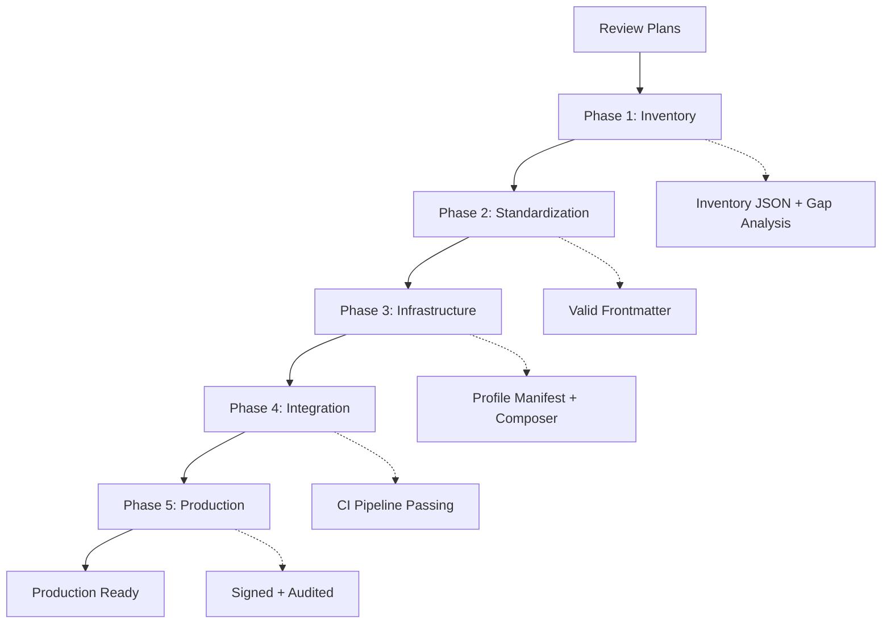

# AI System Profile Architecture - Planning Documents

**Status:** Draft
**Created:** 2025-11-11
**Specification:** DEV-SDS-AI-PROFILE-001

---

## 📋 Overview

This directory contains planning documents for aligning VibesPro's distributed AI system (AGENT\*.md, instructions, prompts, chatmodes) with the unified AI System Profile Architecture specification.

---

## 📁 Documents

### Primary Plan

- **[ai-profile-architecture-alignment.md](./ai-profile-architecture-alignment.md)**
    - Complete phased implementation plan
    - 5 phases, 13 cycles with detailed RED/GREEN/Verification steps
    - Follows PLAN_TEMPLATE.md structure
    - Includes dependency graphs, checklists, and audit trails

### Analysis

- **[current-vs-target-analysis.md](./current-vs-target-analysis.md)**
    - Side-by-side comparison of current vs. target state
    - Gap analysis for all artifact types
    - Frontmatter standardization requirements
    - Migration strategy and success criteria

---

## 🎯 Quick Start

### For Project Leads

1. Review [current-vs-target-analysis.md](./current-vs-target-analysis.md) for executive summary
2. Review [ai-profile-architecture-alignment.md](./ai-profile-architecture-alignment.md) phases
3. Approve plan and allocate resources
4. Monitor phase completion via checklists

### For Implementation Agents

1. Start with **Phase 1: Inventory & Analysis**
2. Execute cycles in dependency order (see cycle tables)
3. Mark checklist items as complete with evidence
4. Store artifacts in `artifacts/` subdirectories
5. Validate before moving to next phase

### For Reviewers

1. Check phase checklists for completion
2. Verify evidence artifacts exist
3. Run validation commands (`just ai-profile-validate`)
4. Approve phase completion

---

## 📊 Phase Overview

| Phase | Objective                | Status         | Duration  | Dependencies |
| ----- | ------------------------ | -------------- | --------- | ------------ |
| **1** | Inventory & Analysis     | 🔴 Not Started | 1 week    | None         |
| **2** | Artifact Standardization | ⚪ Pending     | 1-2 weeks | Phase 1      |
| **3** | Profile Infrastructure   | ⚪ Pending     | 1-2 weeks | Phase 2      |
| **4** | Integration & Validation | ⚪ Pending     | 1 week    | Phase 3      |
| **5** | Production Hardening     | ⚪ Pending     | 1 week    | Phase 4      |

**Total Estimated Duration:** 4-5 weeks

---

## 🔄 Workflow



---

## 🎯 Success Criteria

### Phase 1 Complete When:

- ✅ All 75 artifacts inventoried (17 instructions + 26 prompts + 32 chatmodes)
- ✅ Gap analysis document generated
- ✅ Migration strategy defined

### Phase 2 Complete When:

- ✅ All frontmatter validates against schemas
- ✅ `profileId` added to all artifacts
- ✅ Field names standardized

### Phase 3 Complete When:

- ✅ `profile.jsonc` manifest created and validated
- ✅ Profile composer dry-run succeeds
- ✅ Token budget report generated

### Phase 4 Complete When:

- ✅ CI validation workflow passing
- ✅ All `just ai-profile-*` commands work
- ✅ Validation suite reports GREEN

### Phase 5 Complete When:

- ✅ Profile GPG-signed and verified
- ✅ Audit trail logging active
- ✅ Documentation updated
- ✅ Team trained

---

## 📂 Artifact Storage

```
docs/plans/AI-system/
├── README.md                            # This file
├── ai-profile-architecture-alignment.md # Primary plan
├── current-vs-target-analysis.md       # Gap analysis
└── artifacts/                          # Generated during execution
    ├── inventory/
    │   ├── ai-artifacts-inventory.json  # Phase 1A output
    │   └── inventory-summary.md         # Phase 1A summary
    ├── gaps/
    │   ├── gap-analysis.md              # Phase 1B output
    │   └── migration-strategy.md        # Phase 1B strategy
    └── validation/
        ├── frontmatter-validation.log   # Phase 2 validation
        ├── profile-validation.log       # Phase 3 validation
        └── token-budget-report.txt      # Phase 3D output
```

---

## 🔧 Key Commands

### Validation

```bash
# Validate frontmatter (after Phase 2)
just prompt-lint
node scripts/validate-frontmatter.js --all

# Validate profile manifest (after Phase 3)
node scripts/validate-profile.js

# Generate token budget report (after Phase 3)
node scripts/token-budget.js --report

# Compose profile (dry-run)
node scripts/compose-profile.js --dry-run

# Full profile validation (after Phase 4)
just ai-profile-check
```

### Signing & Security (Phase 5)

```bash
# Sign profile
bash scripts/sign-profile.sh

# Verify signature
bash scripts/verify-profile.sh

# Query audit logs
node scripts/audit-logger.js --query '{"event": "profile_composed"}'
```

---

## 📚 Related Documents

### Specifications

- [DEV-SDS-AI-PROFILE-001](/docs/specs/ai-system-profile-architecture.md) - AI System Profile Architecture

### Current System

- [AGENT-SYSTEM.md](/AGENT-SYSTEM.md) - Distributed agent routing
- [AGENT-MAP.md](/AGENT-MAP.md) - Navigation hub
- [.github/copilot-instructions.md](/.github/copilot-instructions.md) - Master AI guidance

### Templates

- [PLAN_TEMPLATE.md](../PLAN_TEMPLATE.md) - Planning document template

---

## 🚦 Status Tracking

| Cycle                         | Status         | Evidence | Date Completed |
| ----------------------------- | -------------- | -------- | -------------- |
| 1A - Inventory                | 🔴 Not Started | -        | -              |
| 1B - Gap Analysis             | 🔴 Not Started | -        | -              |
| 2A - Standardize Instructions | 🔴 Not Started | -        | -              |
| 2B - Standardize Prompts      | 🔴 Not Started | -        | -              |
| 2C - Standardize Chatmodes    | 🔴 Not Started | -        | -              |
| 3A - Profile Structure        | 🔴 Not Started | -        | -              |
| 3B - Profile Manifest         | 🔴 Not Started | -        | -              |
| 3C - Profile Composer         | 🔴 Not Started | -        | -              |
| 3D - Token Budget             | 🔴 Not Started | -        | -              |
| 4A - CI Validation            | 🔴 Not Started | -        | -              |
| 4B - Just Integration         | 🔴 Not Started | -        | -              |
| 4C - Validation Suite         | 🔴 Not Started | -        | -              |
| 5A - Profile Signing          | 🔴 Not Started | -        | -              |
| 5B - Audit Trails             | 🔴 Not Started | -        | -              |
| 5C - Documentation            | 🔴 Not Started | -        | -              |

**Legend:**
🔴 Not Started | 🟡 In Progress | 🟢 Complete | ⚠️ Blocked

---

## 🤝 Contributing

When executing cycles:

1. **Update checklists** in ai-profile-architecture-alignment.md
2. **Store evidence** in `artifacts/` subdirectories
3. **Mark completion** with agent name and date
4. **Update status** in this README
5. **Commit changes** with spec ID reference

---

## ❓ Questions & Support

- Review [current-vs-target-analysis.md](./current-vs-target-analysis.md) for detailed context
- Check [DEV-SDS-AI-PROFILE-001](../specs/ai-system-profile-architecture.md) for specification details
- Consult [AGENT-SYSTEM.md](../../AGENT-SYSTEM.md) for current system architecture

---

**Last Updated:** 2025-11-11
**Next Review:** Upon Phase 1 completion
