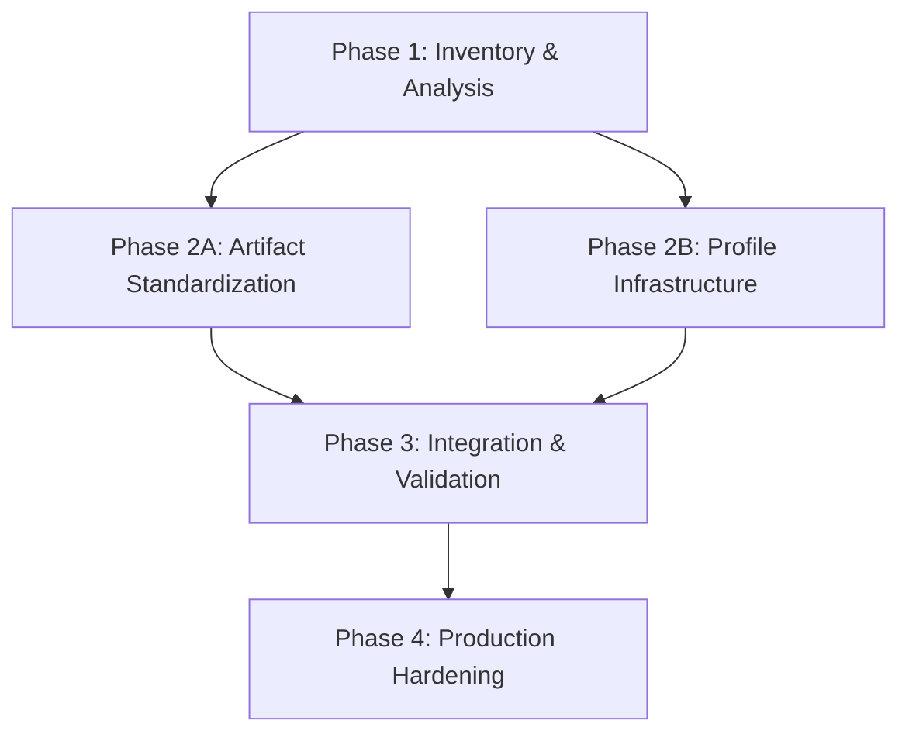

# 🧭 AI System Profile Architecture Alignment Plan

**Status:** Draft
**Revision Date:** 2025-11-11
**Aligned With:** DEV-SDS-AI-PROFILE-001, AGENT-SYSTEM.md, .github/copilot-instructions.md

---

## 1. Objectives and Context

### 1.1 Purpose

Align VibesPro's distributed AI system (AGENT\*.md, instructions, prompts, chatmodes) with the unified AI System Profile Architecture (DEV-SDS-AI-PROFILE-001).

### 1.2 Current State

**Existing Assets:**

- `.github/copilot-instructions.md` - Master AI guidance (Supreme authority)
- `.github/instructions/*.instructions.md` - 17 modular MECE instruction files
- `.github/prompts/*.prompt.md` - 26 reusable prompt templates
- `.github/chatmodes/*.chatmode.md` - 32 specialized personas
- `AGENT-SYSTEM.md` - Distributed agent routing system
- `AGENT-MAP.md` - Navigation hub
- Directory-specific `AGENT.md` files (`.github/`, `docs/`, `tools/`, `scripts/`, `templates/`)

**Target State:**

- Unified profile manifest (`profile.jsonc`) orchestrating all components
- Standardized frontmatter across all artifacts
- Token budget management and pruning strategy
- Security boundaries and tool access policies
- CI/CD validation pipeline
- Signature verification and audit trails

### 1.3 Key Considerations

- Maintain backward compatibility with existing workflows
- Preserve MECE principle for instruction stacking
- Ensure security guidelines remain highest precedence
- Enable auditable, reproducible AI behavior
- Support team-wide profile distribution

---

## 2. Global Parallelization & Dependencies Overview

### Parallelization Matrix

| Component                   | Can Run Parallel With                    | Shared Artifacts / Risks | Coordination Notes             |
| --------------------------- | ---------------------------------------- | ------------------------ | ------------------------------ |
| Phase 1 (Inventory)         | None                                     | All files                | Foundational analysis          |
| Cycle A1 (Instructions)     | Cycle B1 (Prompts), Cycle C1 (Chatmodes) | None                     | Independent standardization    |
| Cycle A2 (Profile Manifest) | Cycle B2 (Token Budget)                  | profile.jsonc            | Must sync before merge         |
| Phase 3 (Validation)        | None                                     | CI pipeline              | Depends on all previous cycles |

### High-Level Dependency Map



---

## 3. Global Dependencies Table

| Dependency Type | Depends On           | Description / Rationale                           | Resolution Trigger    |
| --------------- | -------------------- | ------------------------------------------------- | --------------------- |
| Upstream Phase  | Phase 1 Complete     | All artifacts inventoried and analyzed            | Inventory validated   |
| Cross-Cycle     | A1, B1, C1 Complete  | Standardized frontmatter before manifest creation | All frontmatter valid |
| External        | CI/CD pipeline setup | GitHub Actions workflow for validation            | Workflow file created |

---

## 4. Phases Overview (MECE)

_To be filled iteratively..._

---

## Phase 1: Inventory & Analysis

**Objective:** Comprehensive audit of existing AI system artifacts and gap analysis against target architecture.

**Coordinator:** Analysis Agent

**Traceability Goal:** Complete mapping of current → target state with gap identification.

### ✅ Phase Checklist

- [ ] Catalog all instruction files — _Updated By:_ TBD
- [ ] Catalog all prompt files — _Updated By:_ TBD
- [ ] Catalog all chatmode files — _Updated By:_ TBD
- [ ] Catalog all AGENT\*.md files — _Updated By:_ TBD
- [ ] Analyze current frontmatter patterns — _Updated By:_ TBD
- [ ] Map to target profile schema — _Updated By:_ TBD
- [ ] Generate gap analysis report — _Updated By:_ TBD
- [ ] **Mark Phase as Complete** once all cycles are GREEN and evidence is verified.

### Cycle Summary Table

| Cycle Label | Owner Agent | Branch / Task                  | Depends On | Can Run Parallel With | Audit Artifacts       |
| ----------- | ----------- | ------------------------------ | ---------- | --------------------- | --------------------- |
| 1A          | Analysis    | `feature/ai-profile-inventory` | None       | None                  | Inventory report JSON |
| 1B          | Analysis    | `feature/ai-profile-gaps`      | 1A         | None                  | Gap analysis markdown |

---

### Cycle 1A — Artifact Inventory

**Owner Agent:** Analysis Agent  
**Branch / Task ID:** `feature/ai-profile-inventory`  
**Upstream Dependency:** None  
**Parallel With:** None

#### ✅ Cycle Checklist

- [ ] Scan `.github/instructions/` directory — _Updated By:_ TBD
- [ ] Scan `.github/prompts/` directory — _Updated By:_ TBD
- [ ] Scan `.github/chatmodes/` directory — _Updated By:_ TBD
- [ ] Scan for all `AGENT*.md` files — _Updated By:_ TBD
- [ ] Extract existing frontmatter patterns — _Updated By:_ TBD
- [ ] Generate structured inventory JSON — _Updated By:_ TBD
- [ ] **Mark Cycle as Complete** after validation passes and artifacts logged.

#### RED Phase

- Expected outcome: Structured inventory of all AI artifacts
- Validation: JSON schema validation for inventory format
- Test: `node scripts/validate-inventory.js`

#### GREEN Phase

**Actions:**

1. Create `scripts/inventory-ai-artifacts.js` to scan directories
2. Extract frontmatter from all `.instructions.md`, `.prompt.md`, `.chatmode.md` files
3. Find all `AGENT*.md` files using glob pattern
4. Generate JSON inventory with structure:

```json
{
  "instructions": [
    {
      "path": ".github/instructions/security.instructions.md",
      "frontmatter": { "precedence": 10, "domain": "security", "kind": "instructions" },
      "hasContent": true,
      "lineCount": 26
    }
  ],
  "prompts": [...],
  "chatmodes": [...],
  "agentFiles": [...]
}
```

5. Store output in `/docs/plans/AI-system/artifacts/inventory/ai-artifacts-inventory.json`

#### Verification & Evidence Capture

```bash
node scripts/inventory-ai-artifacts.js
node scripts/validate-inventory.js
```

**Artifacts to Store:**

- `/docs/plans/AI-system/artifacts/inventory/ai-artifacts-inventory.json`
- `/docs/plans/AI-system/artifacts/inventory/inventory-summary.md`

Label → **1A-GREEN**

---

### Cycle 1B — Gap Analysis

**Owner Agent:** Analysis Agent  
**Branch / Task ID:** `feature/ai-profile-gaps`  
**Upstream Dependency:** Cycle 1A  
**Parallel With:** None

#### ✅ Cycle Checklist

- [ ] Load inventory from 1A — _Updated By:_ TBD
- [ ] Compare against profile schema requirements — _Updated By:_ TBD
- [ ] Identify missing frontmatter fields — _Updated By:_ TBD
- [ ] Identify non-standard patterns — _Updated By:_ TBD
- [ ] Generate migration strategy — _Updated By:_ TBD
- [ ] Document gaps in markdown report — _Updated By:_ TBD
- [ ] **Mark Cycle as Complete** after validation passes and artifacts logged.

#### RED Phase

- Expected outcome: Comprehensive gap analysis report
- Validation: All gaps categorized and prioritized
- Test: Manual review of gap report

#### GREEN Phase

**Actions:**

1. Load `ai-artifacts-inventory.json` from Cycle 1A
2. Compare each artifact against target schema (DEV-SDS-AI-PROFILE-001 §3.2)
3. Identify gaps:
    - Missing frontmatter fields (mode, model, tools, variables)
    - Non-standard field names or formats
    - Missing profile manifest references
    - Token budget metadata absent
4. Categorize gaps by severity:
    - **Critical**: Prevents profile composition (missing required fields)
    - **High**: Impacts functionality (missing tools/model declarations)
    - **Medium**: Reduces auditability (missing descriptions)
    - **Low**: Enhancement opportunities (missing optional metadata)
5. Generate migration strategy for each gap category
6. Store report in `/docs/plans/AI-system/artifacts/gaps/gap-analysis.md`

#### Verification & Evidence Capture

```bash
node scripts/analyze-gaps.js
# Manual review of gap-analysis.md
```

**Artifacts to Store:**

- `/docs/plans/AI-system/artifacts/gaps/gap-analysis.md`
- `/docs/plans/AI-system/artifacts/gaps/migration-strategy.md`

Label → **1B-GREEN**

---

## Phase 2: Artifact Standardization

**Objective:** Standardize frontmatter and metadata across all AI artifacts to match profile schema.

**Coordinator:** Standardization Agent

**Traceability Goal:** All artifacts conform to profile schema with valid, complete frontmatter.

### ✅ Phase Checklist

- [ ] Standardize instruction frontmatter — _Updated By:_ TBD
- [ ] Standardize prompt frontmatter — _Updated By:_ TBD
- [ ] Standardize chatmode frontmatter — _Updated By:_ TBD
- [ ] Add missing metadata fields — _Updated By:_ TBD
- [ ] Validate all frontmatter — _Updated By:_ TBD
- [ ] **Mark Phase as Complete** once all cycles are GREEN and evidence is verified.

### Cycle Summary Table

| Cycle Label | Owner Agent     | Branch / Task                      | Depends On | Can Run Parallel With | Audit Artifacts |
| ----------- | --------------- | ---------------------------------- | ---------- | --------------------- | --------------- |
| 2A          | Standardization | `feature/standardize-instructions` | 1B         | 2B, 2C                | Validation logs |
| 2B          | Standardization | `feature/standardize-prompts`      | 1B         | 2A, 2C                | Validation logs |
| 2C          | Standardization | `feature/standardize-chatmodes`    | 1B         | 2A, 2B                | Validation logs |

---

### Cycle 2A — Standardize Instructions

**Owner Agent:** Standardization Agent  
**Branch / Task ID:** `feature/standardize-instructions`  
**Upstream Dependency:** Cycle 1B  
**Parallel With:** 2B, 2C

#### ✅ Cycle Checklist

- [ ] Update frontmatter schema for instructions — _Updated By:_ TBD
- [ ] Add missing `applyToGlob` fields — _Updated By:_ TBD
- [ ] Ensure all have `kind: instructions` — _Updated By:_ TBD
- [ ] Validate precedence values — _Updated By:_ TBD
- [ ] Run validation tests — _Updated By:_ TBD
- [ ] **Mark Cycle as Complete** after validation passes.

#### Target Schema (from DEV-SDS-AI-PROFILE-001 §3.2.1)

```yaml
---
description: "Brief description of the instruction domain"
applyToGlob: "**" # or specific pattern
kind: instructions
domain: security|testing|general|etc
precedence: 10-50 # Lower = higher priority
profileId: "vibespro-ai" # NEW
---
```

#### GREEN Phase Actions

1. Review all 17 instruction files in `.github/instructions/`
2. Add missing `profileId: "vibespro-ai"` to all
3. Ensure `applyToGlob` is present (default to `"**"` if missing)
4. Validate `precedence` values match documented hierarchy
5. Update validation script to check new schema

#### Verification

```bash
just prompt-lint
node scripts/validate-frontmatter.js --type=instructions
```

**Artifacts:** Validation logs in `/docs/plans/AI-system/artifacts/validation/`

Label → **2A-GREEN**

---

### Cycle 2B — Standardize Prompts

**Owner Agent:** Standardization Agent  
**Branch / Task ID:** `feature/standardize-prompts`  
**Upstream Dependency:** Cycle 1B  
**Parallel With:** 2A, 2C

#### Target Schema (from DEV-SDS-AI-PROFILE-001 §3.2.2)

```yaml
---
kind: prompt
mode: "ask|edit|task|agent"
model: "model-id"
tools: ["tool-id-1", "tool-id-2"]
description: "Brief description"
domain: "tdd|debug|spec|etc"
task: "workflow|review|generate|etc"
variables:
    - "SPEC_IDS"
    - "TARGET"
profileId: "vibespro-ai" # NEW
---
```

#### GREEN Phase Actions

1. Review all 26 prompt files in `.github/prompts/`
2. Add `mode`, `model`, `tools` arrays where missing
3. Add `profileId: "vibespro-ai"`
4. Extract variable placeholders (e.g., `{{ '{{SPEC_IDS}}' }}`) and document in `variables` array
5. Update prompt-lint tool to validate new schema

Label → **2B-GREEN**

---

### Cycle 2C — Standardize Chatmodes

**Owner Agent:** Standardization Agent  
**Branch / Task ID:** `feature/standardize-chatmodes`  
**Upstream Dependency:** Cycle 1B  
**Parallel With:** 2A, 2B

#### Target Schema (from DEV-SDS-AI-PROFILE-001 §3.2.3)

```yaml
---
id: "domain.task"
kind: chatmode
description: "Brief description"
tools: ["tool-id-1", "tool-id-2"]
model: "model-id"
handoffs:
    - label: "transition-name"
      target: "target-mode-id"
      autoSend: false
      prompt: "prefilled prompt text"
profileId: "vibespro-ai" # NEW
---
```

#### GREEN Phase Actions

1. Review all 32 chatmode files in `.github/chatmodes/`
2. Ensure `id` follows `domain.task` pattern (already mostly compliant)
3. Add `tools`, `model`, `handoffs` where applicable
4. Add `profileId: "vibespro-ai"`
5. Document workflow transitions in `handoffs` (e.g., `tdd.red` → `tdd.green`)

Label → **2C-GREEN**

---

## Phase 3: Profile Infrastructure

**Objective:** Create profile manifest and supporting infrastructure (composer, token budget).

**Coordinator:** Profile Agent

**Traceability Goal:** Complete profile infrastructure with manifest, composer, and token management.

### ✅ Phase Checklist

- [ ] Create profile directory structure — _Updated By:_ TBD
- [ ] Generate profile.jsonc manifest — _Updated By:_ TBD
- [ ] Implement Profile Composer — _Updated By:_ TBD
- [ ] Implement token budget calculator — _Updated By:_ TBD
- [ ] Create toolset definitions — _Updated By:_ TBD
- [ ] Link MCP server configurations — _Updated By:_ TBD
- [ ] **Mark Phase as Complete** once all cycles are GREEN.

### Cycle Summary Table

| Cycle Label | Owner Agent | Branch / Task               | Depends On | Can Run Parallel With | Audit Artifacts         |
| ----------- | ----------- | --------------------------- | ---------- | --------------------- | ----------------------- |
| 3A          | Profile     | `feature/profile-structure` | 2A, 2B, 2C | None                  | Directory structure     |
| 3B          | Profile     | `feature/profile-manifest`  | 3A         | 3C                    | profile.jsonc           |
| 3C          | Profile     | `feature/profile-composer`  | 3A         | 3B                    | Composer implementation |
| 3D          | Profile     | `feature/token-budget`      | 3B, 3C     | None                  | Token calculator        |

---

### Cycle 3A — Profile Directory Structure

**Owner Agent:** Profile Agent  
**Branch / Task ID:** `feature/profile-structure`  
**Upstream Dependency:** 2A, 2B, 2C  
**Parallel With:** None

#### Target Structure (from DEV-SDS-AI-PROFILE-001 §4.1)

```
.vscode/profiles/vibespro-ai/
├── profile.jsonc                 # Manifest
├── signatures/
│   └── profile.sig.asc          # GPG signature (Phase 5)
├── AGENTS.md                    # Persona definition (symlink to root)
├── .github/
│   ├── copilot-instructions.md  # Symlink to .github/
│   ├── instructions/            # Symlink to .github/instructions/
│   ├── prompts/                 # Symlink to .github/prompts/
│   └── chatmodes/               # Symlink to .github/chatmodes/
├── toolsets/
│   └── vibespro-tools.jsonc
├── mcp/
│   └── mcp-config.json         # Symlink to .mcp.json
└── scripts/
    ├── compose-profile.js
    └── validate-profile.js
```

#### GREEN Phase Actions

1. Create `.vscode/profiles/vibespro-ai/` directory
2. Create symlinks to existing artifacts (preserve current locations)
3. Create `toolsets/` directory
4. Create `scripts/` directory for composer utilities

Label → **3A-GREEN**

---

### Cycle 3B — Profile Manifest

**Owner Agent:** Profile Agent  
**Branch / Task ID:** `feature/profile-manifest`  
**Upstream Dependency:** 3A  
**Parallel With:** 3C

#### Target Schema (from DEV-SDS-AI-PROFILE-001 §3.1)

```jsonc
{
    "id": "com.vibespro.ai-profile",
    "name": "VibesPro AI Assistant Profile",
    "version": "1.0.0",
    "scope": "workspace",
    "description": "AI profile for VibesPro Copier template development",
    "checksum": "sha256:...",
    "manifestVersion": 1,
    "instructions": [
        ".github/instructions/security.instructions.md",
        ".github/instructions/ai-workflows.constitution.instructions.md",
        // ... all instruction files
    ],
    "prompts": [
        ".github/prompts/tdd.workflow.prompt.md",
        // ... all prompt files
    ],
    "chatModes": [
        ".github/chatmodes/tdd.red.chatmode.md",
        // ... all chatmode files
    ],
    "toolSets": ["toolsets/vibespro-tools.jsonc"],
    "mcpServers": ["mcp/mcp-config.json"],
    "modelPreferences": {
        "default": "gpt-4-turbo",
        "fallback": "gpt-3.5-turbo",
        "contextWindow": 128000,
    },
    "tokenPresets": {
        "baseInstructions": 400,
        "fileContextReserve": 2400,
        "recentHistoryCount": 3,
    },
    "toolPolicy": {
        "allowedToolSets": ["vibespro-tools"],
        "requireMcpTrust": true,
        "autoApproveTools": false,
    },
    "security": {
        "requireSignature": false, // Phase 5
        "signedBy": "",
        "allowedHosts": [],
    },
}
```

#### GREEN Phase Actions

1. Generate `profile.jsonc` from template
2. Populate `instructions`, `prompts`, `chatModes` arrays from inventory
3. Set security defaults (autoApproveTools: false)
4. Calculate initial checksum

Label → **3B-GREEN**

---

### Cycle 3C — Profile Composer

**Owner Agent:** Profile Agent  
**Branch / Task ID:** `feature/profile-composer`  
**Upstream Dependency:** 3A  
**Parallel With:** 3B

#### Implementation

Create `scripts/compose-profile.js` with:

1. **Instruction Aggregation**: Merge all instruction files respecting precedence
2. **Prompt Resolution**: Load and validate all prompts
3. **Tool Policy Enforcement**: Validate toolsets and MCP configs
4. **Dry-Run Mode**: Preview composed profile without execution

```javascript
// scripts/compose-profile.js
const fs = require("fs");
const path = require("path");

class ProfileComposer {
    constructor(profilePath) {
        this.profilePath = profilePath;
        this.manifest = this.loadManifest();
    }

    loadManifest() {
        const manifestPath = path.join(this.profilePath, "profile.jsonc");
        return JSON.parse(fs.readFileSync(manifestPath, "utf-8"));
    }

    composeInstructions() {
        // Load and merge instructions by precedence
    }

    validateTools() {
        // Ensure all tools are whitelisted
    }

    generateTokenReport() {
        // Calculate token budget usage
    }

    dryRun() {
        // Preview composition without side effects
    }
}
```

Label → **3C-GREEN**

---

### Cycle 3D — Token Budget Calculator

**Owner Agent:** Profile Agent  
**Branch / Task ID:** `feature/token-budget`  
**Upstream Dependency:** 3B, 3C  
**Parallel With:** None

#### Implementation (from DEV-SDS-AI-PROFILE-001 §6)

```javascript
// scripts/token-budget.js
function estimateTokens(text) {
    // Naive estimation: 1 token ≈ 4 characters
    return Math.ceil((text?.length || 0) / 4);
}

function calculateBudget(profile) {
    const components = {
        baseInstructions: 0,
        prompts: 0,
        fileContext: 0,
        history: 0,
    };

    // Calculate each component
    profile.instructions.forEach((file) => {
        const content = fs.readFileSync(file, "utf-8");
        components.baseInstructions += estimateTokens(content);
    });

    // Apply pruning if exceeds contextWindow
    if (getTotalTokens(components) > profile.modelPreferences.contextWindow) {
        return pruneByPriority(components, profile);
    }

    return components;
}
```

Label → **3D-GREEN**

---

## Phase 4: Integration & Validation

**Objective:** CI/CD pipeline integration and automated validation of profile artifacts.

**Coordinator:** CI Agent

**Traceability Goal:** Automated validation pipeline with comprehensive quality gates.

### ✅ Phase Checklist

- [ ] Create profile validation workflow — _Updated By:_ TBD
- [ ] Implement frontmatter validation — _Updated By:_ TBD
- [ ] Implement manifest validation — _Updated By:_ TBD
- [ ] Add secret scanning — _Updated By:_ TBD
- [ ] Create token budget reporting — _Updated By:_ TBD
- [ ] Integrate with existing `just` commands — _Updated By:_ TBD
- [ ] **Mark Phase as Complete** once all validation passes.

### Cycle Summary Table

| Cycle Label | Owner Agent | Branch / Task                   | Depends On | Can Run Parallel With | Audit Artifacts         |
| ----------- | ----------- | ------------------------------- | ---------- | --------------------- | ----------------------- |
| 4A          | CI          | `feature/profile-validation-ci` | 3B, 3C, 3D | 4B                    | GitHub Actions workflow |
| 4B          | CI          | `feature/just-integration`      | 3D         | 4A                    | Justfile recipes        |
| 4C          | CI          | `feature/validation-suite`      | 4A, 4B     | None                  | Test results            |

---

### Cycle 4A — CI Validation Workflow

**Owner Agent:** CI Agent  
**Branch / Task ID:** `feature/profile-validation-ci`  
**Upstream Dependency:** 3B, 3C, 3D  
**Parallel With:** 4B

#### Target Workflow (from DEV-SDS-AI-PROFILE-001 §5.1)

Create `.github/workflows/profile-validation.yml`:

```yaml
name: AI Profile Validation

on:
    push:
        paths:
            - ".github/instructions/**"
            - ".github/prompts/**"
            - ".github/chatmodes/**"
            - ".vscode/profiles/**"
            - "AGENT*.md"
    pull_request:
        paths:
            - ".github/instructions/**"
            - ".github/prompts/**"
            - ".github/chatmodes/**"
            - ".vscode/profiles/**"

jobs:
    validate-profile:
        runs-on: ubuntu-latest
        steps:
            - uses: actions/checkout@v4

            - name: Setup Node.js
              uses: actions/setup-node@v4
              with:
                  node-version: "20"

            - name: Install dependencies
              run: pnpm install

            - name: Validate frontmatter
              run: node scripts/validate-frontmatter.js --all

            - name: Validate profile manifest
              run: node scripts/validate-profile.js

            - name: Scan for secrets
              run: |
                  ! grep -r -i "api[_-]key\|secret\|token\|password" \
                    .github/instructions/ \
                    .github/prompts/ \
                    .github/chatmodes/

            - name: Generate token budget report
              run: node scripts/token-budget.js --report

            - name: Composer dry-run
              run: node scripts/compose-profile.js --dry-run
```

Label → **4A-GREEN**

---

### Cycle 4B — Just Integration

**Owner Agent:** CI Agent  
**Branch / Task ID:** `feature/just-integration`  
**Upstream Dependency:** 3D  
**Parallel With:** 4A

#### New Justfile Recipes

Add to `justfile`:

```bash
# Validate AI profile artifacts
ai-profile-validate:
    @echo "🔍 Validating AI profile..."
    node scripts/validate-frontmatter.js --all
    node scripts/validate-profile.js
    @echo "✅ Profile validation complete"

# Generate token budget report
ai-profile-tokens:
    @echo "📊 Calculating token budget..."
    node scripts/token-budget.js --report

# Compose profile (dry-run)
ai-profile-compose:
    @echo "🔧 Composing AI profile..."
    node scripts/compose-profile.js --dry-run

# Full profile check (all validations)
ai-profile-check: ai-profile-validate ai-profile-tokens ai-profile-compose
    @echo "✅ All profile checks passed"
```

Label → **4B-GREEN**

---

### Cycle 4C — Validation Suite

**Owner Agent:** CI Agent  
**Branch / Task ID:** `feature/validation-suite`  
**Upstream Dependency:** 4A, 4B  
**Parallel With:** None

#### Validation Scripts

**1. Frontmatter Validation** (`scripts/validate-frontmatter.js`)

```javascript
const fs = require("fs");
const glob = require("glob");
const yaml = require("yaml");

const SCHEMAS = {
    instructions: {
        required: ["description", "kind", "domain", "precedence"],
        optional: ["applyToGlob", "profileId"],
    },
    prompt: {
        required: ["kind", "mode", "description"],
        optional: ["model", "tools", "variables", "domain", "task", "profileId"],
    },
    chatmode: {
        required: ["id", "kind", "description"],
        optional: ["tools", "model", "handoffs", "profileId"],
    },
};

function validateFile(filePath, schema) {
    const content = fs.readFileSync(filePath, "utf-8");
    const match = content.match(/^---\n([\s\S]*?)\n---/);

    if (!match) {
        return { valid: false, error: "No frontmatter found" };
    }

    const frontmatter = yaml.parse(match[1]);

    // Check required fields
    for (const field of schema.required) {
        if (!frontmatter[field]) {
            return { valid: false, error: `Missing required field: ${field}` };
        }
    }

    return { valid: true };
}
```

**2. Profile Manifest Validation** (`scripts/validate-profile.js`)

```javascript
const Ajv = require("ajv");
const schema = require("./profile-schema.json");

function validateProfile(manifestPath) {
    const manifest = JSON.parse(fs.readFileSync(manifestPath, "utf-8"));

    const ajv = new Ajv();
    const validate = ajv.compile(schema);

    if (!validate(manifest)) {
        console.error("❌ Profile validation failed:", validate.errors);
        process.exit(1);
    }

    // Additional checks
    checkFileReferences(manifest);
    checkSecuritySettings(manifest);

    console.log("✅ Profile manifest is valid");
}

function checkSecuritySettings(manifest) {
    if (manifest.toolPolicy.autoApproveTools === true) {
        console.error("❌ SECURITY: autoApproveTools must be false");
        process.exit(1);
    }
}
```

Label → **4C-GREEN**

---

## Phase 5: Production Hardening

**Objective:** Security hardening, signing, audit trails, and production readiness.

**Coordinator:** Security Agent

**Traceability Goal:** Production-ready profile with security signatures and complete audit trails.

### ✅ Phase Checklist

- [ ] Implement GPG signing — _Updated By:_ TBD
- [ ] Create audit trail logging — _Updated By:_ TBD
- [ ] Security policy enforcement — _Updated By:_ TBD
- [ ] Documentation updates — _Updated By:_ TBD
- [ ] Team training materials — _Updated By:_ TBD
- [ ] **Mark Phase as Complete** once production-ready.

### Cycle Summary Table

| Cycle Label | Owner Agent | Branch / Task             | Depends On | Can Run Parallel With | Audit Artifacts          |
| ----------- | ----------- | ------------------------- | ---------- | --------------------- | ------------------------ |
| 5A          | Security    | `feature/profile-signing` | 4C         | 5B                    | Signing workflow         |
| 5B          | Security    | `feature/audit-trails`    | 4C         | 5A                    | Audit log implementation |
| 5C          | Security    | `feature/documentation`   | 5A, 5B     | None                  | Updated docs             |

---

### Cycle 5A — Profile Signing

**Owner Agent:** Security Agent  
**Branch / Task ID:** `feature/profile-signing`  
**Upstream Dependency:** 4C  
**Parallel With:** 5B

#### Signing Process (from DEV-SDS-AI-PROFILE-001 §5.2)

**1. Generate Signing Key** (one-time setup)

```bash
# Generate GPG key for profile signing
gpg --full-generate-key

# Export public key
gpg --armor --export vibespro-ai > .vscode/profiles/vibespro-ai/signatures/public-key.asc
```

**2. Signing Script** (`scripts/sign-profile.sh`)

```bash
#!/bin/bash
set -euo pipefail

PROFILE_DIR=".vscode/profiles/vibespro-ai"
CHECKSUM_FILE="${PROFILE_DIR}/CHECKSUM.txt"
SIG_FILE="${PROFILE_DIR}/signatures/profile.sig.asc"

# Compute checksum of all profile artifacts
echo "📝 Computing checksums..."
cd "${PROFILE_DIR}"
sha256sum profile.jsonc \
  $(find .github -type f) \
  > CHECKSUM.txt

# Sign checksum
echo "✍️  Signing profile..."
gpg --detach-sign --armor CHECKSUM.txt -o signatures/profile.sig.asc

# Update manifest with checksum
CHECKSUM=$(sha256sum CHECKSUM.txt | cut -d' ' -f1)
jq ".checksum = \"sha256:${CHECKSUM}\"" profile.jsonc > profile.jsonc.tmp
mv profile.jsonc.tmp profile.jsonc

echo "✅ Profile signed successfully"
```

**3. Verification Script** (`scripts/verify-profile.sh`)

```bash
#!/bin/bash
set -euo pipefail

PROFILE_DIR=".vscode/profiles/vibespro-ai"

# Verify GPG signature
echo "🔐 Verifying signature..."
gpg --verify \
  "${PROFILE_DIR}/signatures/profile.sig.asc" \
  "${PROFILE_DIR}/CHECKSUM.txt"

# Verify checksums
echo "✅ Verifying checksums..."
cd "${PROFILE_DIR}"
sha256sum -c CHECKSUM.txt

echo "✅ Profile verification complete"
```

**4. Update CI Workflow**

Add to `.github/workflows/profile-validation.yml`:

```yaml
- name: Verify profile signature
  if: github.event_name == 'push' && github.ref == 'refs/heads/main'
  run: |
      gpg --import .vscode/profiles/vibespro-ai/signatures/public-key.asc
      bash scripts/verify-profile.sh
```

Label → **5A-GREEN**

---

### Cycle 5B — Audit Trail Logging

**Owner Agent:** Security Agent  
**Branch / Task ID:** `feature/audit-trails`  
**Upstream Dependency:** 4C  
**Parallel With:** 5A

#### Audit Trail Implementation

**1. Audit Log Schema**

```jsonc
{
    "timestamp": "2025-11-11T10:30:00Z",
    "event": "profile_composed|prompt_executed|tool_invoked|mcp_accessed",
    "profileId": "com.vibespro.ai-profile",
    "profileVersion": "1.0.0",
    "actor": "user@example.com",
    "details": {
        "mode": "chatmode-id",
        "tools": ["tool-id-1"],
        "tokenUsage": 1234,
        "approved": true,
    },
    "outcome": "success|failure",
    "error": null,
}
```

**2. Audit Logger** (`scripts/audit-logger.js`)

```javascript
const fs = require("fs");
const path = require("path");

class AuditLogger {
    constructor(logPath = ".vscode/profiles/vibespro-ai/audit.jsonl") {
        this.logPath = logPath;
    }

    log(event, details) {
        const entry = {
            timestamp: new Date().toISOString(),
            event,
            profileId: "com.vibespro.ai-profile",
            profileVersion: "1.0.0",
            actor: process.env.USER || "unknown",
            details,
            outcome: "success",
        };

        fs.appendFileSync(this.logPath, JSON.stringify(entry) + "\n", "utf-8");
    }

    query(filters) {
        const logs = fs
            .readFileSync(this.logPath, "utf-8")
            .split("\n")
            .filter(Boolean)
            .map((line) => JSON.parse(line));

        return logs.filter((entry) => {
            return Object.entries(filters).every(([key, value]) => {
                return entry[key] === value;
            });
        });
    }
}

module.exports = AuditLogger;
```

**3. Integration with Composer**

Update `scripts/compose-profile.js`:

```javascript
const AuditLogger = require("./audit-logger");

class ProfileComposer {
    constructor(profilePath) {
        this.profilePath = profilePath;
        this.manifest = this.loadManifest();
        this.audit = new AuditLogger();
    }

    composeInstructions() {
        this.audit.log("profile_composed", {
            instructionCount: this.manifest.instructions.length,
            tokenEstimate: this.calculateTokens(),
        });

        // ... composition logic
    }
}
```

Label → **5B-GREEN**

---

### Cycle 5C — Documentation & Training

**Owner Agent:** Documentation Agent  
**Branch / Task ID:** `feature/documentation`  
**Upstream Dependency:** 5A, 5B  
**Parallel With:** None

#### Documentation Updates

**1. Profile Usage Guide** (`docs/how-to/ai-profile-usage.md`)

```markdown
# AI Profile Usage Guide

## Activating the Profile

The VibesPro AI profile is automatically loaded from `.vscode/profiles/vibespro-ai/`.

## Available Chat Modes

### TDD Workflow

- `tdd.red` - Write failing tests
- `tdd.green` - Implement minimal solution
- `tdd.refactor` - Improve code quality

### Debug Workflow

- `debug.start` - Understand the issue
- `debug.repro` - Create minimal reproduction
- `debug.fix` - Implement the fix

### Specification Workflows

- `spec.lean` - Lightweight specification
- `spec.wide` - Comprehensive specification

## Using Prompts

Load prompts via VS Code command palette:

- `TDD Workflow` → Apply TDD guidance
- `Spec Implement` → Implement from specification
- `Security Review` → Run security audit

## Token Budget

The profile reserves:

- 400 tokens for base instructions
- 2400 tokens for file context
- 3 messages of history

Total context window: 128k tokens
```

**2. Update AGENT-SYSTEM.md**

Add section:

```markdown
## Integration with AI Profile Architecture

The distributed AGENT system integrates with the unified AI profile:

- **AGENT.md files** → Referenced by profile composer for local context
- **Instructions** → Merged by precedence into base context
- **Prompts** → Available via profile prompt library
- **Chat Modes** → Orchestrated by profile workflow engine

See `docs/how-to/ai-profile-usage.md` for details.
```

**3. Team Training Checklist**

- [ ] Profile architecture overview
- [ ] How to use chat modes and handoffs
- [ ] Understanding token budgets
- [ ] Security policies and tool approval
- [ ] Audit trail querying
- [ ] Profile signing process

Label → **5C-GREEN**

---

## 5. Regression & Validation Safeguards

| Category       | Command                            | Purpose                              | Evidence Collected        |
| -------------- | ---------------------------------- | ------------------------------------ | ------------------------- |
| Frontmatter    | `just prompt-lint`                 | Validate prompt/chatmode frontmatter | `prompt_lint.log`         |
| Instructions   | `just ai-validate`                 | Lint and typecheck                   | `ai_validate.log`         |
| Profile Schema | `node scripts/validate-profile.js` | Validate manifest against schema     | `profile_validation.json` |
| Integration    | `just test-generation`             | Test template synthesis              | `generation_test.log`     |

---

## 6. Risk & Rollback

| Risk                        | Trigger                           | Mitigation / Rollback                       | Evidence to Retain        |
| --------------------------- | --------------------------------- | ------------------------------------------- | ------------------------- |
| Breaking existing workflows | Frontmatter changes break prompts | Maintain backward compatibility layer       | Test logs + user feedback |
| Token budget miscalculation | Prompts exceed context window     | Implement conservative estimates first      | Token measurement logs    |
| Security regression         | Auto-approve accidentally enabled | Enforce `autoApproveTools: false` in schema | Security scan results     |

---

## 7. Deliverables & Evidence Tracking

| Deliverable              | Evidence Required                | Collected By Agent    |
| ------------------------ | -------------------------------- | --------------------- |
| Artifact Inventory       | JSON catalog of all files        | Analysis Agent        |
| Standardized Frontmatter | Validation passing for all files | Standardization Agent |
| Profile Manifest         | Valid `profile.jsonc`            | Profile Agent         |
| CI Pipeline              | Passing validation workflow      | CI Agent              |
| Security Audit           | Signature verification + scan    | Security Agent        |

---

## 8. Validation Checklist

Each item must have auditable evidence before being marked complete.

### Phase 1: Inventory & Analysis

- [ ] **Artifact Inventory Complete** — **Agent:** Analysis, **Depends On:** None, **Evidence:** `/docs/plans/AI-system/artifacts/inventory/ai-artifacts-inventory.json`
- [ ] **Gap Analysis Complete** — **Agent:** Analysis, **Depends On:** 1A, **Evidence:** `/docs/plans/AI-system/artifacts/gaps/gap-analysis.md`

### Phase 2: Artifact Standardization

- [ ] **Instructions Standardized** — **Agent:** Standardization, **Depends On:** 1B, **Evidence:** Validation log showing all pass
- [ ] **Prompts Standardized** — **Agent:** Standardization, **Depends On:** 1B, **Evidence:** Validation log showing all pass
- [ ] **Chatmodes Standardized** — **Agent:** Standardization, **Depends On:** 1B, **Evidence:** Validation log showing all pass
- [ ] **Frontmatter Validation Passing** — **Agent:** Standardization, **Depends On:** 2A, 2B, 2C, **Evidence:** `just prompt-lint` output

### Phase 3: Profile Infrastructure

- [ ] **Profile Directory Created** — **Agent:** Profile, **Depends On:** 2A, 2B, 2C, **Evidence:** Directory structure listing
- [ ] **Profile Manifest Valid** — **Agent:** Profile, **Depends On:** 3A, **Evidence:** `profile.jsonc` validated against schema
- [ ] **Profile Composer Implemented** — **Agent:** Profile, **Depends On:** 3A, **Evidence:** Dry-run succeeds
- [ ] **Token Budget Calculator Working** — **Agent:** Profile, **Depends On:** 3B, 3C, **Evidence:** Token report generated

### Phase 4: Integration & Validation

- [ ] **CI Workflow Active** — **Agent:** CI, **Depends On:** 3B, 3C, 3D, **Evidence:** GitHub Actions passing
- [ ] **Just Recipes Working** — **Agent:** CI, **Depends On:** 3D, **Evidence:** All `ai-profile-*` commands succeed
- [ ] **Validation Suite Complete** — **Agent:** CI, **Depends On:** 4A, 4B, **Evidence:** All validations pass

### Phase 5: Production Hardening

- [ ] **Profile Signed** — **Agent:** Security, **Depends On:** 4C, **Evidence:** Valid GPG signature
- [ ] **Audit Trail Active** — **Agent:** Security, **Depends On:** 4C, **Evidence:** Audit logs generated
- [ ] **Documentation Updated** — **Agent:** Documentation, **Depends On:** 5A, 5B, **Evidence:** Docs published
- [ ] **Team Trained** — **Agent:** Documentation, **Depends On:** 5C, **Evidence:** Training completion checklist

### Final Gate

- [ ] **All Phases GREEN** — All cycles complete with evidence
- [ ] **No Security Violations** — `autoApproveTools: false` enforced
- [ ] **Backward Compatible** — Existing workflows still function
- [ ] **Performance Acceptable** — Token budget within limits
- [ ] **Production Ready** — Approved for main branch merge

---

## 9. Audit Trail Reference

| Artifact Type     | Location                                      | Retention Policy       |
| ----------------- | --------------------------------------------- | ---------------------- |
| Inventory Reports | `/docs/plans/AI-system/artifacts/inventory/`  | Until project complete |
| Gap Analysis      | `/docs/plans/AI-system/artifacts/gaps/`       | Until project complete |
| Validation Logs   | `/docs/plans/AI-system/artifacts/validation/` | 90 days                |
| Profile Manifests | `/.vscode/profiles/vibespro-ai/`              | Permanent (versioned)  |

---

**Next Steps:**

1. Review and approve this scaffold
2. Execute Phase 1 inventory cycles
3. Iteratively complete phase details
