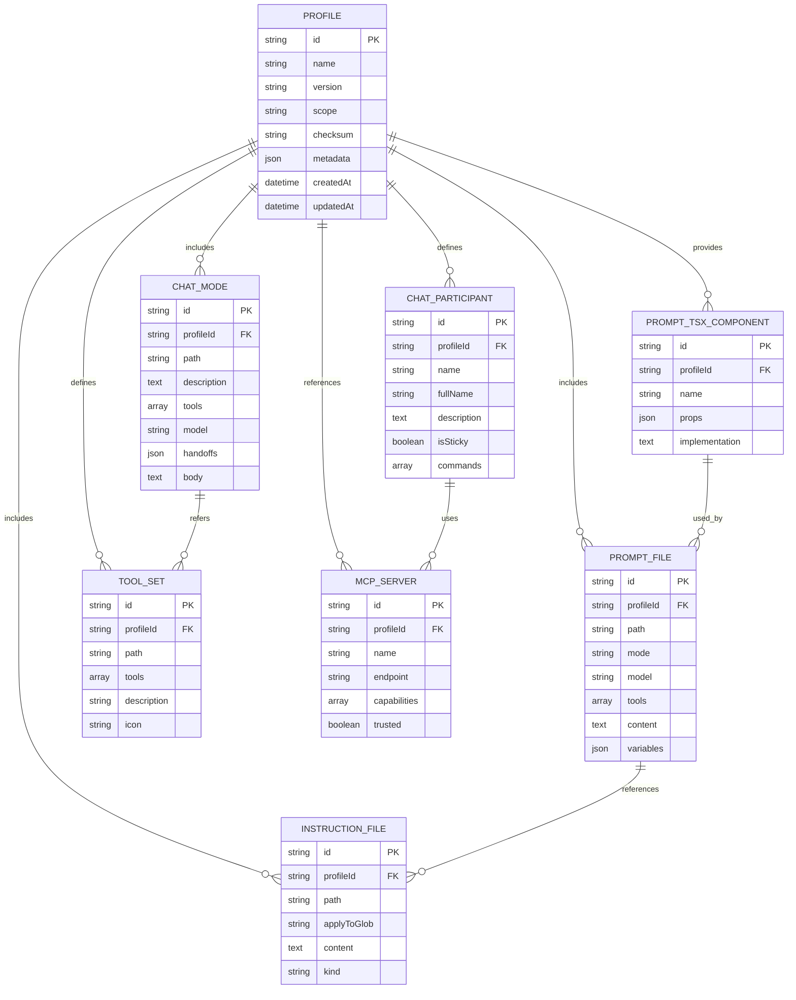

# AI System Profile Architecture Specification

## 1. Executive Summary

This specification defines a unified AI system profile architecture for VS Code that enables composable, auditable AI customization through modular artifacts. The system treats instructions, prompts, chat modes, toolsets, and MCP connectors as first-class entities that compose at runtime into orchestrated AI workflows with enforced security boundaries, token budgets, and tool access policies.

### 1.1 Value Proposition

- **Modularity**: Reusable, version-controlled AI behavior components
- **Security**: Auditable tool approvals, MCP trust boundaries, signature verification
- **Portability**: Team-wide profile distribution with consistent behavior
- **Composability**: LoRA-like adapters for role-specific AI assistants

### 1.2 Scope

- VS Code extension integration
- Workspace and user-level configuration files
- MCP server integration
- CI/CD pipeline validation
- Cross-team portability and auditing

## 2. System Architecture

### 2.1 Profile Composer Responsibilities

The Profile Composer orchestrates five core functions:

1. **Instruction Aggregation**: Merges AGENTS.md and copilot-instructions files with precedence rules
2. **Prompt Composition**: Priority-based rendering with token-aware pruning via prompt-tsx
3. **Tool Access Policy**: Enforces toolset whitelists, MCP server trust, and approval gates
4. **Chat Mode Orchestration**: Manages handoffs and workflow transitions
5. **Participant Routing**: Routes requests to specialized domain assistants

### 2.2 Entity Relationship Model



## 3. Component Specifications

### 3.1 Profile Manifest Schema

```jsonc
{
    "id": "string (required, unique, reverse-domain)",
    "name": "string (required, human-friendly)",
    "version": "string (required, semver)",
    "scope": "enum (required, user|workspace|org)",
    "description": "string (required)",
    "checksum": "string (required, sha256:...)",
    "manifestVersion": "number (required, schema version)",
    "instructions": ["array of instruction file paths"],
    "prompts": ["array of .prompt.md paths"],
    "chatModes": ["array of .chatmode.md paths"],
    "toolSets": ["array of .jsonc toolset paths"],
    "mcpServers": ["array of MCP descriptor paths"],
    "participants": ["array of participant IDs"],
    "promptTsx": ["array of TSX component paths"],
    "modelPreferences": {
        "default": "string (model ID)",
        "fallback": "string (model ID)",
        "contextWindow": "number (token limit)",
    },
    "tokenPresets": {
        "baseInstructions": "number (reserved tokens)",
        "fileContextReserve": "number (reserved tokens)",
        "recentHistoryCount": "number (message count)",
    },
    "toolPolicy": {
        "allowedToolSets": ["array of toolset IDs"],
        "requireMcpTrust": "boolean",
        "autoApproveTools": "boolean (default: false)",
    },
    "security": {
        "requireSignature": "boolean",
        "signedBy": "string (identity)",
        "allowedHosts": ["array of approved hosts"],
    },
    "audit": {
        "composerVersion": "string",
        "lastComposedAt": "ISO8601 timestamp",
        "changelog": "array of change entries",
    },
}
```

### 3.2 VS Code Feature Mapping

#### 3.2.1 Custom Instructions (AGENTS.md)

**Purpose**: Baseline policy, coding standards, persona rules

**Storage**: `INSTRUCTION_FILE` entity

**Attributes**:

- `applyToGlob`: Controls automatic scope application
- `kind`: `copilot-instructions` or `AGENTS.md`
- `content`: Markdown text

**Integration**: Profile Composer merges during preflight with precedence order

#### 3.2.2 Prompt Files (.prompt.md)

**Purpose**: Reusable task artifacts (scaffolding, reviews, generation)

**Storage**: `PROMPT_FILE` entity

**Frontmatter Schema**:

```yaml
---
mode: "ask|edit|task|agent"
model: "model-id"
tools: ["tool-id-1", "tool-id-2"]
description: "Brief description"
variables:
    - "variable-name-1"
    - "variable-name-2"
---
```

**Integration**: Runnable on demand, references instructions for consistency

#### 3.2.3 Chat Modes (.chatmode.md)

**Purpose**: Orchestrated persona + tool whitelist + handoff workflows

**Storage**: `CHAT_MODE` entity

**Handoff Schema**:

```yaml
handoffs:
    - label: "transition-name"
      target: "target-mode-id"
      autoSend: boolean
      prompt: "prefilled prompt text"
```

**Integration**: Sequential workflow transitions (Plan → Implement → Review)

#### 3.2.4 Prompt-TSX Components

**Purpose**: Runtime prompt composition with priority-based pruning

**Storage**: `PROMPT_TSX_COMPONENT` entity

**Component Props**:

- `priority`: Number (higher = kept longer during pruning)
- `flexGrow`: Token allocation weight
- `flexReserve`: Minimum reserved tokens

**Integration**: Composer assembles final LM payload with token budgeting

#### 3.2.5 MCP Servers and Tools

**Purpose**: External capability providers

**Storage**: `MCP_SERVER` and `TOOL_SET` entities

**Tool Schema**:

```jsonc
{
  "id": "tool-id",
  "type": "tool-type",
  "scope": ["scope-1", "scope-2"],
  "requiresApproval": boolean
}
```

**Integration**: Composer enforces tool whitelist, surfaces approval requirements

#### 3.2.6 Chat Participants

**Purpose**: Specialized domain assistants

**Storage**: `CHAT_PARTICIPANT` entity

**Invocation**: Via @-mention or auto-routing rules

**Integration**: May manage end-to-end handling with internal LM calls and MCP access

## 4. Implementation Guidelines

### 4.1 File Structure

```
.vscode/profiles/{profile-id}/
├── profile.jsonc                 # Manifest
├── signatures/
│   └── profile.sig.asc          # GPG signature
├── AGENTS.md                    # Persona definition
├── .github/
│   └── copilot-instructions.md  # Team instructions
├── prompts/
│   ├── generate-pr.prompt.md
│   └── arch-review.prompt.md
├── chatmodes/
│   └── architect.chatmode.md
├── toolsets/
│   └── {profile}-tools.jsonc
├── mcp/
│   └── {server}-mcp.json
└── prompttsx/
    ├── FileContext.tsx
    └── PriorityList.tsx
```

### 4.2 Example Artifacts

#### 4.2.1 AGENTS.md Fragment

```markdown
# {Project} Agent Persona

Role: Expert architecture companion; prefers idiomatic TypeScript/Rust/Python.

Priorities:

- Correctness and minimal breaking changes
- Test coverage and reproducible builds
- Security: never output secrets; suggest SOPS or env patterns
- Observability: prefer OpenTelemetry-compatible instrumentation

Constraints:

- Do not include credentials or tokens in code examples
- Flag PII and mark sensitive I/O for manual review
- Prefer existing repo patterns (Vector, OpenObserve, SOPS)
```

#### 4.2.2 Prompt File Example

```markdown
---
mode: "task"
model: "gpt-code-advanced"
tools: ["reader", "pr"]
description: "Generate PR description with changelog"
---

System: Use repository conventions (README, CHANGELOG.md). Return structured PR body with: Summary, Rationale, Breaking changes, Migration steps, Test plan, Suggested reviewers.

User: ${input:short_summary}

Context:
${FileContext}
```

#### 4.2.3 Chat Mode with Handoff

```markdown
---
id: "architect-mode"
description: "Plan -> Implement -> Review workflow"
tools: ["reader", "ci", "pr"]
handoffs:
    - label: "plan-to-implement"
      target: "implement-mode"
      autoSend: false
      prompt: "Switch to implementation mode using approved plan"
    - label: "implement-to-review"
      target: "review-mode"
      autoSend: true
      prompt: "Run CI checks and produce review checklist"
---

Persona: You are the {Project} Architect. Start by summarizing proposed architecture changes, tradeoffs, and files to modify.
```

#### 4.2.4 Toolset Definition

```jsonc
{
    "id": "project-tools",
    "description": "Toolsets for reading repo, running CI, creating PRs",
    "tools": [
        {
            "id": "reader",
            "type": "file_reader",
            "scope": ["repo"],
            "requiresApproval": false,
        },
        {
            "id": "ci",
            "type": "workflow_trigger",
            "scope": ["actions"],
            "requiresApproval": true,
        },
        {
            "id": "pr",
            "type": "pull_request_creator",
            "scope": ["github"],
            "requiresApproval": true,
        },
    ],
}
```

#### 4.2.5 Prompt-TSX Component

```tsx
export function FileContext(props: { files?: string[]; maxFiles?: number; priority?: number }) {
    const list = (props.files || []).slice(0, props.maxFiles || 10);
    return `Repository context (top files):\n${list.map((f) => `- ${f}`).join("\n")}\n`;
}
```

### 4.3 Security Requirements

#### 4.3.1 Critical Rules

1. **Never modify** `.vscode/settings.json` or `.vscode/tasks.json` without explicit confirmation
    - Risk: Can enable `chat.tools.autoApprove` → Remote Code Execution
2. **Always sanitize inputs** - Never interpolate untrusted data into shell/SQL
3. **Use SOPS for secrets** - Never commit plaintext credentials
4. **Validate at boundaries** - Use type guards at I/O points
5. **Respect workspace trust** - Don't execute code in untrusted folders

#### 4.3.2 Tool Approval Policy

- Tool invocations require user approval by default
- `autoApproveTools: false` enforced in production profiles
- CI runners with auto-approve must have strict audit logging
- Preflight step requests workspace-level approvals

#### 4.3.3 MCP Trust Model

- MCP servers must be explicitly marked `trusted: true`
- Profile manifest requires `requireMcpTrust: true`
- Untrusted servers blocked during composition
- Trust decisions logged for audit

## 5. CI/CD Integration

### 5.1 Validation Pipeline

```yaml
# Required CI checks
- Lint profile manifest against JSON schema
- Validate frontmatter in .prompt.md and .chatmode.md files
- Compute and verify checksum
- Scan for secrets (regex patterns for keys, tokens)
- Dry-run composer to generate token budget report
- Verify GPG signature
```

### 5.2 Signing Process

```bash
# Compute checksum
sha256sum profile.jsonc instructions/* prompts/* > CHECKSUM.txt

# Sign checksum
gpg --detach-sign --armor CHECKSUM.txt -o signatures/profile.sig.asc

# Verify signature
gpg --verify signatures/profile.sig.asc CHECKSUM.txt
```

### 5.3 Publishing Workflow

1. Tag profile with semver version
2. Generate checksum for all tracked files
3. Sign checksum with authorized GPG key
4. Validate signature in CI
5. Publish to internal registry (GitHub Packages, S3)
6. Update changelog and audit metadata

## 6. Token Budget Management

### 6.1 Budget Allocation

```jsonc
{
    "tokenPresets": {
        "baseInstructions": 400, // Fixed persona/instructions
        "fileContextReserve": 2400, // Flexible file content
        "recentHistoryCount": 3, // Message history
    },
}
```

### 6.2 Pruning Strategy

1. Calculate initial token requirements for all components
2. If total exceeds `contextWindow`, apply priority-based pruning:
    - Sort components by `priority` (descending)
    - Remove lowest-priority components until budget met
    - Honor `flexReserve` minimums
    - Preserve `baseInstructions` always

### 6.3 Token Estimation

```javascript
// Naive estimation: 1 token ≈ 4 characters
function estimateTokens(text) {
    return Math.ceil((text.length || 0) / 4);
}
```

## 7. Implementation Roadmap

### Phase 1: Prototype (1-2 sprints)

**Deliverables**:

- Profile manifest schema definition
- 2 sample profiles (planner, reviewer)
- Local Profile Composer (instruction merge, toolset resolution)
- Token preview and pruning logs (no execution)

**Success Criteria**:

- Valid manifest validates against schema
- Composer produces readable token budget report
- Pruning simulation shows expected behavior

### Phase 2: Integration (2-3 sprints)

**Deliverables**:

- VS Code extension integration
- Profile picker UI
- Preflight approval flow (tools/MCP)
- Model selection and prompt execution

**Success Criteria**:

- Extension loads profile from workspace
- Tool approvals gate execution
- Prompts render with token budgeting
- Chat modes activate with handoffs

### Phase 3: Production Hardening (2 sprints)

**Deliverables**:

- CI signing pipeline
- Policy enforcement (MCP trust, tool whitelist)
- Audit trail logging
- Profile registry and templates

**Success Criteria**:

- Signatures required and verified
- Unauthorized tools/MCP blocked
- Audit logs capture all tool invocations
- Org-wide standard profiles available

## 8. VibesPro-Specific Implementation

### 8.1 Project Context

- **Repository**: GodSpeedAI/VibesPro
- **Type**: Copier template for Nx monorepos
- **Stack**: TypeScript, Rust, Python
- **Observability**: OpenObserve, Vector, Logfire
- **Secrets**: SOPS-encrypted
- **Build**: Devbox, mise, Just

### 8.2 Profile Layout

```
.vscode/profiles/vibespro-ai/
├── profile.jsonc
├── signatures/
│   └── profile.sig.asc
├── AGENTS.md
├── .github/
│   └── copilot-instructions.md
├── prompts/
│   ├── generate-pr.prompt.md
│   └── arch-review.prompt.md
├── chatmodes/
│   └── architect.chatmode.md
├── toolsets/
│   └── vibespro-tools.jsonc
├── mcp/
│   └── github-mcp.json
├── prompttsx/
│   ├── FileContext.tsx
│   └── PriorityList.tsx
└── scripts/
    └── compose-profile.js
```

### 8.3 Integration Points

**Existing VibesPro Assets**:

- `.mcp.json` - MCP server configurations
- `AGENTS.md` / `AGENT-SYSTEM.md` - Current persona definitions
- `.github/instructions/*.instructions.md` - Modular guidance
- `.github/prompts/*.prompt.md` - Reusable prompts
- `docs/` - Specification documents

**Integration Strategy**:

1. Reference existing `.mcp.json` for MCP server configuration
2. Migrate relevant content from `AGENTS.md` to profile
3. Convert existing prompts to profile format with frontmatter
4. Link to existing specs in profile metadata

### 8.4 Security Alignment

**VibesPro Security Posture**:

- SOPS for secret management (`.secrets.env.sops`)
- No plaintext credentials committed
- Environment variable injection via `sops exec-env`
- Age encryption key in `~/.config/sops/age/keys.txt`

**Profile Security Requirements**:

- Refuse to output secrets in generated code
- Suggest SOPS/ENV patterns when credentials needed
- Flag PII and sensitive I/O for review
- Respect workspace trust boundaries

## 9. Quality Gates

### 9.1 Acceptance Criteria

- [ ] Profile manifest validates against schema
- [ ] All frontmatter validates (prompts, chat modes)
- [ ] Checksum matches computed value
- [ ] Signature verifies with authorized key
- [ ] No secrets detected in artifact scan
- [ ] Token budget report generated successfully
- [ ] Toolset references resolve correctly
- [ ] MCP servers marked with trust status
- [ ] Dry-run composition completes without errors

### 9.2 Continuous Validation

```bash
# Local validation
just ai-validate

# Profile-specific checks
node scripts/compose-profile.js .vscode/profiles/vibespro-ai

# CI pipeline
- Manifest schema validation
- Frontmatter validation
- Secret scanning
- Signature verification
- Token budget dry-run
```

## 10. References

### 10.1 VS Code Documentation

- [Prompt Files](https://code.visualstudio.com/docs/copilot/prompt-files)
- [Custom Chat Modes](https://code.visualstudio.com/docs/copilot/chat-modes)
- [Chat Participants API](https://code.visualstudio.com/api/extension-guides/chat)
- [MCP Integration](https://modelcontextprotocol.io/)

### 10.2 Related Specifications

- `DEV-PRD-018`: Logfire Integration
- `DEV-SDS-005`: Observability Architecture
- `DEV-SPEC-003`: Build/Lint Tasks
- `DEV-SPEC-006`: CI Security Posture

### 10.3 Repository Documents

- `.github/instructions/ai-workflows.constitution.instructions.md`
- `.github/instructions/security.instructions.md`
- `.github/copilot-instructions.md`
- `docs/ENVIRONMENT.md`
- `temporal_db/README.md`

## Appendix A: Complete Profile Example

See `docs/examples/vibespro-ai-profile/` for a complete, ready-to-use profile implementation with all artifacts.

## Appendix B: Composer Implementation

See `tools/profile-composer/` for the Node.js Profile Composer implementation with token budgeting, signature verification, and dry-run capabilities.

## Appendix C: CI Pipeline Template

See `.github/workflows/profile-validation.yml` for the complete GitHub Actions workflow template.
