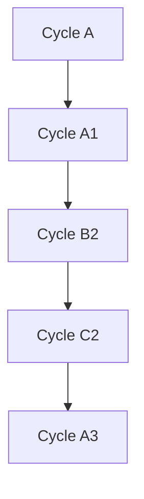
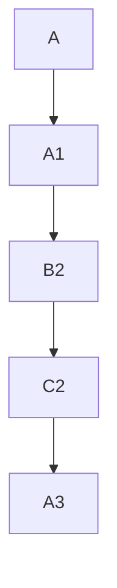

# 🧭 AI Implementation Plan Template

**Status:** <Status e.g., Draft / Ready for Execution>
**Revision Date:** <Date>
**Aligned With:** <Reference Documents / Specifications>

---

## 1. Objectives and Context

Define the scope, purpose, and intent of this AI-driven implementation cycle.
Emphasize traceability, reproducibility, and auditability of each automated or agent-driven step.

-   Ensure compliance with <specs / standards>
-   Maintain transparent validation logs and audit trails
-   Achieve deterministic, isolated test and deployment behavior

**Key considerations:**

-   <List specific auditability or traceability requirements>
-   <Add controls for deterministic outcomes>
-   <Reference relevant governance or validation standards>

---

## 2. Global Parallelization & Dependencies Overview

### Parallelization Matrix

| Component      | Can Run Parallel With | Shared Artifacts / Risks | Coordination Notes      |
| -------------- | --------------------- | ------------------------ | ----------------------- |
| <Phase_1_Name> | <Phase_2_Name>        | <Shared dependencies>    | <Coordination details>  |
| <Cycle_A>      | <Cycle_B>             | <Shared data or models>  | <Sync or audit trigger> |

### High-Level Dependency Map



Use the diagram to represent inter-phase and inter-cycle dependencies. Extend as needed.

---

## 3. Global Dependencies Table

| Dependency Type | Depends On    | Description / Rationale | Resolution Trigger         |
| --------------- | ------------- | ----------------------- | -------------------------- |
| Upstream Phase  | <Phase_Name>  | <Reason for dependency> | <Condition for completion> |
| Cross-Cycle     | <Cycle_Name>  | <Why dependency exists> | <Trigger event>            |
| External        | <System/Team> | <Dependency context>    | <When ready signal>        |

---

## 4. Phases Overview (MECE)

Each phase includes **concise, auditable cycles** (A, B, C, A1, B2, C2, etc.). Each cycle must end with an AI-generated status update marking completion and providing evidence.

### Phase <#>: <Phase_Name>

**Objective:** <Phase objective summary>
**Coordinator (if applicable):** <Lead or Supervising Agent>
**Traceability Goal:** <Define measurable traceable outcomes>

#### ✅ Phase Checklist

-   [ ] Define objectives and dependencies — _Updated By:_ <Agent / Date>
-   [ ] Initialize all cycles — _Updated By:_ <Agent / Date>
-   [ ] Execute all cycles — _Updated By:_ <Agent / Date>
-   [ ] Validate and archive artifacts — _Updated By:_ <Agent / Date>
-   [ ] **Mark Phase as Complete** once all cycles are GREEN and evidence is verified.

> Upon completion, the responsible AI agent must update this checklist to mark all finished items and log evidence paths in Section 9.

#### Cycle Summary Table

| Cycle Label | Owner Agent | Branch / Task      | Depends On | Can Run Parallel With | Audit Artifacts               |
| ----------- | ----------- | ------------------ | ---------- | --------------------- | ----------------------------- |
| A           | Agent A     | `feature/<branch>` | None       | B                     | Log trace + PR link           |
| A1          | Agent A     | `feature/<branch>` | A          | C                     | Test report + validation log  |
| B2          | Agent B     | `feature/<branch>` | A1         | None                  | Structured pytest output      |
| C2          | Agent C     | `feature/<branch>` | B2         | A3                    | Docs lint log + matrix update |
| A3          | Agent A     | `feature/<branch>` | C2         | None                  | Regression summary            |

#### Example Visualization



---

### Cycle <Cycle_Label> — <Cycle_Name>

**Owner Agent:** <Name>
**Branch / Task ID:** `<branch>`
**Upstream Dependency:** <Cycle or Phase>
**Parallel With:** <Other Cycles>

#### ✅ Cycle Checklist

-   [ ] RED Phase tests defined — _Updated By:_ <Agent / Date>
-   [ ] GREEN Phase implementation done — _Updated By:_ <Agent / Date>
-   [ ] Verification executed — _Updated By:_ <Agent / Date>
-   [ ] Evidence captured and stored — _Updated By:_ <Agent / Date>
-   [ ] **Mark Cycle as Complete** after validation passes and artifacts logged.

> Upon completion, the AI agent performing this cycle must update these checkboxes and include log and report paths in Section 9.

#### RED Phase

-   <List expected failing tests or preconditions>
-   <Identify baseline audit checkpoints>

```python
from <module> import <reset_function>
<reset_function>()
```

#### GREEN Phase

-   <Describe deterministic actions or updates>
-   <Implementation or fix summary>

#### Verification & Evidence Capture

```bash
pytest -v --maxfail=1 --disable-warnings
just validate
```

**Artifacts to Store:**

-   Logs (`/logs/<cycle_label>.txt`)
-   Validation outputs (`/reports/<cycle_label>_report.json`)
-   CI metadata or summary (`/ci/<cycle_label>_run.log`)

Label → **<Cycle_Label>-GREEN**

---

## 5. Regression & Validation Safeguards

| Category      | Command                            | Purpose                     | Evidence Collected         |
| ------------- | ---------------------------------- | --------------------------- | -------------------------- |
| Unit Tests    | `pytest tests`                     | Verify component coverage   | `pytest.log`               |
| Integration   | `bash scripts/test_integration.sh` | Validate interfaces         | `integration_results.json` |
| Docs          | `just docs-lint`                   | Ensure docs alignment       | `docs_lint.log`            |
| CI Validation | `just ai-validate`                 | Aggregate validation checks | `ai_validate.log`          |

---

## 6. Risk & Rollback

| Risk                   | Trigger             | Mitigation / Rollback | Evidence to Retain    |
| ---------------------- | ------------------- | --------------------- | --------------------- |
| <Potential risk>       | <Trigger condition> | <Mitigation strategy> | <Rollback log + diff> |
| <Cross-agent conflict> | <Dependency issue>  | <Rollback steps>      | <Conflict trace>      |

Rollback: revert to last GREEN merge or isolate affected agent cycle. Store rollback logs for audit review.

---

## 7. Deliverables & Evidence Tracking

| Deliverable            | Evidence Required                 | Collected By Agent |
| ---------------------- | --------------------------------- | ------------------ |
| <Deliverable item>     | <File path or artifact reference> | <Agent Name>       |
| <Documentation Update> | <Lint or validation report>       | <Agent Name>       |

---

## 8. Validation Checklist

Each item must have auditable evidence before being marked complete.

-   [ ] <Feature> — **Agent:** <Name>, **Depends On:** <Cycle/Phase>, **Evidence:** <Link or File Path>
-   [ ] <Integration> — **Agent:** <Name>, **Depends On:** <Cycle/Phase>, **Evidence:** <Link or File Path>
-   [ ] <Docs> — **Agent:** <Name>, **Depends On:** <Cycle/Phase>, **Evidence:** <Link or File Path>

---

## 9. Audit Trail Reference

Document the locations and identifiers of all relevant audit data.

| Artifact Type      | Location                             | Retention Policy |
| ------------------ | ------------------------------------ | ---------------- |
| Logs               | `/logs/<cycle_label>.txt`            | 90 days          |
| Validation Reports | `/reports/<cycle_label>_report.json` | 1 year           |
| CI Metadata        | `/ci/<cycle_label>_run.log`          | 6 months         |
| Rollback Logs      | `/rollback/<cycle_label>.diff`       | Until next GREEN |

---

## 10. Summary

Summarize verifiable outcomes, audit integrity, and traceability assurance.

> Example:
> This plan defines an auditable AI implementation workflow structured around concise, traceable cycles (A, A1, B2, etc.). Each cycle generates discrete evidence artifacts ensuring transparency, compliance, and reproducibility of every autonomous agent action. AI agents are required to mark progress via embedded checklists for real-time audit readiness.
