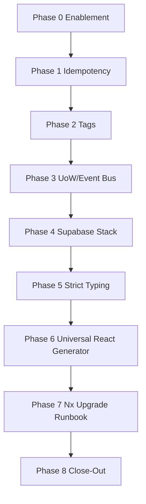
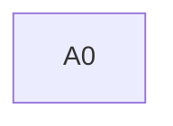

# 🧭 AI Implementation Plan — HexDDD Alignment

**Status:** Draft  
**Revision Date:** 2025-11-08  
**Aligned With:** DEV-ADR-023‒029, DEV-PRD-024‒031, DEV-SDS-023‒030, HexDDD ADR/PRD/SDS (React + FastAPI template)

---

## 1. Objectives and Context

Deliver additive enhancements to VibesPro so generated projects inherit HexDDD’s proven patterns (idempotent generators, Supabase-driven types, UoW/Event Bus seams, strict typing, universal React scaffolding, Nx upgrade discipline).

-   Ensure compliance with new VibesPro specs and HexDDD reference behaviors.
-   Maintain deterministic generator outputs via double-run regression testing.
-   Provide reproducible Supabase environment automation and strict typing gates.

**Key considerations:**

-   Full traceability from ADR/PRD/SDS to implementation artifacts.
-   Feature-flagged rollout for strict typing and Supabase CI stack to prevent regressions.
-   Audit-ready evidence for each cycle (tests, logs, documentation updates).

---

## 2. Global Parallelization & Dependencies Overview

### Parallelization Matrix

| Component                           | Can Run Parallel With | Shared Artifacts / Risks       | Coordination Notes                                              |
| ----------------------------------- | --------------------- | ------------------------------ | --------------------------------------------------------------- |
| Phase 1 – Generator Idempotency     | Phase 2 (partial)     | Generator templates/tests      | Complete helper library before enforcing lint rules             |
| Phase 2 – Nx Tag Enforcement        | Phase 5 (prep)        | `project.json` updates         | Tag rollout must precede strict lint to avoid mass failures     |
| Phase 3 – UoW/Event Bus             | Phase 6 (partial)     | Domain generator scaffolds     | Coordinate template changes to avoid merge conflicts            |
| Phase 4 – Supabase Stack            | Phase 5 (gating)      | Supabase env templates         | CI job optional until strict typing stabilized                  |
| Phase 5 – Strict Typing & Type Sync | Phase 6 (blocked)     | Shared libraries, CI workflows | Strict mode should land before universal generator finalization |
| Phase 6 – Universal React Generator | Phase 7               | Shared shared/web assets       | Keep legacy generators until new one validated                  |

### High-Level Dependency Map

---

## 3. Global Dependencies Table

| Dependency Type | Depends On        | Description / Rationale                                                   | Resolution Trigger                                   |
| --------------- | ----------------- | ------------------------------------------------------------------------- | ---------------------------------------------------- |
| Upstream Phase  | Phase 1           | Idempotency helpers required before enforcing generator changes elsewhere | All generator tests pass with double-run checks      |
| Upstream Phase  | Phase 2           | Tag taxonomy needed before strict linting and generator enhancements      | Lint rule dry-run shows manageable violations        |
| Cross-Phase     | Phase 4           | Supabase automation feeds type sync pipeline                              | Supabase Nx targets operational and documented       |
| Cross-Phase     | Phase 5           | Strict typing prerequisites for universal generator                       | TypeScript/mypy strict suites green on main branch   |
| External        | CI Infrastructure | Docker & Supabase availability in CI                                      | Successful Supabase stack smoke test in optional job |

---

## 4. Phases Overview (MECE)

### Phase 0: Enablement & Traceability

**Objective:** Establish intelligence baseline, traceability matrix, stakeholder alignment.  
**Coordinator:** Codex  
**Traceability Goal:** PRE_PLAN_INTELLIGENCE.md complete; mapping from specs to tasks captured.

#### ✅ Phase Checklist

-   [ ] Define objectives and dependencies — _Updated By:_ Codex / YYYY-MM-DD
-   [ ] Initialize all cycles — _Updated By:_ Codex / YYYY-MM-DD
-   [ ] Execute all cycles — _Updated By:_ Codex / YYYY-MM-DD
-   [ ] Validate and archive artifacts — _Updated By:_ Codex / YYYY-MM-DD
-   [ ] **Mark Phase as Complete** once intelligence log and traceability map approved.

| Cycle Label | Owner Agent | Branch / Task               | Depends On | Can Run Parallel With | Audit Artifacts                                        |
| ----------- | ----------- | --------------------------- | ---------- | --------------------- | ------------------------------------------------------ |
| A0          | Codex       | `planning/hexddd-alignment` | None       | —                     | `docs/plans/hexddd_alignment/PRE_PLAN_INTELLIGENCE.md` |

---

### Phase 1: Generator Idempotency Framework

**Objective:** Enforce deterministic generator output with shared helpers/tests.  
**Coordinator:** Codex (Generators)  
**Traceability Goal:** DEV-ADR-023, DEV-PRD-024, DEV-SDS-023 satisfied with automated regression checks.

| Cycle Label | Owner Agent | Branch / Task                        | Depends On | Parallel | Audit Artifacts                   |
| ----------- | ----------- | ------------------------------------ | ---------- | -------- | --------------------------------- |
| A1          | Codex       | `feature/generator-idempotency`      | A0         | —        | Jest + shellspec logs, CI updates |
| B1          | Codex       | `feature/generator-idempotency-docs` | A1         | —        | Updated docs, lint logs           |

_(Similar detail should be expanded for checklists, RED/GREEN steps, evidence paths when executing.)_

---

### Phase 2: Nx Tag Enforcement

**Objective:** Apply tag taxonomy and lint enforcement per DEV-ADR-025 / DEV-PRD-025 / DEV-SDS-024.  
**Coordinator:** Codex  
**Traceability Goal:** All projects tagged; lint rule active after remediation.

| Cycle Label | Owner Agent | Branch / Task              | Depends On | Parallel     | Audit Artifacts             |
| ----------- | ----------- | -------------------------- | ---------- | ------------ | --------------------------- |
| A2          | Codex       | `feature/tag-taxonomy`     | A1         | Phase 3 prep | Tag diff, lint dry-run logs |
| B2          | Codex       | `feature/tag-lint-enforce` | A2         | —            | Lint config PR, CI evidence |

---

### Phase 3: UoW & Event Bus Scaffolding

**Objective:** Extend generators with domain abstractions; align with DEV-ADR-024 / DEV-PRD-026 / DEV-SDS-025.  
**Coordinator:** Codex  
**Traceability Goal:** Generated projects include UoW/Event Bus contracts, in-memory adapters, sample wiring.

| Cycle Label | Owner Agent | Branch / Task                    | Depends On | Parallel     | Audit Artifacts                    |
| ----------- | ----------- | -------------------------------- | ---------- | ------------ | ---------------------------------- |
| A3          | Codex       | `feature/uow-eventbus-generator` | A2         | Phase 6 prep | Generated fixture diffs, test logs |
| B3          | Codex       | `feature/uow-eventbus-docs`      | A3         | —            | Docs updates, traceability matrix  |

---

### Phase 4: Supabase Dev Stack Automation

**Objective:** Deliver Nx run-commands, Docker compose, CI integration (DEV-ADR-026 / DEV-PRD-027 / DEV-SDS-026).  
**Coordinator:** Codex  
**Traceability Goal:** Developers can start/stop/reset Supabase stack via Nx; optional CI smoke test operational.

| Cycle Label | Owner Agent | Branch / Task               | Depends On | Parallel       | Audit Artifacts                         |
| ----------- | ----------- | --------------------------- | ---------- | -------------- | --------------------------------------- |
| A4          | Codex       | `feature/supabase-nx-stack` | A3         | Phase 5 (prep) | Shellspec logs, compose files           |
| B4          | Codex       | `feature/supabase-docs`     | A4         | —              | Updated ENV docs, CI config screenshots |

---

### Phase 5: Strict Typing & Type Sync Pipeline

**Objective:** Enforce TypeScript/mypy strict modes, automated type regeneration (DEV-ADR-029 / DEV-PRD-030 / DEV-SDS-029‒030).  
**Coordinator:** Codex  
**Traceability Goal:** CI fails on type drift or `any` usage; workflows regenerate types deterministically.

| Cycle Label | Owner Agent | Branch / Task          | Depends On | Parallel | Audit Artifacts               |
| ----------- | ----------- | ---------------------- | ---------- | -------- | ----------------------------- |
| A5          | Codex       | `feature/strict-types` | A4         | —        | TS/mypy config diffs, CI logs |
| B5          | Codex       | `feature/type-sync-ci` | A5         | —        | Workflow logs, hook scripts   |

---

### Phase 6: Universal React Generator

**Objective:** Create single generator for Next/Remix/Expo sharing typed clients (DEV-ADR-028 / DEV-PRD-029 / DEV-SDS-028).  
**Coordinator:** Codex  
**Traceability Goal:** Generator validated with e2e fixtures and idempotency tests; documentation updated.

| Cycle Label | Owner Agent | Branch / Task                       | Depends On | Parallel | Audit Artifacts               |
| ----------- | ----------- | ----------------------------------- | ---------- | -------- | ----------------------------- |
| A6          | Codex       | `feature/universal-react-generator` | A5         | Phase 7  | Fixture builds, e2e logs      |
| B6          | Codex       | `feature/universal-react-docs`      | A6         | —        | README updates, sample output |

---

### Phase 7: Nx Upgrade Cadence

**Objective:** Establish upgrade runbook and automation (DEV-ADR-027 / DEV-PRD-028 / DEV-SDS-027).  
**Coordinator:** Codex  
**Traceability Goal:** Documented procedure executed in pilot upgrade; reminders automated.

| Cycle Label | Owner Agent | Branch / Task                | Depends On | Parallel     | Audit Artifacts               |
| ----------- | ----------- | ---------------------------- | ---------- | ------------ | ----------------------------- |
| A7          | Codex       | `feature/nx-upgrade-runbook` | A6         | Phase 8 prep | Runbook doc, pilot upgrade PR |

---

### Phase 8: Close-Out & Traceability Update

**Objective:** Update traceability matrix, capture lessons learned, ensure audit readiness.  
**Coordinator:** Codex  
**Traceability Goal:** Every spec mapped to code/tests/docs; memory (when available) updated.

| Cycle Label | Owner Agent | Branch / Task             | Depends On | Parallel | Audit Artifacts                               |
| ----------- | ----------- | ------------------------- | ---------- | -------- | --------------------------------------------- |
| A8          | Codex       | `feature/hexddd-closeout` | A7         | —        | Traceability matrix diff, retrospective notes |

---

## 5. Regression & Validation Safeguards

| Category        | Command                                                       | Purpose                                              | Evidence Collected                           |
| --------------- | ------------------------------------------------------------- | ---------------------------------------------------- | -------------------------------------------- |
| Generator Tests | `pnpm jest tests/generators`                                  | Validate generator logic + idempotency               | `reports/generators_jest.log`                |
| ShellSpec       | `pnpm shellspec tests/shell`                                  | Verify CLI workflows (Supabase stack, generator e2e) | `reports/shellspec.log`                      |
| Workspace Lint  | `pnpm exec nx lint --all`                                     | Enforce tag-based boundaries                         | `reports/nx_lint.log`                        |
| Type Safety     | `pnpm tsc --noEmit` / `uv run mypy --strict`                  | Ensure strict typing compliance                      | `reports/typescript.log`, `reports/mypy.log` |
| Supabase Smoke  | `nx run tools-supabase:supabase-devstack:start` (CI optional) | Confirm environment orchestration                    | `reports/supabase_smoke.log`                 |
| Quality Gate    | `just spec-guard`                                             | Aggregate validation and docs checks                 | `reports/spec_guard.log`                     |

---

## 6. Risk & Rollback

| Risk                                  | Trigger                               | Mitigation / Rollback                                                              | Evidence to Retain                      |
| ------------------------------------- | ------------------------------------- | ---------------------------------------------------------------------------------- | --------------------------------------- |
| Strict typing blocks pipelines        | Numerous build failures post-toggle   | Use feature flag branch; provide remediation guide; rollback config via git revert | `rollback/strict-mode.diff`             |
| Supabase stack instability in CI      | Timeouts or resource exhaustion       | Keep job optional; document manual validation; add backoff retries                 | `logs/supabase_failure.log`             |
| Legacy generators fail idempotency    | Double-run test fails on initial pass | Queue fixes per generator; allow temporary ignore list with expiry                 | `reports/idempotency_failures.json`     |
| Universal generator adoption friction | Teams still using legacy scripts      | Maintain legacy commands, provide migration doc, gather feedback                   | `docs/migration_universal_generator.md` |

Rollback strategy: revert to previous GREEN merge or disable new workflow via `just` toggles; capture diff + validation logs.

---

## 7. Deliverables & Evidence Tracking

| Deliverable                 | Evidence Required                          | Collected By Agent |
| --------------------------- | ------------------------------------------ | ------------------ |
| Generator Idempotency Suite | Jest + shellspec reports, CI run link      | Codex              |
| Nx Tag Enforcement          | Lint configuration diff, passing lint logs | Codex              |
| UoW/Event Bus Templates     | Generated fixture diff, template tests     | Codex              |
| Supabase Nx Targets         | Shellspec smoke log, docs update           | Codex              |
| Strict Typing Pipeline      | CI logs, hook scripts, documentation       | Codex              |
| Universal React Generator   | E2E test logs, README updates              | Codex              |
| Nx Upgrade Runbook          | Runbook doc, pilot PR summary              | Codex              |
| Traceability Matrix Update  | Updated matrix, retrospective notes        | Codex              |

---

## 8. Validation Checklist

-   [ ] Generator idempotency tooling shipped — **Agent:** Codex, **Depends On:** Phase 1, **Evidence:** `reports/generators_jest.log`
-   [ ] Nx tag enforcement active — **Agent:** Codex, **Depends On:** Phase 2, **Evidence:** `reports/nx_lint.log`
-   [ ] UoW/Event Bus scaffolding validated — **Agent:** Codex, **Depends On:** Phase 3, **Evidence:** Fixture test logs
-   [ ] Supabase stack automation operational — **Agent:** Codex, **Depends On:** Phase 4, **Evidence:** `reports/supabase_smoke.log`
-   [ ] Strict typing & type sync pipelines enforced — **Agent:** Codex, **Depends On:** Phase 5, **Evidence:** `reports/typescript.log`, `reports/mypy.log`
-   [ ] Universal React generator e2e tests passing — **Agent:** Codex, **Depends On:** Phase 6, **Evidence:** `reports/universal_generator.log`
-   [ ] Nx upgrade runbook published — **Agent:** Codex, **Depends On:** Phase 7, **Evidence:** `docs/runbooks/nx_upgrade.md`
-   [ ] Traceability matrix updated — **Agent:** Codex, **Depends On:** Phase 8, **Evidence:** `docs/traceability_matrix.md`

---

## 9. Audit Trail Reference

| Artifact Type       | Location                                     | Retention Policy                       |
| ------------------- | -------------------------------------------- | -------------------------------------- |
| Generator Logs      | `reports/generators_jest.log`                | 180 days                               |
| ShellSpec Results   | `reports/shellspec.log`                      | 180 days                               |
| Type Reports        | `reports/typescript.log`, `reports/mypy.log` | 1 year                                 |
| Supabase Smoke Logs | `reports/supabase_smoke.log`                 | 90 days                                |
| CI Metadata         | `.github/workflows/*` run artifacts          | Per org policy                         |
| Traceability Matrix | `docs/traceability_matrix.md`                | Permanent                              |
| Rollback Diffs      | `rollback/*.diff`                            | Until superseded by next GREEN release |

---

## 10. Summary

This plan operationalizes HexDDD-aligned specifications through eight auditable phases covering generator determinism, architectural boundaries, domain abstractions, Supabase automation, strict typing, universal React scaffolding, upgrade governance, and traceability closure. Each cycle produces evidence artifacts and checklists to maintain compliance, reproducibility, and readiness for automated or human review.
