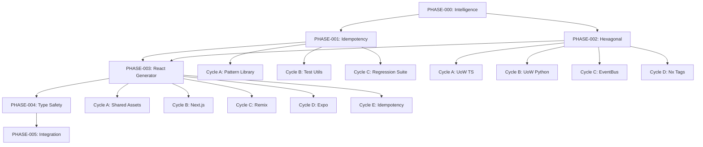

# 🏗️ HexDDD Integration Master Plan

**Status:** Ready for Execution  
**Revision Date:** 2025-11-05  
**Aligned With:** DEV-ADR-023-029, DEV-PRD-024-031, DEV-SDS-023-030

---

## 📋 Executive Summary

This master plan orchestrates the complete integration of hexagonal architecture patterns from [HexDDD](https://github.com/GodSpeedAI/HexDDD) into the VibesPro template repository. The implementation satisfies 7 ADRs, 8 PRDs, and 8 SDSs focused on:

-   ✅ **Generator Idempotency** (DEV-ADR-023, DEV-PRD-024, DEV-SDS-023)
-   ✅ **Hexagonal Boundaries** (DEV-ADR-024, DEV-ADR-025, DEV-PRD-025, DEV-PRD-026, DEV-SDS-024, DEV-SDS-025)
-   ✅ **Supabase Integration** (DEV-ADR-026, DEV-PRD-027, DEV-SDS-026)
-   ✅ **Nx Upgrade Strategy** (DEV-ADR-027, DEV-PRD-028, DEV-SDS-027)
-   ✅ **Universal React Generator** (DEV-ADR-028, DEV-PRD-029, DEV-SDS-028)
-   ✅ **Strict Typing** (DEV-ADR-029, DEV-PRD-030, DEV-PRD-031, DEV-SDS-029, DEV-SDS-030)

---

## 🎯 Objectives and Context

### Primary Goals

1. **Architectural Integrity**: Enforce hexagonal architecture through automated tooling and generators
2. **Type Safety**: Achieve 100% type coverage across TypeScript and Python
3. **Developer Experience**: Provide idempotent, composable generators that scaffold correct-by-construction code
4. **CI/CD Reliability**: Automated type sync and boundary validation in every PR
5. **HexDDD Alignment**: Maintain pattern parity with the reference implementation

### Success Criteria

| Metric                 | Target                                      | Validation Method          |
| ---------------------- | ------------------------------------------- | -------------------------- |
| Generator Idempotency  | 100% (all generators pass double-run tests) | `just test-generators`     |
| Type Coverage (TS)     | 100% (strict mode, zero `any`)              | `pnpm tsc --noEmit`        |
| Type Coverage (Python) | ≥95% (mypy strict)                          | `uv run mypy --strict`     |
| Boundary Violations    | 0 (Nx enforce-module-boundaries)            | `pnpm nx run-many -t lint` |
| Test Pass Rate         | 100% (all unit + integration tests)         | `pnpm nx run-many -t test` |
| Documentation Coverage | All generators + workflows documented       | Manual review              |

### Traceability Goal

Every code change maps to at least one spec ID (ADR/PRD/SDS). Traceability matrix updated in PHASE-005.

---

## 🗺️ Phase Overview

### Phase Structure

Each phase is documented in its own file for AI agent and human consumption:

| Phase         | Document                                                                           | Duration | Parallelization | Critical Path | MVP    |
| ------------- | ---------------------------------------------------------------------------------- | -------- | --------------- | ------------- | ------ |
| **PHASE-000** | [PRE_PLAN_INTELLIGENCE.md](./PHASE-000-PRE_PLAN_INTELLIGENCE.md)                   | 2-3h     | 1 task          | ❌ No         | ✅ Yes |
| **PHASE-001** | [PHASE-001-GENERATOR_IDEMPOTENCY.md](./PHASE-001-GENERATOR_IDEMPOTENCY.md)         | 6-8h     | 3 cycles        | ✅ Yes        | ✅ Yes |
| **PHASE-002** | [PHASE-002-HEXAGONAL_FOUNDATIONS.md](./PHASE-002-HEXAGONAL_FOUNDATIONS.md)         | 8-10h    | 4 cycles        | ✅ Yes        | ✅ Yes |
| **PHASE-003** | [PHASE-003-UNIVERSAL_REACT_GENERATOR.md](./PHASE-003-UNIVERSAL_REACT_GENERATOR.md) | 10-12h   | 5 cycles        | ✅ Yes        | ✅ Yes |
| **PHASE-004** | [PHASE-004-TYPE_SAFETY_CI.md](./PHASE-004-TYPE_SAFETY_CI.md)                       | 6-8h     | 4 cycles        | ✅ Yes        | ✅ Yes |
| **PHASE-005** | [PHASE-005-INTEGRATION_DOCS.md](./PHASE-005-INTEGRATION_DOCS.md)                   | 4-6h     | All parallel    | ❌ No         | ✅ Yes |

**Total Estimated Duration**: 36-47 hours (with optimal parallelization: 18-24 hours)

---

## 🔄 Global Parallelization & Dependencies

### Parallelization Matrix

| Component                     | Can Run Parallel With      | Shared Artifacts / Risks                     | Coordination Notes                 |
| ----------------------------- | -------------------------- | -------------------------------------------- | ---------------------------------- |
| PHASE-000                     | None (must complete first) | All downstream phases depend on intelligence | Blocking phase                     |
| PHASE-001 (Cycles A, B, C)    | All cycles within phase    | Test utilities shared                        | Merge order: A → B → C             |
| PHASE-002 (Cycles A, B, C, D) | A ∥ B, C ∥ D               | UoW/EventBus contracts                       | A+B before C+D                     |
| PHASE-003 (Cycles A-E)        | A ∥ B ∥ C, D ∥ E           | Shared web assets                            | Framework implementations parallel |
| PHASE-004 (Cycles A-D)        | A ∥ B, C ∥ D               | CI workflows                                 | Type configs before CI integration |
| PHASE-005 (All cycles)        | All parallel               | Documentation only                           | No code conflicts                  |

### High-Level Dependency Map



---

## 📊 Global Dependencies Table

| Dependency Type    | Depends On                              | Description / Rationale                                          | Resolution Trigger                       |
| ------------------ | --------------------------------------- | ---------------------------------------------------------------- | ---------------------------------------- |
| **Upstream Phase** | PHASE-000 complete                      | All intelligence gathering must finish before implementation     | PRE_PLAN_INTELLIGENCE.md marked complete |
| **Cross-Phase**    | PHASE-001 + PHASE-002 → PHASE-003       | React generator needs idempotency patterns + hexagonal contracts | Both phases GREEN                        |
| **Cross-Cycle**    | PHASE-002-A + PHASE-002-B → PHASE-002-C | EventBus needs both UoW implementations                          | Both UoW cycles GREEN                    |
| **External**       | HexDDD reference patterns               | Alignment verification against upstream                          | Pattern docs fetched via context7/exa    |
| **CI/CD**          | GitHub Actions runners                  | Type sync and boundary validation                                | Workflow files deployed                  |

---

## 🎨 MCP Tool Integration Strategy

### Tool Orchestration Per Phase

Every phase begins with an **Intelligence Gathering Ritual** using MCP tools:

```yaml
1. Memory Recall [memory]
   → Search: "hexagonal architecture UoW EventBus patterns"
   → Record: Past decisions and learnings

2. Repository Context [github + nx]
   → Analyze: Current workspace structure, active PRs, CI patterns
   → Record: Architectural decisions embedded in code

3. Domain Grounding [context7 + ref]
   → Resolve: Nx, React, FastAPI, Supabase docs
   → Validate: Technical specs against official sources

4. Pattern Research [exa + github]
   → Search: "Nx generator idempotency patterns"
   → Search: "hexagonal architecture testing strategies"
   → Synthesize: 3-5 relevant approaches with citations

5. Metacognitive Checkpoint [vibe-check]
   → Question: "What assumptions am I making?"
   → Question: "What could invalidate this approach?"
   → Record: Identified gaps + mitigation

6. Knowledge Persistence [memory]
   → Store: Phase context, decisions, research outcomes
```

### Tool-Specific Guidelines

| Tool               | Primary Use Cases                                | Integration Points                    |
| ------------------ | ------------------------------------------------ | ------------------------------------- |
| **context7**       | Fetch Nx, React, FastAPI, Supabase official docs | All phases (spec validation)          |
| **exa**            | Find implementation examples and patterns        | PHASE-001, PHASE-002, PHASE-003       |
| **ref**            | Analyze HexDDD codebase and VibesPro internals   | All phases (pattern alignment)        |
| **nx**             | Workspace structure, project details, generators | All phases (architecture validation)  |
| **github**         | Repository intelligence, PR patterns, CI/CD      | All phases (integration verification) |
| **microsoft-docs** | TypeScript/Azure best practices                  | PHASE-004 (type safety)               |
| **memory**         | Store decisions, recall learnings                | All phases (continuity)               |
| **vibe-check**     | Assumption surfacing, blind spot detection       | All phases (quality assurance)        |

---

## 🛡️ Risk & Mitigation Strategy

### Top Risks

| Risk                          | Likelihood | Impact | Trigger                    | Mitigation                                           | Rollback                        |
| ----------------------------- | ---------- | ------ | -------------------------- | ---------------------------------------------------- | ------------------------------- |
| **Generator non-idempotency** | Medium     | High   | Double-run test failures   | Implement deterministic write patterns (PHASE-001-A) | Revert to manual scaffolding    |
| **Nx tag conflicts**          | Low        | High   | Circular dependency errors | MECE validation in PHASE-000                         | Disable enforcement temporarily |
| **Type drift**                | Medium     | Medium | Supabase schema changes    | Automated type sync (PHASE-004-C)                    | Manual type regeneration        |
| **CI pipeline failures**      | Low        | Medium | Workflow syntax errors     | Validate YAML before merge (PHASE-004-D)             | Disable failing workflow        |
| **HexDDD pattern divergence** | Low        | Low    | Upstream updates           | Weekly pattern sync checks                           | Document intentional deviations |
| **Cross-agent conflicts**     | Medium     | Medium | Parallel merge conflicts   | Sequential merge order per phase                     | Coordinate via GitHub PRs       |

### Rollback Procedures

1. **Per-Cycle Rollback**: `git revert <commit-sha>` for individual cycle
2. **Per-Phase Rollback**: Delete feature branch, restart from last GREEN phase
3. **Full Rollback**: Reset to `feature/integrateddb` baseline before PHASE-000

All rollback actions logged in `docs/plans/hexddd_integration/ROLLBACK_LOG.md`.

---

## ✅ Master Validation Checklist

Track overall progress across all phases:

### PHASE-000: Pre-Implementation Intelligence

-   [ ] Intelligence gathering complete (MCP tools, HexDDD analysis)
-   [ ] MECE validation passed (zero task overlap)
-   [ ] Risk assessment documented
-   [ ] Critical path identified
-   [ ] **Evidence**: `PRE_PLAN_INTELLIGENCE.md` marked complete

### PHASE-001: Generator Idempotency & Testing

-   [ ] Idempotency pattern library implemented (Cycle A)
-   [ ] Test utilities created (Cycle B)
-   [ ] Regression suite passing (Cycle C)
-   [ ] All generators pass double-run tests
-   [ ] **Evidence**: `just test-generators` GREEN

### PHASE-002: Hexagonal Foundations

-   [ ] UoW TypeScript implementation (Cycle A)
-   [ ] UoW Python implementation (Cycle B)
-   [ ] EventBus with contracts (Cycle C)
-   [ ] Nx dependency tags enforced (Cycle D)
-   [ ] Supabase devstack operational (Cycle D)
-   [ ] **Evidence**: `pnpm nx run-many -t lint` passes boundary checks

### PHASE-003: Universal React Generator

-   [ ] Shared web assets library (Cycle A)
-   [ ] Next.js generator (Cycle B — App + Pages Router)
-   [ ] Remix generator (Cycle C)
-   [ ] Expo generator (Cycle D)
-   [ ] All surfaces idempotent (Cycle E)
-   [ ] **Evidence**: Next App Router, Next Pages Router, Remix, and Expo scaffolds build successfully

### PHASE-004: Type Safety & CI Integration

-   [ ] TypeScript strict mode enforced (Cycle A)
-   [ ] Python mypy strict mode enforced (Cycle B)
-   [ ] Type sync workflow automated (Cycle C)
-   [ ] CI integration complete (Cycle D)
-   [ ] **Evidence**: `pnpm tsc --noEmit && uv run mypy --strict` both pass

### PHASE-005: Integration & Documentation

-   [ ] End-to-end smoke tests passing
-   [ ] All documentation updated
-   [ ] Traceability matrix complete
-   [ ] Migration guide published
-   [ ] **Evidence**: `just spec-guard` GREEN

---

## 📚 Deliverables & Evidence Tracking

### Per-Phase Artifacts

| Phase     | Deliverable                 | Evidence Location                                       | Owner Agent     |
| --------- | --------------------------- | ------------------------------------------------------- | --------------- |
| PHASE-000 | Intelligence report         | `PRE_PLAN_INTELLIGENCE.md`                              | Orchestrator    |
| PHASE-001 | Idempotency library         | `tests/generators/utils/idempotency.ts`                 | Generator Agent |
| PHASE-002 | UoW/EventBus contracts      | `libs/shared/domain/`, `libs/shared/application/`       | Domain Agent    |
| PHASE-003 | Universal React generator   | `generators/react/`                                     | Frontend Agent  |
| PHASE-004 | Type configs + CI workflows | `tsconfig.base.json`, `.github/workflows/type-sync.yml` | Platform Agent  |
| PHASE-005 | Documentation suite         | `docs/`, `README.md` updates                            | Docs Agent      |

### Audit Trail

All execution evidence stored in:

-   **Logs**: `docs/plans/hexddd_integration/logs/<phase>-<cycle>.log`
-   **Test Reports**: `docs/plans/hexddd_integration/reports/<phase>-<cycle>-report.json`
-   **CI Metadata**: `.github/workflows/` (workflow run logs via GitHub Actions)

Retention: 90 days for logs, 1 year for reports, indefinite for CI metadata.

---

## 🔄 Execution Workflow

### For AI Agents

1. **Read Master Plan** (this document)
2. **Navigate to Phase Document** (e.g., `PHASE-001-GENERATOR_IDEMPOTENCY.md`)
3. **Execute Cycles Sequentially** (or in parallel where permitted)
4. **Update Checklists** (mark completion, log evidence)
5. **Trigger Next Phase** (when all cycles GREEN)

### For Human Reviewers

1. **Review Master Plan** for high-level understanding
2. **Spot-Check Phase Documents** for cycle details
3. **Validate Evidence** (check logs, test reports, CI status)
4. **Approve Merges** (phase branches → `dev`)

---

## 📖 Phase Document Reference

Each phase document follows this structure:

```markdown
# PHASE-XXX: <Phase Name>

## Objectives

## MCP Intelligence Gathering

## Cycles Overview

### Cycle A: <Name>

    - RED Phase
    - GREEN Phase
    - REFACTOR Phase
    - REGRESSION Phase
    - Evidence

### Cycle B: <Name>

    ...

## Validation Checklist

## Dependencies

## Evidence Tracking
```

**Next Steps**: Begin with [PHASE-000: Pre-Implementation Intelligence](./PHASE-000-PRE_PLAN_INTELLIGENCE.md)

---

## 📞 Support & Escalation

### Decision Authority

| Decision Type              | Authority                 | Escalation Path            |
| -------------------------- | ------------------------- | -------------------------- |
| Technical (within spec)    | Executing AI Agent        | Phase Lead → Platform Team |
| Architectural (spec gap)   | Vibe Check → Human Review | Tech Lead                  |
| Timeline (delays >4h)      | Phase Lead                | Project Manager            |
| Scope (new ADR/PRD needed) | Tech Lead                 | Product Owner              |

### Communication Channels

-   **AI Agent Logs**: Real-time progress in cycle checklists
-   **GitHub PRs**: Code review and merge coordination
-   **Traceability Matrix**: Spec → implementation mapping

---

## 🎯 Definition of Done

**Phase Complete**: When all cycles GREEN, evidence captured, and phase checklist 100% complete.

**Master Plan Complete**: When all phases complete and final validation checklist passes:

```bash
# Run from workspace root
just test                    # All tests pass
just ai-validate            # Lint + typecheck clean
just spec-guard             # Specs + prompts + docs validated
pnpm nx run-many -t build   # All projects build successfully
just test-generation        # Template generates without errors
```

---

**Status Tracking**: Update this section as phases complete.

| Phase     | Status         | Completion Date | Evidence Link |
| --------- | -------------- | --------------- | ------------- |
| PHASE-000 | 🔵 Not Started | -               | -             |
| PHASE-001 | 🔵 Not Started | -               | -             |
| PHASE-002 | 🔵 Not Started | -               | -             |
| PHASE-003 | 🔵 Not Started | -               | -             |
| PHASE-004 | 🔵 Not Started | -               | -             |
| PHASE-005 | 🔵 Not Started | -               | -             |

**Legend**: 🔵 Not Started | 🟡 In Progress | 🟢 Complete | 🔴 Blocked

---

_This master plan serves as the single source of truth for the HexDDD integration initiative. All phase documents derive from and report back to this plan._
