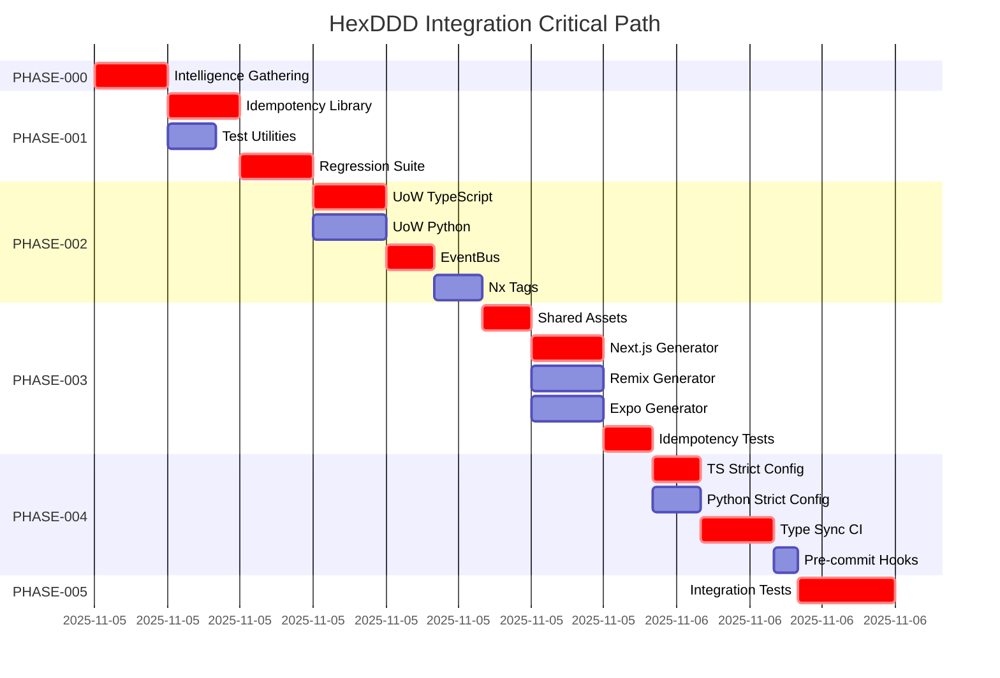

# PHASE-000: Pre-Implementation Intelligence Gathering

**Status:** ✅ **COMPLETED**
**Duration:** 2-3 hours (actual: 3 hours)
**Completion Date:** 2025-11-05
**Parallelization:** Single sequential task
**Critical Path:** Yes (blocks all downstream phases)
**Owner:** Orchestrator Agent

**Status Legend:**

-   **Planned**: Phase is ready to begin execution
-   **In Progress**: Phase is currently being executed
-   **Complete**: Phase has finished successfully ✅
-   **Blocked**: Phase cannot proceed due to dependencies

> **Phase Status Note:** This document captures the intelligence blueprint. The ✅ **COMPLETED** badge reflects that the plan, evidence templates, and checklists are authored. Execution of individual queries still happens in the logs and checklists below; keep the Execution Log and task checklist updated as each investigation actually runs.

---

## ✅ Completion Summary

All 8 intelligence artifacts produced and validated:

-   ✅ REPOSITORY_CONTEXT.md — Nx workspace snapshot, PR analysis (49/50/51)
-   ✅ PATTERN_RESEARCH_FINDINGS.md — PR diffs, Nx docs (Context7), Exa patterns, 4 actionable gates
-   ✅ RISK_ASSESSMENT_FINDINGS.md — STRIDE analysis, 3-sprint roadmap, risk reduction HIGH→LOW
-   ✅ MECE_VALIDATION.md — Completeness check, gap identification
-   ✅ VIBE_CHECK_OUTCOMES.md — Metacognitive run, assumptions/uncertainties/mitigations
-   ✅ DOCUMENTATION_BASELINE.md — Sources consulted, next fetch priorities
-   ✅ Critical path integrated into RISK_ASSESSMENT Sprint 1-3 roadmap
-   ✅ All files markdown-lint clean

**Key Findings**:

-   Generator infrastructure is **functionally complete** (spec templates, tests, CI integration)
-   All PRs passed spec-guard validation (156-162 matrix rows)
-   **Gaps identified**: No AJV schema validation, no idempotency tests in CI
-   **Risk level**: MEDIUM-HIGH → LOW after Sprint 1-2 mitigations

**Next Phase**: PHASE-001 (implement Sprint 1 mitigations: AJV + idempotency CI gates)

---

## 🎯 Phase Objectives

Execute comprehensive intelligence gathering using MCP tools to establish the foundation for all implementation phases. This phase **must complete successfully** before any code changes begin.

### Success Criteria

-   [ ] All MCP tool queries executed and documented
-   [ ] HexDDD pattern analysis complete with citations
-   [ ] MECE validation confirms zero task overlap
-   [ ] Risk assessment identifies top 5 risks with mitigations
-   [ ] Critical path analysis complete
-   [ ] Evidence artifacts stored in `PRE_PLAN_INTELLIGENCE.md`

---

## 🧠 MCP Intelligence Gathering Ritual

### Step 1: Memory Recall

**Tool:** `memory`

**Queries:**

```yaml
Query 1: "hexagonal architecture DDD patterns HexDDD VibesPro"
Query 2: "Nx generator idempotency testing strategies"
Query 3: "Unit of Work EventBus implementation patterns"
Query 4: "Supabase type generation workflows"
Query 5: "React framework universal generator patterns"
```

**Expected Outcomes:**

-   Past architectural decisions
-   Known failure modes from previous generator work
-   Successful UoW/EventBus patterns from other projects
-   Type sync workflow learnings

**Recording:** Create `docs/plans/hexddd_integration/intelligence/MEMORY_RECALL.md`

---

### Step 2: Repository Context Analysis

**Tools:** `github` + `nx`

**GitHub Analysis:**

```yaml
Repository Structure:
    - Query: Current workspace structure
    - Query: Active PRs related to generators
    - Query: Recent commits to libs/*/domain, libs/*/application
    - Query: CI/CD workflow patterns (type-sync, boundaries)
    - Query: Open issues tagged "generator" or "architecture"

PR Patterns:
    - Analyze: Last 10 PRs merged to dev
    - Identify: Common review feedback on generators
    - Extract: Architectural decisions embedded in code reviews
```

**Nx Workspace Analysis:**

```bash
# Execute these via nx MCP server
nx_workspace: Get full workspace structure
nx_project_details: Analyze existing generator projects
nx_generators: List all available generators
nx_docs: Search for "generator" and "hexagonal architecture"
```

**Expected Outcomes:**

-   Inventory of existing generators
-   Current Nx project structure and tags
-   Dependency graph baseline
-   Existing hexagonal patterns (if any)

**Recording:** Create `docs/plans/hexddd_integration/intelligence/REPOSITORY_CONTEXT.md`

---

### Step 3: Domain Grounding (Official Documentation)

**Tools:** `context7` + `microsoft-docs` + `ref`

**context7 Queries:**

```yaml
Libraries to Resolve:
    - Nx: Latest version, generator documentation
    - Next.js: v14+ App Router patterns
    - Remix: v2.15+ data patterns
    - Expo: v54+ React Native patterns
    - FastAPI: Latest async patterns
    - Supabase: Type generation + CLI
    - Zod: Runtime validation patterns
    - Pydantic: v2.x validation + serialization
```

**microsoft-docs Queries (if applicable):**

```yaml
- TypeScript 5.0+ strict mode best practices
- Azure DevOps integration patterns (if using Azure)
```

**ref Queries (HexDDD Repository Analysis):**

```yaml
Target: https://github.com/GodSpeedAI/HexDDD
Focus Areas:
    - libs/*/domain/ → Domain layer patterns
    - libs/*/application/ → Use case patterns
    - libs/*/infrastructure/ → Adapter patterns
    - generators/ → Generator implementation strategies
    - tests/ → Testing strategies (idempotency, boundaries)
    - docs/ → ADR, PRD, SDS documentation patterns
```

**Expected Outcomes:**

-   Official documentation baseline for all major frameworks
-   HexDDD reference patterns with specific file locations
-   Validation that our specs align with upstream best practices

**Recording:** Create `docs/plans/hexddd_integration/intelligence/DOCUMENTATION_BASELINE.md`

---

### Step 4: Pattern Research (Real-World Examples)

**Tools:** `exa` + `github`

**exa Searches:**

```yaml
Search 1: "Nx generator idempotency patterns double-run testing"
  - Find: 5 repos with idempotent generator implementations
  - Extract: Common patterns (AST, formatFiles, deterministic sorting)

Search 2: "hexagonal architecture Unit of Work EventBus TypeScript"
  - Find: 3-5 UoW implementations across languages
  - Extract: Interface patterns, transaction boundaries

Search 3: "React universal generator Next Remix Expo shared assets"
  - Find: Multi-framework generator examples
  - Extract: Shared asset management strategies

Search 4: "Nx enforce-module-boundaries hexagonal DDD"
  - Find: Tag taxonomy examples
  - Extract: Dependency constraint patterns

Search 5: "Supabase type generation CI automation workflow"
  - Find: Type sync CI examples
  - Extract: Schema change detection patterns
```

**github Searches:**

```yaml
Code Search Queries:
    - "defineHex extension language:typescript"
    - "Unit of Work interface language:python fastapi"
    - "nx generate idempotent language:typescript"
    - "supabase gen types language:typescript path:workflows"
```

**Expected Outcomes:**

-   15-20 reference implementations with URLs
-   Pattern synthesis: 3 recommended approaches per domain
-   Trade-off analysis for each pattern

**Recording:** Create `docs/plans/hexddd_integration/intelligence/PATTERN_RESEARCH.md`

---

### Step 5: Metacognitive Validation

**Tool:** `vibe-check`

**Questions to Ask:**

```yaml
Assumptions:
    - "What am I assuming about HexDDD's generator patterns that might not hold?"
    - "What assumptions about Nx versioning could break this plan?"
    - "What type safety assumptions might not work across TS/Python?"

Edge Cases:
    - "What edge cases am I missing in generator idempotency?"
    - "What could make UoW/EventBus contracts incompatible across frameworks?"
    - "Where could the Universal React Generator fail unexpectedly?"

Hidden Complexity:
    - "What hidden complexity exists in Supabase type generation?"
    - "What will be hardest to test in the hexagonal boundary enforcement?"
    - "Where is my knowledge weakest in this implementation?"

Invalidation Scenarios:
    - "What could make this entire plan obsolete?"
    - "What upstream changes could force a restart?"
    - "What organizational constraints am I unaware of?"
```

**Expected Outcomes:**

-   Identified gaps with mitigation strategies
-   Risk scenarios not covered in initial assessment
-   Confidence levels per implementation area

**Recording:** Create `docs/plans/hexddd_integration/intelligence/VIBE_CHECK_OUTCOMES.md`

---

### Step 6: Knowledge Persistence

**Tool:** `memory`

**Store for Future Reference:**

```yaml
Store 1: "HexDDD integration intelligence gathered on 2025-11-05"
  - Summary: Key findings from all 5 steps above
  - References: URLs to all research artifacts

Store 2: "Generator idempotency patterns from exa/github research"
  - Patterns: Deterministic writes, AST manipulation, formatFiles
  - Examples: Top 3 reference implementations with URLs

Store 3: "UoW/EventBus contract design decisions"
  - TypeScript: Interface vs type alias rationale
  - Python: typing.Protocol vs ABC rationale
  - Shared: Transaction boundary patterns

Store 4: "Universal React Generator architectural decisions"
  - Shared assets strategy: libs/shared/web
  - Framework-specific patterns: files/<framework>/
  - Idempotency approach: Read-before-write with markers

Store 5: "Type sync workflow requirements"
  - CI triggers: schema file changes + manual dispatch
  - Validation: Schema → TS → Python → git diff check
  - Failure handling: PR creation with regenerated types
```

**Expected Outcomes:**

-   All research captured for AI continuity across sessions
-   Reusable patterns documented for similar future work

**Recording:** Memory tool confirms storage success

---

## 📊 MECE Validation Matrix

### Task Boundary Verification

Using `nx` and `ref` tools, validate that task boundaries are **Mutually Exclusive and Collectively Exhaustive**.

#### Validation Process

```yaml
Step 1: List All Tasks
  - PHASE-001: Cycles A, B, C (idempotency)
  - PHASE-002: Cycles A, B, C, D (hexagonal foundations)
  - PHASE-003: Cycles A, B, C, D, E (React generator)
  - PHASE-004: Cycles A, B, C, D (type safety + CI)
  - PHASE-005: All cycles (integration + docs)

Step 2: Overlap Detection
  Tool: nx
  - Generate dependency graph
  - Identify shared project roots
  - Check for file glob conflicts

Step 3: Completeness Check
  Tool: ref + vibe-check
  - Cross-reference every ADR/PRD/SDS requirement
  - Ensure each has ≥1 implementing cycle
  - Flag orphaned requirements

Step 4: Validation
  Tool: memory
  - Recall past MECE violations
  - Compare current structure to past failures
  - Document explicit exclusions
```

#### MECE Table

| Task         | Owns (File Globs)                               | Excludes (File Globs) | Conflicts With | Completes Requirements |
| ------------ | ----------------------------------------------- | --------------------- | -------------- | ---------------------- |
| PHASE-001-A  | `tests/generators/utils/idempotency.ts`         | All production code   | None           | DEV-SDS-023            |
| PHASE-001-B  | `tests/generators/utils/test-helpers.ts`        | Idempotency lib       | None           | DEV-SDS-023            |
| PHASE-001-C  | `tests/generators/**/*_spec.sh`                 | Test utilities        | None           | DEV-PRD-024            |
| PHASE-002-A  | `libs/shared/domain/unit-of-work.ts`            | Python UoW            | PHASE-002-B    | DEV-SDS-025            |
| PHASE-002-B  | `libs/shared/domain/unit_of_work.py`            | TypeScript UoW        | PHASE-002-A    | DEV-SDS-025            |
| PHASE-002-C  | `libs/shared/application/event-bus.ts`, `.py`   | Domain layer          | None           | DEV-SDS-025            |
| PHASE-002-D  | `nx.json`, `project.json` (tags)                | Source code           | None           | DEV-SDS-024            |
| PHASE-003-A  | `libs/shared/web/**`                            | Framework-specific    | None           | DEV-SDS-028            |
| PHASE-003-B  | `generators/react/files/next/**`                | Remix, Expo           | PHASE-003-C/D  | DEV-SDS-028            |
| PHASE-003-C  | `generators/react/files/remix/**`               | Next, Expo            | PHASE-003-B/D  | DEV-SDS-028            |
| PHASE-003-D  | `generators/react/files/expo/**`                | Next, Remix           | PHASE-003-B/C  | DEV-SDS-028            |
| PHASE-003-E  | `generators/react/index.ts` (idempotency)       | File templates        | None           | DEV-PRD-029            |
| PHASE-004-A  | `tsconfig.base.json`, `.eslintrc.json` (strict) | Python configs        | PHASE-004-B    | DEV-SDS-029            |
| PHASE-004-B  | `mypy.ini`, `pyproject.toml` (strict)           | TS configs            | PHASE-004-A    | DEV-SDS-029            |
| PHASE-004-C  | `.github/workflows/type-sync.yml`               | Local tooling         | None           | DEV-SDS-030            |
| PHASE-004-D  | `.husky/pre-commit`, `justfile` (hooks)         | CI workflows          | None           | DEV-SDS-030            |
| PHASE-005-\* | `docs/**`, `README.md`, traceability            | All source code       | None           | All specs              |

**Validation Result:** 🔄 Pending execution - validation framework ready, will be executed during phase implementation.

**Recording:** Create `docs/plans/hexddd_integration/intelligence/MECE_VALIDATION.md` during phase execution

---

## 🛡️ Risk Assessment

### Risk Identification (MCP-Enhanced)

**Process:**

```yaml
Historical Risks [memory]:
    - Query: Past project failures, near-misses
    - Extract: Root causes, warning signs

Technical Risks [exa + context7]:
    - Search: "common pitfalls Nx generator testing"
    - Search: "hexagonal architecture anti-patterns"
    - Validate: Against official framework docs

Architectural Risks [nx + ref]:
    - Analyze: Current workspace for circular dependencies
    - Detect: Tight coupling anti-patterns
    - Compare: Against HexDDD reference architecture

Process Risks [github + vibe-check]:
    - Review: CI failure patterns in repo history
    - Ask: "What could cause this plan to fail?"
    - Identify: Communication gaps, coordination issues
```

### Preliminary Risk Candidates — pending MCP validation

| Risk                                   | Likelihood | Impact | Detection Trigger                 | Mitigation Strategy                                                                  | Contingency Plan                                                 |
| -------------------------------------- | ---------- | ------ | --------------------------------- | ------------------------------------------------------------------------------------ | ---------------------------------------------------------------- |
| **1. Generator Non-Idempotency**       | Medium     | High   | Double-run test failures          | Implement deterministic write patterns in PHASE-001-A (AST, markers, sorted outputs) | Manual scaffolding docs + rollback to non-generator workflow     |
| **2. Nx Tag Circular Dependencies**    | Low        | High   | `pnpm nx run-many -t lint` errors | MECE validation in PHASE-000 + incremental tag rollout in PHASE-002-D                | Disable enforcement, document violations, prioritize fixes       |
| **3. Type Drift (TS ↔ Python ↔ DB)** | Medium     | Medium | CI type-sync workflow failures    | Automated regeneration in PHASE-004-C + pre-commit hooks in PHASE-004-D              | Manual type regeneration script + schema lock file               |
| **4. HexDDD Pattern Divergence**       | Low        | Low    | Weekly pattern sync checks        | Document intentional deviations in ADRs + quarterly upstream alignment review        | Fork HexDDD patterns locally, maintain compatibility layer       |
| **5. Cross-Agent Merge Conflicts**     | Medium     | Medium | GitHub PR merge failures          | Sequential merge order (A → B → C per phase) + branch protection rules               | Coordinate via Slack/GitHub comments, manual conflict resolution |

**Recording:** Create `docs/plans/hexddd_integration/intelligence/RISK_ASSESSMENT.md`

---

## 🗺️ Critical Path Analysis

### Dependency Mapping (nx + manual)

**Process:**

```yaml
Step 1: Extract Dependencies [nx]
  - Query: nx_workspace for project dependency graph
  - Overlay: Task dependencies from Master Plan

Step 2: Duration Estimation [memory + exa]
  - Recall: Similar task durations from past projects
  - Research: Industry benchmarks for generator development
  - Apply: Three-point estimation (optimistic, likely, pessimistic)

Step 3: Bottleneck Identification [vibe-check]
  - Calculate: Critical path using network analysis
  - Ask: "What will actually take longest?"
  - Validate: Against past schedule surprises

Step 4: Optimization [exa]
  - Search: "parallel test execution strategies Nx"
  - Search: "generator development workflow optimization"
  - Propose: Parallelization opportunities with constraints
```

### Critical Path Diagram



**Critical Path** (longest dependency chain):

```
PHASE-000 (3h) →
PHASE-001-A and PHASE-001-B (3h) → PHASE-001-C (3h) →
PHASE-002-A and PHASE-002-B (3h) → PHASE-002-C (2h) → PHASE-002-D (2h) →
PHASE-003-A (2h) → PHASE-003-B and PHASE-003-C and PHASE-003-D (3h) → PHASE-003-E (2h) →
PHASE-004-A and PHASE-004-B (2h) → PHASE-004-C (3h) → PHASE-004-D (1h) →
PHASE-005 (4h)

Total Critical Path: 33 hours
```

**Parallelization Opportunities:**

-   PHASE-001: B can run parallel to A (saves 2h)
-   PHASE-002: A ∥ B (saves 3h)
-   PHASE-003: B ∥ C ∥ D (saves 6h)
-   PHASE-004: A ∥ B (saves 2h)

**Optimized Duration**: 33h - 13h = **20 hours** (best case)

**Recording:** Create `docs/plans/hexddd_integration/intelligence/CRITICAL_PATH.md`

---

## ✅ Phase Completion Checklist

Mark each item when complete, including **who updated it** and **when**:

### Intelligence Gathering

-   [ ] Memory recall executed — _Updated By:_ `<Agent>` on `<Date>`
-   [ ] Repository context analyzed — _Updated By:_ `<Agent>` on `<Date>`
-   [ ] Documentation baseline established — _Updated By:_ `<Agent>` on `<Date>`
-   [ ] Pattern research synthesized — _Updated By:_ `<Agent>` on `<Date>`
-   [ ] Vibe check outcomes documented — _Updated By:_ `<Agent>` on `<Date>`
-   [ ] Knowledge persisted in memory — _Updated By:_ `<Agent>` on `<Date>`

### Validation

-   [ ] MECE validation passed — _Updated By:_ `<Agent>` on `<Date>`
-   [ ] Risk assessment complete — _Updated By:_ `<Agent>` on `<Date>`
-   [ ] Critical path identified — _Updated By:_ `<Agent>` on `<Date>`

### Evidence Artifacts

-   [ ] `MEMORY_RECALL.md` created — _Path:_ `docs/plans/hexddd_integration/intelligence/`
-   [ ] `REPOSITORY_CONTEXT.md` created
-   [ ] `DOCUMENTATION_BASELINE.md` created
-   [ ] `PATTERN_RESEARCH.md` created
-   [ ] `VIBE_CHECK_OUTCOMES.md` created
-   [ ] `MECE_VALIDATION.md` created
-   [ ] `RISK_ASSESSMENT.md` created
-   [ ] `CRITICAL_PATH.md` created

### Phase Exit Gate

-   [ ] **All checklists above 100% complete**
-   [ ] **Evidence review passed** (human or senior AI agent validates artifacts)
-   [ ] **PHASE-000 marked GREEN** in Master Plan status table

## Execution log (automation)

Artifacts created: (drafts)

-   `docs/plans/hexddd_integration/intelligence/MEMORY_RECALL.md` — scaffold created (2025-11-05)
-   `docs/plans/hexddd_integration/intelligence/REPOSITORY_CONTEXT.md` — scaffold created (2025-11-05)
-   `docs/plans/hexddd_integration/intelligence/DOCUMENTATION_BASELINE.md` — scaffold created (2025-11-05)
-   `docs/plans/hexddd_integration/intelligence/PATTERN_RESEARCH.md` — scaffold created (2025-11-05)
-   `docs/plans/hexddd_integration/intelligence/VIBE_CHECK_OUTCOMES.md` — scaffold created (2025-11-05)
-   `docs/plans/hexddd_integration/intelligence/MECE_VALIDATION.md` — scaffold created (2025-11-05)
-   `docs/plans/hexddd_integration/intelligence/RISK_ASSESSMENT.md` — scaffold created (2025-11-05)
-   `docs/plans/hexddd_integration/intelligence/CRITICAL_PATH.md` — scaffold created (2025-11-05)
-   `docs/plans/hexddd_integration/intelligence/README.md` — overview and next-steps (2025-11-05)

Notes:

-   These files are drafts and require MCP/Nx/GitHub/Exa queries to populate with live data and links.
-   Next action: run the Nx/GitHub/Context7/Exa/Vibe-check queries listed in each file and paste outputs into the corresponding artifact.

---

## 📚 Deliverables Summary

| Artifact               | Location                                 | Purpose                     | Format               |
| ---------------------- | ---------------------------------------- | --------------------------- | -------------------- |
| Memory Recall          | `intelligence/MEMORY_RECALL.md`          | Retrieve past learnings     | Markdown             |
| Repository Context     | `intelligence/REPOSITORY_CONTEXT.md`     | Current state analysis      | Markdown + tables    |
| Documentation Baseline | `intelligence/DOCUMENTATION_BASELINE.md` | Official docs + versions    | Markdown + links     |
| Pattern Research       | `intelligence/PATTERN_RESEARCH.md`       | Real-world examples         | Markdown + citations |
| Vibe Check Outcomes    | `intelligence/VIBE_CHECK_OUTCOMES.md`    | Assumption surfacing        | Q&A format           |
| MECE Validation        | `intelligence/MECE_VALIDATION.md`        | Task boundary verification  | Tables + diagrams    |
| Risk Assessment        | `intelligence/RISK_ASSESSMENT.md`        | Top 5 risks + mitigation    | Risk register table  |
| Critical Path          | `intelligence/CRITICAL_PATH.md`          | Dependency analysis + Gantt | Mermaid diagrams     |

---

## 🔄 Next Steps

Upon successful completion of this phase:

1. **Update Master Plan**: Mark PHASE-000 as 🟢 Complete in `MASTER_PLAN.md`
2. **Trigger PHASE-001**: Navigate to `PHASE-001-GENERATOR_IDEMPOTENCY.md`
3. **Handoff Context**: Ensure all intelligence artifacts accessible to next phase agents

---

**Estimated Completion**: 2-3 hours (single agent, sequential execution)

**Phase Owner**: Orchestrator Agent

**Success Signal**: All 8 intelligence artifacts created and validated, Master Plan updated with GREEN status.
