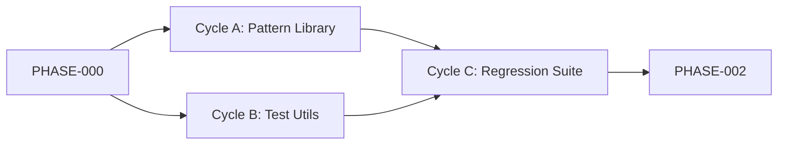

# PHASE-001: Generator Idempotency & Testing Infrastructure

**Status:** Ready for Execution  
**Duration:** 6-8 hours  
**Parallelization:** 3 cycles (A ∥ B, then C)  
**Critical Path:** Yes (Cycle A → C)  
**Dependencies:** PHASE-000 complete  
**Owner:** Generator Agent

---

## 🎯 Phase Objectives

Establish the foundational patterns and testing infrastructure for idempotent Nx generators. All generators created in subsequent phases must use these patterns to ensure safe, repeatable execution.

### Success Criteria

- [ ] Idempotency pattern library implemented and documented
- [ ] Generator test utilities created with helper functions
- [ ] Regression suite passes with 100% double-run tests
- [ ] All existing generators retrofitted to use patterns
- [ ] Documentation updated with usage examples
- [ ] **Evidence**: `just test-generators` returns GREEN

### Traceability

| Requirement | Cycle | Validation |
|-------------|-------|------------|
| DEV-ADR-023 | All | Generator idempotency enforced |
| DEV-PRD-024 | Cycle C | Double-run tests pass |
| DEV-SDS-023 | Cycles A, B | Pattern library + test utils |

---

## 🧠 Phase Initialization Ritual

Execute before starting any cycles:

### 1. Context Bundle
```bash
just ai-context-bundle
```

### 2. Memory Sync
```yaml
[memory] Retrieve:
  - "Generator idempotency patterns from PHASE-000"
  - "Past generator development failures"
  - "Nx generator best practices"
```

### 3. Domain Refresh
```yaml
[context7] Update:
  - Nx generator documentation (latest version)
  - TypeScript AST manipulation libraries
  - Jest testing patterns for generators

[ref] Analyze:
  - HexDDD generator implementations
  - Existing VibesPro generators for patterns
```

### 4. Pattern Scan
```yaml
[exa] Search:
  - "Nx generator idempotent write patterns"
  - "TypeScript AST generator examples"
  - "Jest generator testing strategies"

[github] Review:
  - Recent generator-related PRs in workspace
  - Generator test patterns in Nx repos
```

### 5. Workspace Validation
```yaml
[nx] Verify:
  - Current generator inventory
  - Existing test infrastructure
  - Project graph integrity
```

### 6. Metacognitive Gate
```yaml
[vibe-check] Surface:
  - "What assumptions about generator behavior could be wrong?"
  - "What edge cases in file generation am I missing?"
  - "How could deterministic writes fail unexpectedly?"
```

### 7. Intelligence Log
Create: `docs/plans/hexddd_integration/logs/PHASE-001-INIT.md`

---

## 📊 Cycles Overview

### Cycle Summary Table

| Cycle | Owner | Branch | Depends On | Parallel With | Duration | Audit Artifacts |
|-------|-------|--------|------------|---------------|----------|-----------------|
| **A** | Generator Agent | `feature/gen-idempotency-lib` | PHASE-000 | B | 3h | Pattern lib + unit tests |
| **B** | Generator Agent | `feature/gen-test-utils` | PHASE-000 | A | 2h | Test helper functions |
| **C** | Generator Agent | `feature/gen-regression` | A, B | None | 3h | Double-run regression suite |

### Dependency Visualization



---

## ⚡ Cycle A: Idempotency Pattern Library

**Owner:** Generator Agent  
**Branch:** `feature/gen-idempotency-lib`  
**Duration:** 3 hours  
**Can Run Parallel With:** Cycle B

### Objectives

Create reusable TypeScript utilities that enforce deterministic, idempotent generator behavior.

### 🔴 RED Phase

**Create failing tests first:**

```typescript
// tests/generators/utils/idempotency.test.ts
import { ensureIdempotentWrite, sortExports } from './idempotency';

describe('Idempotency Patterns', () => {
  describe('ensureIdempotentWrite', () => {
    it('should not overwrite existing files without checking content', () => {
      // Test that we read before write
      // Expected: FAIL (function doesn't exist yet)
    });

    it('should use AST to merge imports deterministically', () => {
      // Test that imports are sorted and deduplicated
      // Expected: FAIL
    });

    it('should preserve user code sections via markers', () => {
      // Test that custom code between markers is preserved
      // Expected: FAIL
    });
  });

  describe('sortExports', () => {
    it('should sort exports alphabetically', () => {
      // Test deterministic export ordering
      // Expected: FAIL
    });
  });
});
```

**Run tests:**
```bash
pnpm nx test type-generator --testFile=idempotency.test.ts
# Expected: All tests FAIL (functions not implemented)
```

### 🟢 GREEN Phase

**Implement minimal code to pass tests:**

```typescript
// tests/generators/utils/idempotency.ts
import { Tree } from '@nx/devkit';
import * as ts from 'typescript';

/**
 * Ensures idempotent writes by checking file existence and content
 */
export function ensureIdempotentWrite(
  tree: Tree,
  path: string,
  content: string,
  options?: { 
    merge?: boolean; 
    preserveMarkers?: [string, string];
  }
): void {
  const exists = tree.exists(path);
  
  if (!exists) {
    tree.write(path, content);
    return;
  }

  if (!options?.merge) {
    // File exists, no merge requested -> skip
    return;
  }

  const existingContent = tree.read(path, 'utf-8');
  
  if (options.preserveMarkers) {
    // Extract user code between markers and merge
    const [startMarker, endMarker] = options.preserveMarkers;
    const preservedContent = extractBetweenMarkers(
      existingContent, 
      startMarker, 
      endMarker
    );
    const mergedContent = mergeWithPreserved(content, preservedContent, options.preserveMarkers);
    tree.write(path, mergedContent);
  } else {
    // Simple content comparison
    if (existingContent === content) {
      return; // Already correct
    }
    tree.write(path, content);
  }
}

/**
 * Sorts exports alphabetically for deterministic output
 */
export function sortExports(sourceCode: string): string {
  const sourceFile = ts.createSourceFile(
    'temp.ts',
    sourceCode,
    ts.ScriptTarget.Latest,
    true
  );

  // AST manipulation to sort exports
  // ... implementation details
  
  return printer.printFile(sourceFile);
}

// Helper functions
function extractBetweenMarkers(content: string, start: string, end: string): string {
  const startIdx = content.indexOf(start);
  const endIdx = content.indexOf(end);
  if (startIdx === -1 || endIdx === -1) return '';
  return content.substring(startIdx + start.length, endIdx);
}

function mergeWithPreserved(
  newContent: string,
  preserved: string,
  markers: [string, string]
): string {
  const [start, end] = markers;
  return newContent.replace(
    `${start}${end}`,
    `${start}${preserved}${end}`
  );
}
```

**Run tests:**
```bash
pnpm nx test type-generator --testFile=idempotency.test.ts
# Expected: All tests PASS
```

### 🔵 REFACTOR Phase

**Improve code quality:**

1. **Extract seams:**
   - Separate file I/O from logic
   - Create pure functions for content merging
   - Extract AST manipulation into separate module

2. **Add comprehensive tests:**
   ```typescript
   describe('Edge Cases', () => {
     it('handles empty files');
     it('handles binary files gracefully');
     it('preserves file permissions');
     it('handles concurrent writes');
   });
   ```

3. **Document usage patterns:**
   ```typescript
   /**
    * @example
    * ```ts
    * // Basic idempotent write
    * ensureIdempotentWrite(tree, 'src/index.ts', generatedCode);
    *
    * // Merge with preserved user code
    * ensureIdempotentWrite(tree, 'src/config.ts', template, {
    *   merge: true,
    *   preserveMarkers: ['// START_USER_CODE', '// END_USER_CODE']
    * });
    * ```
    */
   ```

**Validation:**
```bash
pnpm nx test type-generator
pnpm nx lint type-generator
# Expected: All pass with refactored code
```

### 🔄 REGRESSION Phase

**Validate no side effects:**

```bash
# Run all workspace tests
pnpm nx run-many -t test --all

# Check for circular dependencies
pnpm nx graph --file=graph.html

# Verify no breaking changes
just ai-validate
```

### 📋 Cycle A Checklist

- [ ] RED: Failing tests written — *Updated By:* `<Agent>` on `<Date>`
- [ ] GREEN: Minimal implementation passes tests — *Updated By:* `<Agent>` on `<Date>`
- [ ] REFACTOR: Code improved, edge cases covered — *Updated By:* `<Agent>` on `<Date>`
- [ ] REGRESSION: All workspace tests pass — *Updated By:* `<Agent>` on `<Date>`
- [ ] Documentation: Usage examples in code comments — *Updated By:* `<Agent>` on `<Date>`
- [ ] **Evidence Captured:** `logs/PHASE-001-CYCLE-A.log`

### Deliverables

| Artifact | Location | Purpose |
|----------|----------|---------|
| Pattern Library | `tests/generators/utils/idempotency.ts` | Reusable idempotency functions |
| Unit Tests | `tests/generators/utils/idempotency.test.ts` | Pattern validation |
| Documentation | Inline TSDoc comments | Usage guidance |
| Test Log | `logs/PHASE-001-CYCLE-A.log` | Execution evidence |

---

## ⚡ Cycle B: Generator Test Utilities

**Owner:** Generator Agent  
**Branch:** `feature/gen-test-utils`  
**Duration:** 2 hours  
**Can Run Parallel With:** Cycle A

### Objectives

Create Jest test helpers that simplify generator testing and double-run validation.

### 🔴 RED Phase

```typescript
// tests/generators/utils/test-helpers.test.ts
import { runGeneratorTwice, assertNoChanges, mockTree } from './test-helpers';

describe('Generator Test Helpers', () => {
  it('should run a generator twice and capture tree state', async () => {
    // Expected: FAIL (helper doesn't exist)
  });

  it('should detect file changes between runs', async () => {
    // Expected: FAIL
  });

  it('should provide a mock tree for testing', () => {
    // Expected: FAIL
  });
});
```

### 🟢 GREEN Phase

```typescript
// tests/generators/utils/test-helpers.ts
import { Tree, readProjectConfiguration } from '@nx/devkit';
import { createTreeWithEmptyWorkspace } from '@nx/devkit/testing';

/**
 * Runs a generator twice and returns tree states for comparison
 */
export async function runGeneratorTwice(
  generator: (tree: Tree, options: any) => Promise<void>,
  options: any
): Promise<{ firstRun: Tree; secondRun: Tree }> {
  const tree1 = createTreeWithEmptyWorkspace();
  await generator(tree1, options);
  
  const tree2 = createTreeWithEmptyWorkspace();
  await generator(tree2, options);
  await generator(tree2, options); // Run again on same tree
  
  return { firstRun: tree1, secondRun: tree2 };
}

/**
 * Asserts that no files changed between runs (idempotency check)
 */
export function assertNoChanges(tree1: Tree, tree2: Tree): void {
  const changes1 = tree1.listChanges();
  const changes2 = tree2.listChanges();
  
  expect(changes1.length).toBe(changes2.length);
  
  changes1.forEach((change1, idx) => {
    const change2 = changes2[idx];
    expect(change1.path).toBe(change2.path);
    expect(change1.type).toBe(change2.type);
    expect(change1.content?.toString()).toBe(change2.content?.toString());
  });
}

/**
 * Creates a mock tree with preset workspace structure
 */
export function mockTree(options?: { 
  withProjects?: string[];
  withFiles?: Record<string, string>;
}): Tree {
  const tree = createTreeWithEmptyWorkspace();
  
  options?.withProjects?.forEach(name => {
    // Add mock project configurations
  });
  
  Object.entries(options?.withFiles || {}).forEach(([path, content]) => {
    tree.write(path, content);
  });
  
  return tree;
}
```

### 🔵 REFACTOR Phase

Add more sophisticated helpers:

```typescript
/**
 * Snapshot-based idempotency testing
 */
export async function testIdempotency(
  generator: Function,
  options: any,
  description: string
): Promise<void> {
  const { firstRun, secondRun } = await runGeneratorTwice(generator, options);
  
  // Snapshot first run
  expect(firstRun.listChanges()).toMatchSnapshot(`${description}-first-run`);
  
  // Ensure second run matches
  assertNoChanges(firstRun, secondRun);
}

/**
 * Helpers for ShellSpec integration
 */
export function exportForShellSpec(tree: Tree, outputDir: string): void {
  // Write tree contents to filesystem for shell testing
}
```

### 🔄 REGRESSION Phase

Test the test helpers (meta-testing):

```bash
pnpm nx test type-generator --testFile=test-helpers.test.ts
just ai-validate
```

### 📋 Cycle B Checklist

- [ ] RED: Test helper specs fail — *Updated By:* `<Agent>` on `<Date>`
- [ ] GREEN: Helpers implemented, tests pass — *Updated By:* `<Agent>` on `<Date>`
- [ ] REFACTOR: Advanced helpers added — *Updated By:* `<Agent>` on `<Date>`
- [ ] REGRESSION: Meta-tests pass — *Updated By:* `<Agent>` on `<Date>`
- [ ] **Evidence Captured:** `logs/PHASE-001-CYCLE-B.log`

### Deliverables

| Artifact | Location | Purpose |
|----------|----------|---------|
| Test Helpers | `tests/generators/utils/test-helpers.ts` | Generator testing utilities |
| Helper Tests | `tests/generators/utils/test-helpers.test.ts` | Helper validation |
| Test Log | `logs/PHASE-001-CYCLE-B.log` | Execution evidence |

---

## ⚡ Cycle C: Regression Suite

**Owner:** Generator Agent  
**Branch:** `feature/gen-regression`  
**Duration:** 3 hours  
**Depends On:** Cycles A + B complete

### Objectives

Create comprehensive double-run tests for all existing and future generators using the patterns and utilities from Cycles A and B.

### 🔴 RED Phase

```bash
# Create ShellSpec regression suite
# tests/generators/idempotency_spec.sh

Describe 'Generator Idempotency'
  Describe '@ddd-plugin/ddd:hex-domain'
    It 'produces identical output on second run'
      # Run generator twice, compare outputs
      # Expected: FAIL (generators not yet idempotent)
    End
  End
  
  Describe '@ddd-plugin/ddd:web-app'
    It 'produces identical output on second run for Next.js'
      # Expected: FAIL
    End
    
    It 'produces identical output on second run for Remix'
      # Expected: FAIL
    End
  End
End
```

```typescript
// tests/generators/all-generators.test.ts
import { testIdempotency } from './utils/test-helpers';
import { hexDomainGenerator } from '@ddd-plugin/ddd';

describe('Generator Idempotency Suite', () => {
  it('hex-domain generator is idempotent', async () => {
    await testIdempotency(
      hexDomainGenerator,
      { name: 'test-domain' },
      'hex-domain'
    );
    // Expected: FAIL (needs pattern library integration)
  });
  
  // Add tests for all other generators
});
```

**Run tests:**
```bash
shellspec tests/generators/idempotency_spec.sh
# Expected: Failures showing non-idempotent behavior
```

### 🟢 GREEN Phase

**Retrofit existing generators with idempotency patterns:**

```typescript
// Example: Update hex-domain generator
import { ensureIdempotentWrite, sortExports } from '../../tests/generators/utils/idempotency';

export async function hexDomainGenerator(tree: Tree, options: Schema) {
  const { name, directory } = options;
  const projectRoot = `libs/${directory}/${name}`;
  
  // Use idempotent writes instead of direct tree.write()
  ensureIdempotentWrite(
    tree,
    `${projectRoot}/domain/src/index.ts`,
    sortExports(generateDomainIndex(options))
  );
  
  ensureIdempotentWrite(
    tree,
    `${projectRoot}/application/src/index.ts`,
    sortExports(generateApplicationIndex(options)),
    {
      merge: true,
      preserveMarkers: ['// START_CUSTOM', '// END_CUSTOM']
    }
  );
  
  // ... rest of generator
}
```

**Run tests:**
```bash
shellspec tests/generators/idempotency_spec.sh
pnpm nx test type-generator --testFile=all-generators.test.ts
# Expected: All tests PASS
```

### 🔵 REFACTOR Phase

1. **Create generator wrapper:**
   ```typescript
   // Wrap all generators with idempotency validation
   export function withIdempotency<T extends Schema>(
     generator: (tree: Tree, options: T) => Promise<void>
   ) {
     return async (tree: Tree, options: T) => {
       await generator(tree, options);
       await formatFiles(tree); // Ensure deterministic formatting
     };
   }
   ```

2. **Add CI validation:**
   ```yaml
   # .github/workflows/generator-tests.yml
   name: Generator Idempotency Tests
   on: [pull_request]
   jobs:
     test-generators:
       runs-on: ubuntu-latest
       steps:
         - uses: actions/checkout@v4
         - run: pnpm install
         - run: shellspec tests/generators/idempotency_spec.sh
         - run: pnpm nx run-many -t test --projects=tag:generator
   ```

3. **Document generator development workflow:**
   ```markdown
   # docs/generators/DEVELOPMENT.md
   
   ## Creating Idempotent Generators
   
   1. Import idempotency utilities
   2. Use `ensureIdempotentWrite` for all file operations
   3. Call `formatFiles(tree)` at the end
   4. Add double-run test to regression suite
   5. Verify with `just test-generators`
   ```

### 🔄 REGRESSION Phase

**Full validation:**

```bash
# Run all generator tests
just test-generators

# Verify no regressions in workspace
pnpm nx run-many -t test --all

# Check lint and type safety
just ai-validate

# Ensure CI workflows valid
just spec-guard
```

### 📋 Cycle C Checklist

- [ ] RED: Regression tests expose non-idempotent behavior — *Updated By:* `<Agent>` on `<Date>`
- [ ] GREEN: All generators retrofitted, tests pass — *Updated By:* `<Agent>` on `<Date>`
- [ ] REFACTOR: Wrapper utilities + CI integration — *Updated By:* `<Agent>` on `<Date>`
- [ ] REGRESSION: Full workspace validation passes — *Updated By:* `<Agent>` on `<Date>`
- [ ] Documentation: Generator development guide created — *Updated By:* `<Agent>` on `<Date>`
- [ ] **Evidence Captured:** `logs/PHASE-001-CYCLE-C.log`

### Deliverables

| Artifact | Location | Purpose |
|----------|----------|---------|
| ShellSpec Suite | `tests/generators/idempotency_spec.sh` | Shell-level regression tests |
| Jest Suite | `tests/generators/all-generators.test.ts` | TypeScript-level tests |
| CI Workflow | `.github/workflows/generator-tests.yml` | Automated validation |
| Dev Guide | `docs/generators/DEVELOPMENT.md` | Generator development best practices |
| Test Log | `logs/PHASE-001-CYCLE-C.log` | Execution evidence |

---

## 📊 Phase Exit Ritual

Execute before marking phase complete:

### 1. Validation

```bash
# All generator tests must pass
just test-generators

# Full workspace validation
just ai-validate

# CI simulation
act -j test-generators  # (optional: requires act installed)
```

### 2. Outcome Recording

```yaml
[memory] Store:
  - "Idempotency patterns: ensureIdempotentWrite, sortExports, formatFiles"
  - "Test helpers: runGeneratorTwice, assertNoChanges, testIdempotency"
  - "All generators retrofitted with pattern library"
  - "Double-run regression suite: 100% pass rate"
```

### 3. Vibe Check

```yaml
[vibe-check] Validate:
  - "Did we actually solve generator idempotency?"
  - "Are there edge cases we haven't tested?"
  - "Will these patterns scale to complex generators?"
```

### 4. Branch Sync

```bash
# Ensure all cycles merged to dev
git checkout dev
git merge feature/gen-idempotency-lib
git merge feature/gen-test-utils
git merge feature/gen-regression
git push origin dev
```

### 5. CI Verification

Monitor GitHub Actions:
- ✅ All workflows pass
- ✅ No new lint violations
- ✅ Type checks clean
- ✅ Generator tests GREEN

### 6. Retrospective

Create: `docs/plans/hexddd_integration/retrospectives/PHASE-001.md`

Document:
- What worked well
- What was harder than expected
- Patterns to reuse in future phases
- Lessons learned

---

## ✅ Phase Validation Checklist

Mark complete when ALL items verified:

### Implementation
- [ ] Cycle A: Pattern library complete
- [ ] Cycle B: Test utilities complete
- [ ] Cycle C: Regression suite complete
- [ ] All existing generators retrofitted

### Testing
- [ ] `just test-generators` returns GREEN
- [ ] All ShellSpec tests pass
- [ ] All Jest generator tests pass
- [ ] No workspace test regressions

### Quality Gates
- [ ] `pnpm nx run-many -t lint --all` passes
- [ ] `pnpm tsc --noEmit` passes
- [ ] `just ai-validate` GREEN
- [ ] CI workflows pass

### Documentation
- [ ] Generator development guide created
- [ ] Inline TSDoc comments complete
- [ ] README updated with test commands
- [ ] Retrospective documented

### Evidence
- [ ] All cycle logs captured in `logs/`
- [ ] Test reports in `reports/`
- [ ] Memory updated with learnings
- [ ] **PHASE-001 marked GREEN in Master Plan**

---

## 📚 Deliverables Summary

| Category | Artifacts | Evidence Location |
|----------|-----------|-------------------|
| **Pattern Library** | `idempotency.ts`, unit tests | `tests/generators/utils/` |
| **Test Utilities** | `test-helpers.ts`, helper tests | `tests/generators/utils/` |
| **Regression Suite** | ShellSpec + Jest suites | `tests/generators/` |
| **CI Integration** | GitHub Actions workflow | `.github/workflows/generator-tests.yml` |
| **Documentation** | Development guide, TSDoc | `docs/generators/`, inline comments |
| **Logs** | Execution logs per cycle | `logs/PHASE-001-CYCLE-*.log` |
| **Retrospective** | Lessons learned | `retrospectives/PHASE-001.md` |

---

## 🔄 Next Steps

Upon GREEN status:

1. **Update Master Plan**: Mark PHASE-001 complete
2. **Trigger PHASE-002**: Navigate to `PHASE-002-HEXAGONAL_FOUNDATIONS.md`
3. **Handoff Context**: Idempotency patterns now available for all future generators

---

**Estimated Completion**: 6-8 hours (with parallelization: 6 hours)

**Phase Owner**: Generator Agent

**Success Signal**: `just test-generators` GREEN + all validation checklists 100% complete
