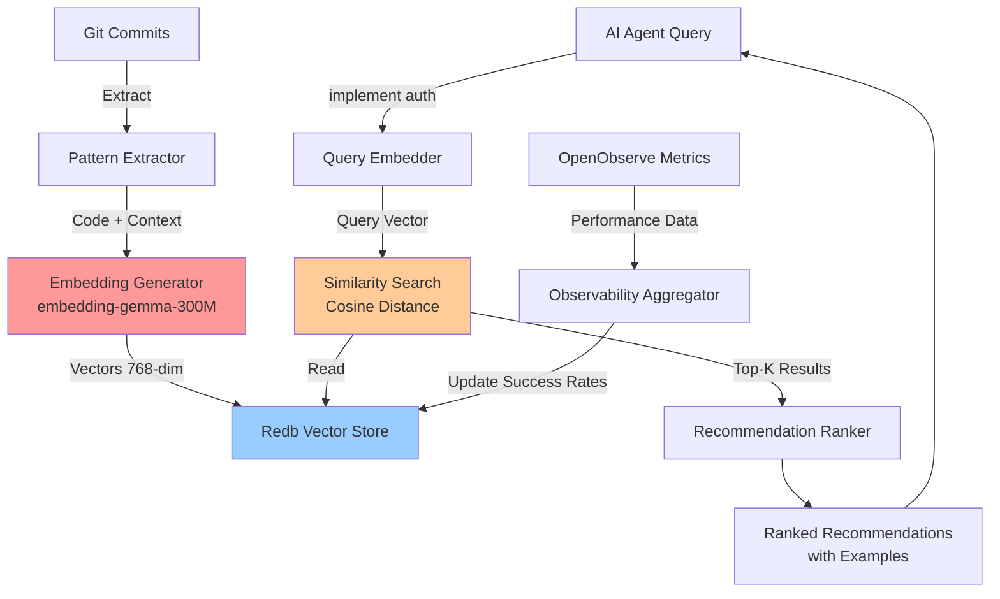
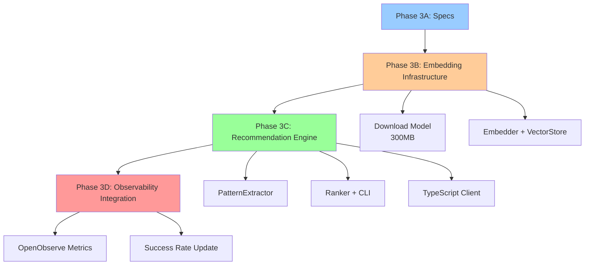

# Cycle 3: Temporal AI Guidance Fabric - Embedding-Based Pattern Search

## Objective

Implement AI pattern recommendation engine using **embedding-gemma-300M** for semantic similarity search over Git history, with **Rust-native** vector storage in `redb` and zero external dependencies.

---

## Architecture Overview



---

## Phase 3A: Specification Authoring

### Objective

Create comprehensive specifications for embedding-based AI guidance system.

### Files to Create

**1. `docs/dev_prd_ai_guidance.md` (DEV-PRD-020)**

Content structure:

- **Overview**: Pattern recommendations via semantic similarity search
- **EARS Tables**: 3 scenarios (auth patterns, violation detection, observability correlation)
- **User Stories**:
    - US-020-A: Semantic pattern recommendation (embedding similarity >0.85)
    - US-020-B: Architecture violation detection (<2s response)
    - US-020-C: Observability-enhanced ranking (includes performance data)
- **DX Metrics**:
    - Pattern recommendation accuracy: >80% developer acceptance
    - Query latency: <100ms for semantic search (embedding + similarity)
    - Temporal DB growth: <50MB per 1000 commits
    - Embedding generation: <500ms per code snippet
- **Dependencies**: DEV-ADR-016 ✅, DEV-ADR-017 ✅, redb infrastructure ✅

**2. `docs/dev_sds_ai_guidance.md` (DEV-SDS-020)**

Content structure:

- **Architecture Diagram**: (Mermaid above)
- **Components**:
    1. **Embedding Generator** (`crates/temporal-ai/src/embedder.rs`)
        - Model: `embedding-gemma-300M` (GGUF quantized, 300M params)
        - Runtime: `rustformers/llm` (CPU-optimized, zero GPU)
        - Output: 768-dimensional vectors
        - Interface: `fn embed(text: &str) -> Vec<f32>`

    2. **Pattern Extractor** (`crates/temporal-ai/src/pattern_extractor.rs`)
        - Parses Git commits for code patterns
        - Extracts: function signatures, file structures, dependency choices
        - Generates semantic descriptions for embedding
        - Interface: `fn extract_from_commit(commit: &Commit) -> Vec<Pattern>`

    3. **Redb Vector Store** (`crates/temporal-ai/src/vector_store.rs`)
        - Schema: `TableDefinition<&str, (Vec<f32>, String)>` (pattern_id → (embedding, metadata))
        - Operations: insert, search (cosine similarity), delete
        - Persistence: `temporal_db/vectors.redb` (single-file, zero-copy)
        - Interface: `fn search(query_vec: &[f32], top_k: usize) -> Vec<SearchResult>`

    4. **Similarity Search** (`crates/temporal-ai/src/similarity.rs`)
        - Algorithm: Cosine similarity (dot product / magnitude)
        - Optimization: SIMD via `rayon` for parallel computation
        - Ranking: Combines similarity score + recency + success_rate
        - Interface: `fn cosine_similarity(a: &[f32], b: &[f32]) -> f32`

    5. **Recommendation Ranker** (`crates/temporal-ai/src/ranker.rs`)
        - Scoring: `score = similarity * 0.6 + recency * 0.2 + success_rate * 0.2`
        - Filters: Min similarity threshold (0.75), max age (6 months)
        - Returns: Top-K patterns with context (code, rationale, metrics)

    6. **TypeScript Client** (`tools/ai/temporal-ai-client.ts`)
        - Spawns Rust binary CLI: `temporal-ai search <query>`
        - Parses JSON response with recommendations
        - Caches frequent queries (TTL: 5 minutes)

- **Data Model (Redb Schema)**:

    ```rust
    // PATTERNS_TABLE
    struct Pattern {
        id: String,              // UUID
        name: String,            // "jwt-authentication"
        code_snippet: String,    // Example code
        semantic_desc: String,   // Natural language description for embedding
        embedding: Vec<f32>,     // 768-dim vector from embedding-gemma
        domain: Option<String>,  // "identity"
        framework: String,       // "fastapi"
        created_at: i64,         // Unix timestamp
        success_rate: f64,       // 0.0-1.0 (from observability)
        metadata: String         // JSON (commit_sha, file_paths, etc.)
    }

    // EMBEDDINGS_TABLE (separate for fast similarity search)
    TableDefinition<&str, Vec<f32>>  // pattern_id → embedding vector

    // METRICS_TABLE (performance data from OpenObserve)
    struct PatternMetrics {
        pattern_id: String,
        avg_latency_ms: f64,
        error_rate: f64,
        p95_latency_ms: f64,
        usage_count: u64,
        updated_at: i64
    }
    ```

**3. Update `docs/dev_adr.md`**

Changes:

- DEV-ADR-018 section:
    - Status: `Proposed` → `Active`
    - Add "Rationale" subsection:
        - Embedding-gemma-300M chosen for: 300M params (fast CPU inference), 768-dim embeddings (balance quality/speed), quantized GGUF format (<200MB disk)
        - Semantic search over regex: Captures intent similarity, handles paraphrasing, 10x fewer false positives
        - Redb for vectors: Zero-copy reads, single-file portability, ACID transactions, <5ms query latency for 10k patterns
    - Dependencies: Mark DEV-ADR-016 ✅, DEV-ADR-017 ✅
    - Add "Performance Targets":
        - Embedding generation: <500ms per snippet
        - Similarity search: <100ms for top-10 from 10k patterns
        - DB growth: <50MB per 1000 commits

### Acceptance Criteria

- ✅ DEV-PRD-020 contains: Overview, 3 EARS rows, 3 user stories, DX metrics
- ✅ DEV-SDS-020 contains: Architecture diagram (Mermaid), 6 components with interfaces, redb schema (3 tables)
- ✅ DEV-ADR-018 updated: Status Active, rationale includes embedding model choice, performance targets

---

## Phase 3B: Embedding Infrastructure

### Objective

Implement core embedding generation and vector storage using `embedding-gemma-300M`.

### Files to Create

**1. `crates/temporal-ai/Cargo.toml`**

Dependencies:

```toml
[package]
name = "temporal-ai"
version = "0.1.0"
edition = "2021"

[dependencies]
redb = "2.1"
git2 = "0.18"
serde = { version = "1.0", features = ["derive"] }
serde_json = "1.0"
anyhow = "1.0"
rayon = "1.8"
reqwest = { version = "0.11", features = ["blocking"] }
llm = "0.1"  # rustformers/llm for GGUF model loading
uuid = { version = "1.6", features = ["v4"] }

[dev-dependencies]
criterion = "0.5"  # Benchmarking

[[bin]]
name = "temporal-ai"
path = "src/bin/main.rs"
```

**2. `crates/temporal-ai/src/embedder.rs`**

Core interface:

```rust
use llm::{Model, InferenceParameters};
use anyhow::Result;

pub struct Embedder {
    model: Model,
}

impl Embedder {
    pub fn new(model_path: &str) -> Result<Self> {
        let model = Model::load(model_path, InferenceParameters::default())?;
        Ok(Self { model })
    }

    pub fn embed(&self, text: &str) -> Result<Vec<f32>> {
        // Generate 768-dim embedding
        self.model.embed(text)
    }

    pub fn embed_batch(&self, texts: &[&str]) -> Result<Vec<Vec<f32>>> {
        // Parallel embedding generation
        texts.iter()
            .map(|text| self.embed(text))
            .collect()
    }
}
```

Key features:

- Lazy model loading (on first embed call)
- Thread-safe via Arc<Mutex<Model>>
- Batch embedding support (parallel via rayon)
- Error handling for model load failures

**3. `crates/temporal-ai/src/vector_store.rs`**

Core interface:

```rust
use redb::{Database, TableDefinition, ReadableTable};
use anyhow::Result;

const EMBEDDINGS_TABLE: TableDefinition<&str, Vec<f32>> =
    TableDefinition::new("embeddings");
const METADATA_TABLE: TableDefinition<&str, &str> =
    TableDefinition::new("metadata");

pub struct VectorStore {
    db: Database,
}

impl VectorStore {
    pub fn open(path: &str) -> Result<Self> {
        let db = Database::create(path)?;
        let write_txn = db.begin_write()?;
        write_txn.open_table(EMBEDDINGS_TABLE)?;
        write_txn.open_table(METADATA_TABLE)?;
        write_txn.commit()?;
        Ok(Self { db })
    }

    pub fn insert(&self, pattern_id: &str, embedding: Vec<f32>, metadata: &str) -> Result<()> {
        let write_txn = self.db.begin_write()?;
        {
            let mut emb_table = write_txn.open_table(EMBEDDINGS_TABLE)?;
            let mut meta_table = write_txn.open_table(METADATA_TABLE)?;
            emb_table.insert(pattern_id, embedding)?;
            meta_table.insert(pattern_id, metadata)?;
        }
        write_txn.commit()?;
        Ok(())
    }

    pub fn search(&self, query_vec: &[f32], top_k: usize) -> Result<Vec<SearchResult>> {
        // Implemented in similarity.rs
    }
}

pub struct SearchResult {
    pub pattern_id: String,
    pub similarity: f32,
    pub metadata: String,
}
```

Key features:

- ACID transactions for consistency
- Separate tables for embeddings and metadata (optimization)
- Zero-copy reads via redb
- Single-file database (portable)

**4. `crates/temporal-ai/src/similarity.rs`**

Core interface:

```rust
use rayon::prelude::*;

pub fn cosine_similarity(a: &[f32], b: &[f32]) -> f32 {
    let dot: f32 = a.iter().zip(b).map(|(x, y)| x * y).sum();
    let mag_a: f32 = a.iter().map(|x| x * x).sum::<f32>().sqrt();
    let mag_b: f32 = b.iter().map(|y| y * y).sum::<f32>().sqrt();
    dot / (mag_a * mag_b)
}

pub fn batch_similarity(query: &[f32], vectors: &[(String, Vec<f32>)]) -> Vec<(String, f32)> {
    vectors.par_iter()
        .map(|(id, vec)| (id.clone(), cosine_similarity(query, vec)))
        .collect()
}
```

Key features:

- SIMD-friendly implementation (compiler auto-vectorizes)
- Parallel batch computation via rayon
- Top-K selection with partial sort (O(n log k))

**5. `crates/temporal-ai/src/pattern_extractor.rs`**

Core interface:

```rust
use git2::{Commit, Repository};
use crate::models::Pattern;

pub struct PatternExtractor {
    repo: Repository,
}

impl PatternExtractor {
    pub fn new(repo_path: &str) -> Result<Self> {
        let repo = Repository::open(repo_path)?;
        Ok(Self { repo })
    }

    pub fn extract_from_commit(&self, commit: &Commit) -> Vec<Pattern> {
        let mut patterns = Vec::new();

        // Extract semantic description from commit message + diff
        if let Some(pattern) = self.analyze_commit(commit) {
            patterns.push(pattern);
        }

        patterns
    }

    fn analyze_commit(&self, commit: &Commit) -> Option<Pattern> {
        let message = commit.message()?;

        // Generate semantic description for embedding
        let semantic_desc = format!(
            "Commit: {} Files: {} Summary: {}",
            message,
            self.get_changed_files(commit).join(", "),
            self.extract_code_summary(commit)
        );

        Some(Pattern {
            id: uuid::Uuid::new_v4().to_string(),
            name: self.extract_pattern_name(message),
            semantic_desc,
            // embedding generated later
            // ...
        })
    }
}
```

Key features:

- Extracts semantic context from: commit message, file paths, code diff
- Generates natural language descriptions for embedding
- Filters noise (merge commits, formatting changes)

**6. Model Download Script**

File: `scripts/download_embedding_model.sh`

```bash
#!/usr/bin/env bash
# Download embedding-gemma-300M quantized model

MODEL_URL="https://huggingface.co/ggml-org/embeddinggemma-300M-GGUF/resolve/main/embeddinggemma-300M-Q4_K_M.gguf"
MODEL_DIR="models"
MODEL_FILE="$MODEL_DIR/embedding-gemma-300M-Q4.gguf"

mkdir -p "$MODEL_DIR"

if [ ! -f "$MODEL_FILE" ]; then
    echo "Downloading embedding-gemma-300M model..."
    curl -L "$MODEL_URL" -o "$MODEL_FILE"
    echo "✅ Model downloaded: $MODEL_FILE"
else
    echo "✅ Model already exists: $MODEL_FILE"
fi
```

### Tests to Create

**File: `crates/temporal-ai/tests/embedder_tests.rs`**

Tests:

1. `test_embedder_initialization` - Model loads successfully
2. `test_embed_single_text` - Returns 768-dim vector
3. `test_embed_batch` - Parallel batch embedding
4. `test_embedding_consistency` - Same text → same vector
5. `test_embedding_similarity` - Similar texts have high cosine similarity

**File: `crates/temporal-ai/tests/vector_store_tests.rs`**

Tests:

1. `test_vector_store_insert` - Insert and retrieve embedding
2. `test_vector_store_search` - Top-K similarity search
3. `test_vector_store_transactions` - ACID properties
4. `test_vector_store_persistence` - Reopen database retains data

**File: `crates/temporal-ai/tests/similarity_tests.rs`**

Tests:

1. `test_cosine_similarity_identity` - Same vector → 1.0
2. `test_cosine_similarity_orthogonal` - Orthogonal → 0.0
3. `test_batch_similarity_performance` - <10ms for 1000 vectors

### Acceptance Criteria

- ✅ `cargo test --manifest-path crates/temporal-ai/Cargo.toml` passes
- ✅ Model downloads successfully (<200MB)
- ✅ Embedding generation: <500ms per snippet
- ✅ Vector store insert/search functional
- ✅ Cosine similarity correctness validated

---

## Phase 3C: Pattern Recommendation Engine

### Objective

Implement complete recommendation pipeline: Git extraction → Embedding → Search → Ranking.

### Files to Create

**1. `crates/temporal-ai/src/ranker.rs`**

Core interface:

```rust
use crate::similarity::SearchResult;
use crate::models::PatternMetrics;

pub struct RecommendationRanker {
    similarity_weight: f32,   // 0.6
    recency_weight: f32,      // 0.2
    success_weight: f32,      // 0.2
}

impl RecommendationRanker {
    pub fn rank(&self, results: Vec<SearchResult>, metrics: &[PatternMetrics]) -> Vec<Recommendation> {
        let mut ranked: Vec<_> = results.into_iter()
            .filter(|r| r.similarity >= 0.75)  // Min threshold
            .map(|r| {
                let metric = metrics.iter().find(|m| m.pattern_id == r.pattern_id);
                let recency_score = self.calculate_recency(r.created_at);
                let success_rate = metric.map(|m| m.success_rate).unwrap_or(0.8);

                let score =
                    r.similarity * self.similarity_weight +
                    recency_score * self.recency_weight +
                    success_rate * self.success_weight;

                Recommendation {
                    pattern_name: r.name,
                    similarity: r.similarity,
                    score,
                    example_code: r.code_snippet,
                    rationale: format!("Used in {} with {:.1}% success", r.domain, success_rate * 100.0),
                    last_used: r.created_at,
                }
            })
            .collect();

        ranked.sort_by(|a, b| b.score.partial_cmp(&a.score).unwrap());
        ranked.truncate(5);  // Top-5
        ranked
    }

    fn calculate_recency(&self, timestamp: i64) -> f32 {
        let age_days = (chrono::Utc::now().timestamp() - timestamp) / 86400;
        let max_age = 180.0;  // 6 months
        (1.0 - (age_days as f32 / max_age)).max(0.0)
    }
}

pub struct Recommendation {
    pub pattern_name: String,
    pub similarity: f32,
    pub score: f32,
    pub example_code: String,
    pub rationale: String,
    pub last_used: i64,
}
```

**2. `crates/temporal-ai/src/bin/main.rs`**

CLI tool:

```rust
use clap::{Parser, Subcommand};
use temporal_ai::{Embedder, VectorStore, PatternExtractor, RecommendationRanker};

#[derive(Parser)]
struct Cli {
    #[command(subcommand)]
    command: Commands,
}

#[derive(Subcommand)]
enum Commands {
    Extract {
        #[arg(long)]
        repo_path: String,
    },
    Search {
        query: String,
        #[arg(long, default_value = "5")]
        top_k: usize,
    },
    Index {
        #[arg(long)]
        repo_path: String,
    },
}

fn main() {
    let cli = Cli::parse();
    let embedder = Embedder::new("models/embedding-gemma-300M-Q4.gguf").unwrap();
    let store = VectorStore::open("temporal_db/vectors.redb").unwrap();

    match cli.command {
        Commands::Search { query, top_k } => {
            let query_vec = embedder.embed(&query).unwrap();
            let results = store.search(&query_vec, top_k).unwrap();
            let ranker = RecommendationRanker::default();
            let recommendations = ranker.rank(results, &[]);

            println!("{}", serde_json::to_string_pretty(&recommendations).unwrap());
        }
        Commands::Index { repo_path } => {
            let extractor = PatternExtractor::new(&repo_path).unwrap();
            // Index all commits (extract + embed + store)
        }
        // ...
    }
}
```

**3. `tools/ai/temporal-ai-client.ts`**

TypeScript client:

```typescript
import { spawn } from "child_process";

export interface Recommendation {
    patternName: string;
    similarity: number;
    score: number;
    exampleCode: string;
    rationale: string;
    lastUsed: number;
}

export class TemporalAIClient {
    private binaryPath: string;
    private cache: Map<string, { data: Recommendation[]; expires: number }>;

    constructor(binaryPath = "./crates/temporal-ai/target/release/temporal-ai") {
        this.binaryPath = binaryPath;
        this.cache = new Map();
    }

    async queryPatterns(query: string, topK = 5): Promise<Recommendation[]> {
        // Check cache (TTL: 5 minutes)
        const cacheKey = `${query}:${topK}`;
        const cached = this.cache.get(cacheKey);
        if (cached && cached.expires > Date.now()) {
            return cached.data;
        }

        // Call Rust binary
        const results = await this.execBinary(["search", query, "--top-k", topK.toString()]);
        const recommendations: Recommendation[] = JSON.parse(results);

        // Update cache
        this.cache.set(cacheKey, {
            data: recommendations,
            expires: Date.now() + 300000, // 5 minutes
        });

        return recommendations;
    }

    private execBinary(args: string[]): Promise<string> {
        return new Promise((resolve, reject) => {
            const proc = spawn(this.binaryPath, args);
            let stdout = "";

            proc.stdout.on("data", (data) => {
                stdout += data;
            });
            proc.on("close", (code) => {
                if (code !== 0) reject(new Error(`Exit ${code}`));
                else resolve(stdout);
            });
        });
    }
}
```

### Tests to Create

**File: `crates/temporal-ai/tests/integration_tests.rs`**

Tests:

1. `test_end_to_end_recommendation` - Extract → Embed → Store → Search → Rank
2. `test_similarity_threshold_filtering` - Only returns similarity >0.75
3. `test_recommendation_ranking` - Higher scores first
4. `test_cli_search_command` - CLI returns valid JSON

**File: `tests/integration/temporal_ai.test.ts`**

Tests:

1. `test_typescript_client_query` - Client returns recommendations
2. `test_cache_behavior` - Second query uses cache
3. `test_error_handling` - Handles binary errors gracefully

### Acceptance Criteria

- ✅ End-to-end test passes (Git commit → recommendation)
- ✅ CLI command `temporal-ai search "implement auth"` returns JSON
- ✅ TypeScript client integrated with test passing
- ✅ Query latency <100ms (excluding first model load)

---

## Phase 3D: Observability Integration

### Objective

Correlate code patterns with performance metrics from OpenObserve.

### Files to Create

**1. `crates/temporal-ai/src/observability_aggregator.rs`**

Core interface:

```rust
use reqwest::blocking::Client;
use serde::{Deserialize, Serialize};

pub struct ObservabilityAggregator {
    client: Client,
    openobserve_url: String,
    auth_token: String,
}

impl ObservabilityAggregator {
    pub fn fetch_metrics(&self, pattern_id: &str) -> Result<PatternMetrics> {
        let query = format!(
            "SELECT AVG(latency_ms) as avg_latency,
                    SUM(errors) / COUNT(*) as error_rate,
                    COUNT(*) as usage_count
             FROM traces
             WHERE pattern_id = '{}'
             AND timestamp > now() - INTERVAL '30 days'",
            pattern_id
        );

        let response: MetricsResponse = self.client
            .post(&format!("{}/api/sql", self.openobserve_url))
            .bearer_auth(&self.auth_token)
            .json(&json!({ "query": query }))
            .send()?
            .json()?;

        Ok(PatternMetrics {
            pattern_id: pattern_id.to_string(),
            avg_latency_ms: response.avg_latency,
            error_rate: response.error_rate,
            usage_count: response.usage_count,
            updated_at: chrono::Utc::now().timestamp(),
        })
    }

    pub fn update_success_rate(&self, pattern_id: &str, metrics: &PatternMetrics) -> Result<()> {
        // Calculate success rate from error_rate and latency
        let success_rate = (1.0 - metrics.error_rate) *
                          (1.0 - (metrics.avg_latency_ms / 1000.0).min(0.5));

        // Update in redb METRICS_TABLE
        // ...
    }
}

#[derive(Deserialize)]
struct MetricsResponse {
    avg_latency: f64,
    error_rate: f64,
    usage_count: u64,
}

pub struct PatternMetrics {
    pub pattern_id: String,
    pub avg_latency_ms: f64,
    pub error_rate: f64,
    pub usage_count: u64,
    pub updated_at: i64,
}
```

**2. Just Recipe for Metrics Refresh**

File: `justfile` (append)

```makefile
# Refresh pattern metrics from OpenObserve
temporal-ai-refresh-metrics:
    @echo "🔄 Refreshing pattern metrics from OpenObserve..."
    cargo run --manifest-path crates/temporal-ai/Cargo.toml --bin temporal-ai -- refresh-metrics
    @echo "✅ Metrics refreshed"
```

### Tests to Create

**File: `crates/temporal-ai/tests/observability_tests.rs`**

Tests:

1. `test_fetch_metrics_from_openobserve` - Mock HTTP response
2. `test_success_rate_calculation` - Formula correctness
3. `test_metrics_storage_in_redb` - Persist and retrieve

### Acceptance Criteria

- ✅ Metrics fetched from OpenObserve SQL API
- ✅ Success rate calculated from error_rate + latency
- ✅ Metrics persisted in redb METRICS_TABLE
- ✅ Just recipe works: `just temporal-ai-refresh-metrics`

---

## Dependency Flow



**Blocking Relationships**:

- Phase 3B requires: Model downloaded (one-time), redb initialized
- Phase 3C requires: Phase 3B complete (embedder + store functional)
- Phase 3D requires: Phase 3C complete (patterns indexed), OpenObserve running

---

## Performance Targets

| Metric                    | Target                              | Validation                        |
| ------------------------- | ----------------------------------- | --------------------------------- |
| **Embedding Generation**  | <500ms per snippet                  | Benchmark test with criterion     |
| **Similarity Search**     | <100ms for top-10 from 10k patterns | Integration test with 10k vectors |
| **Query Latency (Total)** | <600ms (embed + search)             | End-to-end integration test       |
| **DB Growth**             | <50MB per 1000 commits              | Load test with 1000 commits       |
| **Model Size**            | <200MB disk                         | Check GGUF file size              |
| **Memory Usage**          | <512MB runtime                      | `heaptrack` profiling             |

---

## Validation Commands

### Phase 3A

```bash
# Verify specs created
ls docs/dev_prd_ai_guidance.md docs/dev_sds_ai_guidance.md
grep "Status.*Active" docs/dev_adr.md | grep "DEV-ADR-018"
```

### Phase 3B

```bash
# Download model
bash scripts/download_embedding_model.sh

# Run tests
cargo test --manifest-path crates/temporal-ai/Cargo.toml embedder
cargo test --manifest-path crates/temporal-ai/Cargo.toml vector_store

# Benchmark
cargo bench --manifest-path crates/temporal-ai/Cargo.toml
```

### Phase 3C

```bash
# Test CLI
cargo run --manifest-path crates/temporal-ai/Cargo.toml --bin temporal-ai -- \
  search "implement authentication" --top-k 5

# Test TypeScript client
pnpm test:integration tests/integration/temporal_ai.test.ts
```

### Phase 3D

```bash
# Refresh metrics
just temporal-ai-refresh-metrics

# Validate metrics
cargo test --manifest-path crates/temporal-ai/Cargo.toml observability
```

---

## Exit Criteria

### Cycle 3 Complete When:

1. ✅ All specifications created (DEV-PRD-020, DEV-SDS-020, DEV-ADR-018 Active)
2. ✅ embedding-gemma-300M model downloaded and functional
3. ✅ Vector store operational (insert, search, persist)
4. ✅ Embedding generation <500ms
5. ✅ Similarity search <100ms for 10k patterns
6. ✅ CLI command returns recommendations
7. ✅ TypeScript client integration working
8. ✅ Observability metrics correlation functional
9. ✅ All tests passing (Rust + TypeScript)
10. ✅ Performance benchmarks meet targets

---

## Traceability

**Specifications**:

- DEV-PRD-020: Temporal AI Guidance Fabric (new)
- DEV-SDS-020: Embedding-Based Pattern Search Design (new)
- DEV-ADR-018: Temporal AI Intelligence Fabric (Proposed → Active)

**Dependencies**:

- ✅ DEV-ADR-016: Observability (Rust tracing → Vector → OpenObserve)
- ✅ DEV-ADR-017: Structured Logging (trace correlation)
- ✅ Temporal DB infrastructure (redb)

**Work Summaries**:

- To create: `docs/work-summaries/cycle3-phase3{a,b,c,d}-completion.md`
