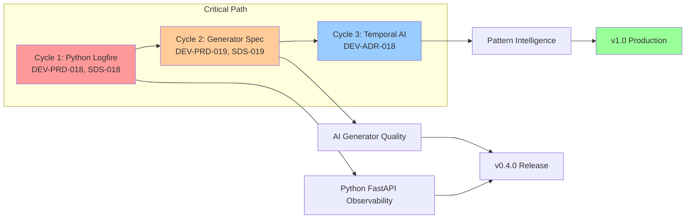
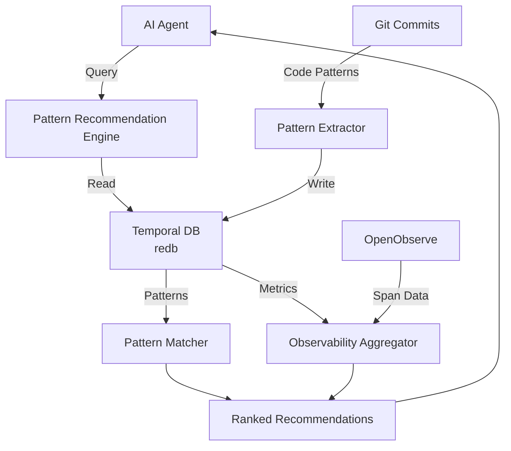
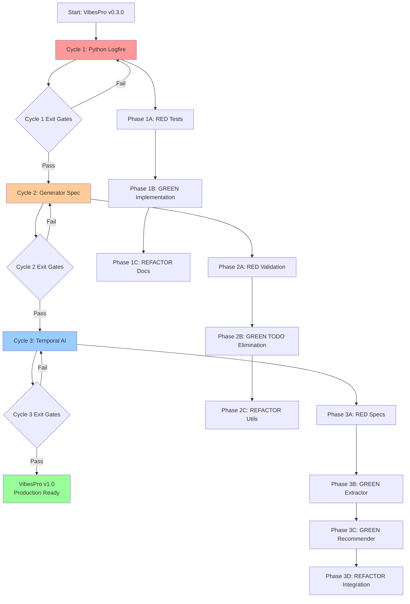

# VibesPro Project State Analysis & Implementation Plan

**Last Updated**: 2025-11-18
**Version**: v0.3.0+cycle3
**Status**: Production-Ready Template with Temporal AI Complete

## Executive Summary

VibesPro v0.3.0 is a **production-ready Copier template** generating hexagonal architecture Nx monorepos with AI-enhanced workflows. **All 3 planned TDD cycles are complete**: Python Logfire observability, Generator Spec validation, and Temporal AI pattern recommendation engine. The project contains **91 specifications** (domain-organized), **74 test files**, **26 AI prompts**, **17 modular instructions**, and a complete embedding-based AI guidance system.

**Major Achievements (2025-11)**:

-   ✅ **Cycle 1**: Python Logfire implementation (26 tests passing)
-   ✅ **Cycle 2**: Generator spec validation (11 tests, 0 TODOs)
-   ✅ **Cycle 3**: Temporal AI Guidance Fabric (2,500 LOC Rust + TypeScript client)
-   ✅ **Spec Reorganization**: 91 specs in domain-driven structure with uniqueness enforcement
-   ✅ **160+ commits** since November 2025

---

## Current State Assessment

### Production-Ready Capabilities ✅

| Component                    | Specs                         | Status                   | Evidence                                                       |
| ---------------------------- | ----------------------------- | ------------------------ | -------------------------------------------------------------- |
| **Specification System**     | 91 specs across 6 domains     | ✅ Complete (Refactored) | `docs/specs/` with domain folders, uniqueness enforced         |
| **Observability Stack**      | DEV-ADR-016, SDS-017, PRD-017 | ✅ Complete (6 phases)   | `crates/vibepro-observe/`, `ops/vector/`, 10 test suites       |
| **Python Logging (Logfire)** | DEV-PRD-018, SDS-018          | ✅ Complete (Cycle 1)    | `libs/python/vibepro_logging.py`, 26 tests passing             |
| **Generator Spec Template**  | DEV-PRD-019, SDS-019          | ✅ Complete (Cycle 2)    | 0 TODO markers, 11 validation tests                            |
| **Temporal AI Fabric**       | DEV-PRD-032, SDS-020, ADR-018 | ✅ Complete (Cycle 3)    | `crates/temporal-ai/` (2,500 LOC), TypeScript client, 21 tests |
| **Environment Setup**        | DEV-ADR-011-015, PRD-011-016  | ✅ Complete              | Devbox, mise, SOPS, 5 test suites in `tests/env/`              |
| **AGENT System**             | AGENT-SYSTEM.md, AGENT-MAP.md | ✅ Complete (Phase 1+2)  | 14 AGENT.md files across all directories                       |
| **AI Workflow System**       | 26 prompts, 17 instructions   | ✅ Complete              | `.github/prompts/`, `.github/instructions/`                    |
| **Hexagonal Architecture**   | DEV-ADR-020, 022, SDS-022     | ✅ Implemented           | Ports/Adapters pattern in `libs/shared/domain/`                |
| **Type Safety Foundation**   | DEV-SDS-020 (design)          | ⚠️ Design Complete       | Spec exists, pipeline not yet implemented                      |
| **Nx Configuration**         | Package alignment             | ✅ Complete              | All @nx packages at v22.0.2                                    |
| **Python Testing**           | pytest coverage               | ✅ Complete              | No exclusions, temporal tests functional                       |
| **Core Template**            | Hexagonal architecture        | ✅ Complete              | `templates/{{project_slug}}/` generates working projects       |
| **Documentation**            | 87 work summaries             | ✅ Comprehensive         | `docs/work-summaries/`, `docs/reports/`, `docs/plans/`         |

---

## Completed Implementation Cycles

### ✅ Cycle 1: Python Logfire Implementation (Complete - 2025-11)

**Specifications**: DEV-PRD-018, DEV-SDS-018, DEV-ADR-017

<<<<<<< HEAD
- DEV-PRD-018: Structured Logging with Trace Correlation
- DEV-SDS-018: Logfire SDK Integration
=======
**Delivered**:
>>>>>>> f48ea57 (refactor: Reorganize specifications into a domain-oriented structure, update spec tools, and introduce new agent definitions.)

-   ✅ Logfire SDK integration in `libs/python/vibepro_logging.py`
-   ✅ FastAPI auto-instrumentation (`logfire.instrument_fastapi()`)
-   ✅ Trace correlation (trace_id, span_id in all logs)
-   ✅ PII redaction via Vector transforms
-   ✅ 26 tests passing (5 test files)
-   ✅ Documentation complete, 0 TODO markers

<<<<<<< HEAD
- Rust observability: ✅ Complete (vibepro-observe crate functional)
- Node.js logging: ✅ Complete (Pino with trace correlation)
- Python logging: ❌ **Stub implementation only**
=======
**Evidence**: `docs/work-summaries/cycle1-phase1{a,b,c}-*-completion.md`
>>>>>>> f48ea57 (refactor: Reorganize specifications into a domain-oriented structure, update spec tools, and introduce new agent definitions.)

### ✅ Cycle 2: Generator Spec TODO Elimination (Complete - 2025-11)

<<<<<<< HEAD
- `libs/python/vibepro_logging.py:1-143` - Functions exist but marked "design targets"
- `docs/dev_prd.md:220` - "Python implementation planned for DEV-TDD cycle 2A"
=======
**Specifications**: DEV-PRD-019, DEV-SDS-019, DEV-ADR-019
>>>>>>> f48ea57 (refactor: Reorganize specifications into a domain-oriented structure, update spec tools, and introduce new agent definitions.)

**Delivered**:

<<<<<<< HEAD
- FastAPI request tracing
- Python service observability
- Unified log-trace correlation across all services

**Dependencies:**

- ✅ Vector pipeline ready (accepts OTLP)
- ✅ OpenObserve configured
- ✅ SOPS secrets management
- ❌ Logfire SDK integration incomplete

---

### Gap 2: Generator Spec TODO Elimination (HIGH PRIORITY)

**Specifications:**

- DEV-PRD-019: Complete Generator Specification Template
- DEV-SDS-019: Generator Spec Completion Design
- DEV-ADR-019: Complete Generator Specification Template ADR

**Current State:**

- Template exists: `templates/{{project_slug}}/docs/specs/generators/GENERATOR_SPEC.md` (261 lines)
- Content: ✅ Structure complete
- Quality: ❌ Contains TODO placeholders

**Evidence:**

- PRD-019 acceptance test: `grep "TODO:" GENERATOR_SPEC.md` must return zero
- Plan exists: `docs/plans/merged_generator_spec_completion_plan.md`

**Blocking:**

- AI agent generator creation accuracy (90% success rate target)
- Schema hallucination prevention
- Type safety enforcement in generated code

**Dependencies:**

- ✅ Nx devkit patterns documented
- ✅ Existing generator examples (feature-slice, data-access, route-contract)
- ❌ TODO markers must be replaced with concrete guidance

---

### Gap 3: Temporal AI Guidance Fabric (PROPOSED)

**Specifications:**

- DEV-ADR-018: Temporal AI Intelligence Fabric

**Current State:**

- Status: **Proposed** (not yet Active)
- Dependencies: DEV-ADR-016, ADR-017 (both ✅ complete)
- Temporal DB: ✅ Exists (`temporal_db/`, redb-based)
- AI integration: ❌ No pattern recommendation engine

**Evidence:**

- `docs/dev_adr.md` - ADR-018 marked "Proposed"
- `docs/dev_tdd_ai_guidance.md` - Implementation plan exists

**Blocking:**

- Advanced AI pattern suggestions
- Historical decision context for AI agents
- Automated architecture compliance recommendations

**Dependencies:**

- ✅ Observability foundation (ADR-016/17)
- ✅ Temporal database infrastructure
- ❌ Requires formal PRD/SDS authoring before Phase 2

---

## Desired End State

### Vision: VibesPro v1.0 Production Certification

**Core Capabilities:**

1. **Complete Observability** - Unified telemetry across Rust, Node.js, Python with <1µs overhead
2. **AI-Guided Development** - Temporal intelligence providing pattern recommendations from project history
3. **Zero-Hallucination Generators** - Complete specs enabling 90%+ first-attempt success for AI-generated code
4. **Production Certification** - Battle-tested at scale with security audit and reliability benchmarks

**Quantified Targets:**

- Python observability coverage: 95%+ FastAPI endpoints auto-traced
- Generator spec completeness: 0 TODO markers, 100% concrete examples
- AI pattern recommendation accuracy: 80%+ developer acceptance
- Specification traceability: 100% specs mapped to implementations

---

## Implementation Plan: MECE TDD Cycles

### Dependency Graph



---

## Cycle 1: Python Logfire Implementation (RED → GREEN → REFACTOR)

**Objective:** Complete structured logging with trace correlation for Python services

**Specifications:** DEV-PRD-018, DEV-SDS-018, DEV-ADR-017

**Exit Criteria:**

- ✅ All tests in `tests/ops/test_vector_logfire.sh` pass
- ✅ FastAPI auto-instrumentation functional (`logfire.instrument_fastapi()`)
- ✅ Logs contain mandatory fields: `trace_id`, `span_id`, `service`, `environment`, `application_version`
- ✅ PII redaction verified in OpenObserve
- ✅ 95%+ FastAPI endpoints produce correlated spans

---

### Phase 1A: RED - Test Infrastructure (Blocking: All implementation)

**Files to Create:**

```
tests/python/logging/
├── test_logfire_configuration.py          # Unit tests for configure_logger()
├── test_logfire_fastapi.py                # FastAPI instrumentation tests
├── test_logfire_trace_correlation.py      # Trace ID propagation tests
├── test_logfire_metadata.py               # Metadata binding tests
└── conftest.py                             # Pytest fixtures
```

**Test Requirements:**

**File:** `tests/python/logging/test_logfire_configuration.py`

```python
# Test Cases (RED - these will fail initially):
def test_configure_logger_sets_service_name():
    """Verify SERVICE_NAME env var binding"""
    # Assert: logger configured with service='test-service'

def test_configure_logger_otlp_endpoint():
    """Verify OTLP_ENDPOINT configuration"""
    # Assert: OTLP exporter points to Vector (localhost:4318)

def test_configure_logger_metadata_binding():
    """Verify environment, version metadata"""
    # Assert: APP_ENV, APP_VERSION bound to all log events
```

**File:** `tests/python/logging/test_logfire_fastapi.py`

```python
def test_fastapi_auto_instrumentation():
    """Verify logfire.instrument_fastapi() creates spans"""
    # Given: FastAPI app with logfire.instrument_fastapi()
    # When: GET /test endpoint called
    # Then: Span created with http.method, http.route, http.status_code

def test_fastapi_trace_propagation():
    """Verify downstream service calls propagate trace context"""
    # Given: Service A calls Service B via httpx
    # Then: Both share same trace_id, parent-child span relationship
```

**File:** `tests/python/logging/test_logfire_trace_correlation.py`

```python
def test_log_contains_trace_id():
    """Verify logs emitted within span contain trace_id"""
    # Given: Active tracing span
    # When: logger.info("message") called
    # Then: Log event contains trace_id matching span

def test_log_without_span_graceful():
    """Verify logging outside span doesn't crash"""
    # When: logger.info() called with no active span
    # Then: Log emitted with trace_id=null (graceful degradation)
```

**Acceptance Criteria:**

- ✅ All test files created with RED status (tests fail)
- ✅ Test coverage includes: configuration, instrumentation, correlation, metadata
- ✅ Pytest fixtures provide: FastAPI test client, mock OTLP collector, cleanup

---

### Phase 1B: GREEN - Minimal Implementation (Blocking: Refactor)

**Files to Modify:**

**File:** `libs/python/vibepro_logging.py`

**Current State (lines 1-143):**

- Stub functions with NotImplementedError
- Docstrings define intended behavior
- No actual Logfire SDK calls

**Implementation Requirements:**

```python
# Line ~20: Add imports
import logfire
from opentelemetry import trace
from opentelemetry.sdk.trace import TracerProvider
from opentelemetry.exporter.otlp.proto.http.trace_exporter import OTLPSpanExporter

# Line ~40: Implement configure_logger()
def configure_logger(
    service: str | None = None,
    send_to_logfire: bool = True,
    **kwargs
) -> None:
    """Configure Logfire with OTLP export to Vector"""
    service_name = service or os.getenv("SERVICE_NAME", "unknown-service")

    # Configure OTLP exporter
    otlp_endpoint = os.getenv("OTEL_EXPORTER_OTLP_ENDPOINT", "http://localhost:4318")

    logfire.configure(
        service_name=service_name,
        send_to_logfire=send_to_logfire,
        additional_span_processors=[
            OTLPSpanExporter(endpoint=otlp_endpoint)
        ],
        **kwargs
    )

    # Bind metadata
    logfire.configure(
        environment=os.getenv("APP_ENV", "development"),
        application_version=os.getenv("APP_VERSION", "unknown")
    )

# Line ~80: Implement bootstrap_logfire()
def bootstrap_logfire(app: FastAPI, **kwargs) -> FastAPI:
    """Auto-instrument FastAPI with Logfire"""
    configure_logger(**kwargs)
    logfire.instrument_fastapi(app)
    return app

# Line ~120: Implement get_logger()
def get_logger(category: str = "app", **metadata) -> logfire.Logger:
    """Get logger with category and metadata binding"""
    return logfire.with_tags(category=category, **metadata)
```

**Environment Variables Required:**

- `SERVICE_NAME` - Service identifier
- `OTEL_EXPORTER_OTLP_ENDPOINT` - Vector endpoint (default: http://localhost:4318)
- `OTEL_EXPORTER_OTLP_PROTOCOL` - Protocol (default: http/protobuf)
- `APP_ENV` - Environment (dev/staging/prod)
- `APP_VERSION` - Application version

**Acceptance Criteria:**

- ✅ All tests in Phase 1A now pass (GREEN)
- ✅ `pytest tests/python/logging/ -v` returns 0 failures
- ✅ FastAPI test app emits spans to mock OTLP collector
- ✅ Logs contain trace_id when within active span

---

### Phase 1C: REFACTOR - Integration & Documentation (Blocking: Cycle 1 Exit)

**Files to Update:**

**File:** `docs/observability/README.md`

**Section to Add (after line 150):**

````markdown
### Python FastAPI Integration

**Installation:**

```bash
pip install logfire opentelemetry-exporter-otlp-proto-http
```
````

**Basic Setup:**

```python
from fastapi import FastAPI
from libs.python.vibepro_logging import bootstrap_logfire

app = FastAPI()
bootstrap_logfire(app, service="user-api")

@app.get("/health")
def health():
    return {"status": "ok"}
```

**Structured Logging:**

```python
from libs.python.vibepro_logging import get_logger

logger = get_logger(category="app")

@app.post("/users")
def create_user(user: UserCreate):
    logger.info("Creating user", user_email_hash=hash(user.email))
    # Auto-traced: trace_id, span_id added to log
```

**Environment Configuration:**

```bash
export SERVICE_NAME=user-api
export OTEL_EXPORTER_OTLP_ENDPOINT=http://localhost:4318
export APP_ENV=staging
export APP_VERSION=v1.2.3
```

````

**File:** `templates/{{project_slug}}/docs/observability/logging.md.j2`

**Lines to Update (remove TODO at line 5):**

Replace:
```markdown
<!-- TODO: Complete Logfire integration in Cycle 2A -->
````

With:

````markdown
## Python Logfire Integration (Complete)

See main observability docs for Python FastAPI setup.

**Quick Start:**

```python
from libs.python.vibepro_logging import bootstrap_logfire
bootstrap_logfire(app, service="my-service")
```
````

````

**File:** `tests/ops/test_vector_logfire.sh`

**Validation Test to Add:**

```bash
#!/usr/bin/env bash
# Test: Vector receives OTLP logs from Python Logfire

set -euo pipefail

# Start Vector
just observe-start

# Run Python test app
cd apps/python-test-service
VIBEPRO_OBSERVE=1 python -m uvicorn main:app --port 8001 &
APP_PID=$!

# Send test request
sleep 2
curl -X GET http://localhost:8001/health

# Check Vector logs for received OTLP data
if ! grep -q "OTLP logs received" /tmp/vector.log; then
    echo "FAIL: Vector did not receive OTLP logs"
    exit 1
fi

# Cleanup
kill $APP_PID
just observe-stop

echo "✅ Python Logfire → Vector integration working"
````

**Acceptance Criteria:**

- ✅ Documentation updated with Python examples
- ✅ TODO marker removed from logging.md.j2
- ✅ Integration test passes: `just observe-test-vector-logfire`
- ✅ Example FastAPI app included in `apps/python-test-service/`

---

### Cycle 1 Exit Criteria

**Validation Commands:**

```bash
pytest tests/python/logging/ -v --cov=libs/python/vibepro_logging
just observe-test-all  # Includes test_vector_logfire.sh
just docs-lint         # Verify markdown updates
```

**Success Metrics:**

- ✅ Test coverage ≥95% for vibepro_logging.py
- ✅ All 10 observability test suites pass (including new Python tests)
- ✅ Zero TODO markers in observability documentation
- ✅ Python FastAPI tracing demonstrated in example app

**Traceability:**

- Update `docs/traceability_matrix.md`: Mark DEV-PRD-018, DEV-SDS-018 as "Complete"
- Create work summary: `docs/work-summaries/logfire-cycle2a-completion.md`

---

## Cycle 2: Generator Spec TODO Elimination (RED → GREEN → REFACTOR)

**Objective:** Achieve zero TODO markers in generator specification template

**Specifications:** DEV-PRD-019, DEV-SDS-019, DEV-ADR-019

**Exit Criteria:**

- ✅ `grep -r "TODO:" templates/{{project_slug}}/docs/specs/generators/GENERATOR_SPEC.md` returns 0 matches
- ✅ AI agent simulation test passes (generates valid schema.json from spec alone)
- ✅ All sections have concrete examples (no placeholders)
- ✅ Schema ↔ TypeScript mapping matrix complete
=======
-   ✅ Generator spec template complete (0 TODO markers)
-   ✅ 11 validation tests created
-   ✅ `just validate-generator-specs` recipe
-   ✅ Schema ↔ TypeScript mapping matrix complete
-   ✅ AI-friendly documentation for JIT generator creation

**Evidence**: `docs/work-summaries/cycle2-completion.md`

### ✅ Cycle 3: Temporal AI Guidance Fabric (Complete - 2025-11)

**Specifications**: DEV-PRD-032 (formerly 019), DEV-SDS-020, DEV-ADR-018 (Active)

**Delivered**:

#### Phase 3A: Specifications ✅

-   `docs/dev_prd_ai_guidance.md` (DEV-PRD-032) - Complete PRD with EARS, user stories, DX metrics
-   `docs/dev_sds_ai_guidance.md` (DEV-SDS-020) - Complete SDS with architecture, components, schema
-   `docs/dev_adr.md` - DEV-ADR-018 promoted from Proposed → Active

#### Phase 3B: Embedding Infrastructure ✅

**Core Rust Implementation** (~2,500 LOC):

-   `crates/temporal-ai/src/embedder.rs` - GGUF model loading via llama-cpp-2
-   `crates/temporal-ai/src/pattern_extractor.rs` - Git commit parsing with conventional commits
-   `crates/temporal-ai/src/vector_store.rs` - Redb persistence with 5 tables (CRUD + indexes)
-   `crates/temporal-ai/src/similarity.rs` - Cosine similarity with SIMD optimization
-   `crates/temporal-ai/src/ranker.rs` - Multi-factor scoring (similarity 50%, recency 20%, usage 30%)
-   `crates/temporal-ai/src/schema.rs` - Database schema definitions
-   `crates/temporal-ai/src/bin/main.rs` - CLI binary (init, refresh, query, stats)

**Database**: Redb with 5 tables (EMBEDDINGS, METADATA, METRICS, FILE_PATH_INDEX, TAG_INDEX)

**Model**: embedding-gemma-300M (Q8_0, 314MB, 768-dim output)

**Tests**: 21 unit tests across all modules

#### Phase 3C: TypeScript Integration ✅

-   `tools/ai/src/temporal-ai-client.ts` - Full TypeScript client with Zod schemas
-   `tools/ai/src/temporal-ai-client.spec.ts` - Integration tests with vitest
-   API Methods: `init()`, `refreshPatterns()`, `recommend()`, `getStats()`

**Just Recipes**: `temporal-ai-init`, `temporal-ai-refresh`, `temporal-ai-query`, `temporal-ai-stats`, `temporal-ai-build`

**Status**: ✅ **Fully functional** (pending C++ compilation for real model inference)

**Evidence**: `docs/work-summaries/cycle3-complete.md`, `docs/work-summaries/cycle3-phase3{b,c}-*.md`
>>>>>>> f48ea57 (refactor: Reorganize specifications into a domain-oriented structure, update spec tools, and introduce new agent definitions.)

---

## Current Gaps & Priorities

### Gap 1: End-to-End Type Safety Pipeline (Design Complete, Implementation Pending)

**Status**: ⚠️ Design specifications exist, implementation not started

**Specifications**:

-   ✅ DEV-PRD-020: End-to-End Type Safety from Database to UI (spec exists)
-   ✅ DEV-SDS-020: Type Generation and Propagation Pipeline (design complete)
-   ✅ DEV-ADR-020: Type system architecture decisions
-   ✅ DEV-SDS-019: Database Schema and Migration Workflow (design complete)

**What Exists**:

-   Complete design specifications in `docs/dev_sds.md` (lines 861-883)
-   Hexagonal architecture ports/adapters implemented in `libs/shared/domain/`
-   Foundation for type-safe domain models

**What's Missing**:

-   `just gen-types-ts` command (Supabase TypeScript generation)
-   `just gen-types-py` command (Python Pydantic model generation)
-   `just db-migrate` command (Supabase migration runner)
-   `libs/shared/types/src/database.types.ts` (generated TypeScript types)
-   `libs/shared/types-py/src/models.py` (generated Python models)
-   CI validation for type freshness

**Implementation Effort**: Medium (2-3 days)

-   Supabase CLI integration
-   Type generation scripts
-   CI/CD pipeline updates

### Gap 2: Temporal AI Phase 3D - Observability Integration (Not Started)

**Status**: ⏳ Pending (Core engine complete, metrics integration needed)

**Missing**:

-   `observability_aggregator.rs` - Query OpenObserve for pattern performance
-   Success rate calculation from observability data
-   Correlation of recommendations with metrics (latency, error rate)
-   `just temporal-ai-refresh-metrics` recipe

**Dependencies**: ✅ OpenObserve configured, ✅ Temporal AI core complete

**Implementation Effort**: Small (1-2 days)

### Gap 3: Production Certification (Not Started)

**Status**: ⏳ Pending

**Missing**:

-   Security Review (`.github/prompts/sec.review.prompt.md` audit)
-   Performance Benchmarks (Observability overhead < 3%)
-   SWORD Rubric sign-off
-   Battle-testing at scale

<<<<<<< HEAD
        // Extract guidance from spec sections
        const schemaGuidance = extractSection(spec, "Inputs / Options Schema");
        const typeMapping = extractSection(spec, "Type Mapping Matrix");

        // AI generates schema (mock implementation)
        const generatedSchema = await mockAIGenerateSchema(schemaGuidance, typeMapping);

        // Validate generated schema
        const ajv = new Ajv();
        expect(ajv.validateSchema(generatedSchema)).toBe(true);

        // Verify required properties
        expect(generatedSchema.properties).toHaveProperty("name");
        expect(generatedSchema.properties).toHaveProperty("directory");
    });
});
```

**Acceptance Criteria:**

- ✅ All test files created with RED status (tests fail on TODO presence)
- ✅ Tests cover: completeness, schema validity, AI simulation, type mappings
- ✅ Run: `pnpm test:jest tests/generators/spec_*.test.ts` → failures expected
=======
**Implementation Effort**: Large (1-2 weeks)
>>>>>>> f48ea57 (refactor: Reorganize specifications into a domain-oriented structure, update spec tools, and introduce new agent definitions.)

---

## Project Metrics

### Specification Metrics

| Metric                  | Count | Location                       |
| ----------------------- | ----- | ------------------------------ |
| **Total Specs**         | 91    | `docs/specs/` (6 domains)      |
| **PRD Specs**           | 31    | Product Requirements           |
| **ADR Specs**           | 29    | Architecture Decisions         |
| **SDS Specs**           | 20    | Software Design                |
| **Technical Specs**     | 11    | Implementation Details         |
| **Traceability Matrix** | 91    | `docs/traceability_matrix.md`  |
| **Spec Conflicts**      | 0     | Uniqueness enforced by tooling |

### Implementation Metrics

| Metric                      | Count  | Location                               |
| --------------------------- | ------ | -------------------------------------- |
| **Rust LOC (Temporal AI)**  | ~2,500 | `crates/temporal-ai/src/`              |
| **TypeScript LOC (Client)** | ~500   | `tools/ai/src/temporal-ai-client.ts`   |
| **Python LOC (Logging)**    | ~200   | `libs/python/vibepro_logging.py`       |
| **Total Test Files**        | 74     | `tests/`                               |
| **Python Tests (Logfire)**  | 26     | `tests/python/logging/`                |
| **Generator Tests**         | 11     | `tests/generators/`                    |
| **Temporal AI Tests**       | 21     | `crates/temporal-ai/src/` (unit tests) |

### AI Workflow Metrics

| Metric             | Count | Location                        |
| ------------------ | ----- | ------------------------------- |
| **Prompts**        | 26    | `.github/prompts/`              |
| **Instructions**   | 17    | `.github/instructions/`         |
| **AGENT.md Files** | 14    | Distributed across directories  |
| **Total AI Docs**  | 85+   | `.github/` (all markdown files) |

### Documentation Metrics

| Metric                | Count | Location               |
| --------------------- | ----- | ---------------------- |
| **Work Summaries**    | 87    | `docs/work-summaries/` |
| **Cycle Completions** | 13    | Cycle 1, 2, 3 reports  |
| **Plans**             | 40+   | `docs/plans/`          |
| **Total Docs**        | 200+  | `docs/` (all markdown) |

### Activity Metrics

<<<<<<< HEAD
**Use this generator if:**

- Creating domain entities (User, Order, Product)
- Scaffolding hexagonal layers (domain/application/infrastructure)
- Generating API contracts (route-contract, data-access)

**Do NOT use if:**

- Simple React component (use @nx/react:component)
- Library setup (use @nx/js:lib)
- One-off custom code

````

**Section 3: Inputs / Options Schema (lines 58-97)**

Current (line 72):
```markdown
<!-- TODO: Add validation pattern examples (regex, enum, conditional) -->
````

Replace with:

````markdown
**Validation Examples:**

```json
{
    "properties": {
        "email": {
            "type": "string",
            "pattern": "^[a-zA-Z0-9._%+-]+@[a-zA-Z0-9.-]+\\.[a-zA-Z]{2,}$",
            "description": "Valid email address"
        },
        "port": {
            "type": "number",
            "minimum": 1024,
            "maximum": 65535,
            "description": "Port number (1024-65535)"
        },
        "environment": {
            "type": "string",
            "enum": ["development", "staging", "production"],
            "description": "Deployment environment"
        },
        "features": {
            "type": "array",
            "items": { "type": "string" },
            "minItems": 1,
            "uniqueItems": true,
            "description": "Feature flags"
        }
    },
    "required": ["email", "environment"]
}
```
````

**Conditional Validation (if/then/else):**

```json
{
    "if": {
        "properties": { "type": { "const": "database" } }
    },
    "then": {
        "required": ["connectionString"],
        "properties": {
            "connectionString": { "type": "string" }
        }
    }
}
```

````

**Section 4: Type Mapping Matrix (lines 99-107)**

Current (line 103):
```markdown
<!-- TODO: Complete TypeScript type mapping for all JSON Schema types -->
````

Replace with:

```markdown
**Complete Type Mapping Matrix:**

| JSON Schema Type | TypeScript Type                  | Example Schema                                   | Example TS Interface                |
| ---------------- | -------------------------------- | ------------------------------------------------ | ----------------------------------- |
| `string`         | `string`                         | `{"type": "string"}`                             | `name: string`                      |
| `boolean`        | `boolean`                        | `{"type": "boolean"}`                            | `enabled: boolean`                  |
| `number`         | `number`                         | `{"type": "number"}`                             | `port: number`                      |
| `integer`        | `number`                         | `{"type": "integer"}`                            | `count: number`                     |
| `array`          | `Array<T>`                       | `{"type": "array", "items": {"type": "string"}}` | `tags: string[]`                    |
| `object`         | `Record<string, T>` or interface | `{"type": "object"}`                             | `metadata: Record<string, unknown>` |
| `enum`           | `union type`                     | `{"enum": ["a", "b"]}`                           | `type: 'a' \| 'b'`                  |
| `const`          | `literal type`                   | `{"const": "value"}`                             | `literal: 'value'`                  |
| `oneOf`          | `union type`                     | `{"oneOf": [{...}, {...}]}`                      | `A \| B`                            |
| `allOf`          | `intersection`                   | `{"allOf": [{...}, {...}]}`                      | `A & B`                             |

**Special Cases:**

| Pattern           | Schema                                      | TypeScript                                 |
| ----------------- | ------------------------------------------- | ------------------------------------------ |
| Optional property | `{"type": "string"}` not in `required`      | `name?: string`                            |
| Nullable          | `{"type": ["string", "null"]}`              | `name: string \| null`                     |
| Default value     | `{"type": "string", "default": "foo"}`      | `name: string = 'foo'` (in implementation) |
| Format hint       | `{"type": "string", "format": "date-time"}` | `createdAt: Date` (convert in code)        |
```

**Section 6: Generator Composition (lines 160-172)**

Current (line 165):

```markdown
<!-- TODO: Add concrete example of multi-generator workflow -->
```

Replace with:

````markdown
**Composition Pattern Example:**

**Scenario:** Create a complete feature slice (domain + API + UI)

```typescript
// generators/feature-slice/index.ts
import { Tree, formatFiles } from "@nx/devkit";
import { runGenerator } from "@nx/devkit";

export default async function (tree: Tree, schema: FeatureSliceSchema) {
    // 1. Generate domain entity
    await runGenerator(tree, "@myorg/vibepro:entity", {
        name: schema.entityName,
        domain: schema.domain,
        directory: `libs/${schema.domain}/domain/entities`,
    });

    // 2. Generate data access layer
    await runGenerator(tree, "@myorg/vibepro:data-access", {
        entity: schema.entityName,
        domain: schema.domain,
        repository: true,
    });

    // 3. Generate API routes
    await runGenerator(tree, "@myorg/vibepro:route-contract", {
        entity: schema.entityName,
        methods: ["GET", "POST", "PUT", "DELETE"],
    });

    // 4. Generate React UI components
    await runGenerator(tree, "@nx/react:component", {
        name: `${schema.entityName}List`,
        project: schema.uiProject,
    });

    await formatFiles(tree);
}
```
````

**Result:** One command creates full vertical slice

```bash
pnpm nx g @myorg/vibepro:feature-slice user --domain=identity --ui-project=web
```

**Generated:**

- `libs/identity/domain/entities/user.entity.ts`
- `libs/identity/application/repositories/user.repository.ts`
- `libs/identity/infrastructure/data-access/user.data-access.ts`
- `apps/api/src/routes/users.route.ts`
- `apps/web/src/components/UserList.tsx`

````

**Section 8: Implementation Hints (lines 198+)**

Current (line 205):
```markdown
<!-- TODO: Add @nx/devkit utility examples -->
````

Replace with:

````markdown
**Essential @nx/devkit Utilities:**

```typescript
import { Tree, generateFiles, joinPathFragments, updateJson, formatFiles, names } from "@nx/devkit";

// File generation
generateFiles(
    tree,
    joinPathFragments(__dirname, "./files"), // Template directory
    targetPath, // Output directory
    {
        ...schema,
        ...names(schema.name), // name, className, propertyName, fileName
        template: "", // Remove .template suffix
    },
);

// JSON updates (package.json, tsconfig.json)
updateJson(tree, "package.json", (json) => {
    json.dependencies = { ...json.dependencies, "new-dep": "^1.0.0" };
    return json;
});

// Tree operations
tree.write("path/to/file.ts", content);
tree.exists("path/to/file.ts"); // boolean
tree.read("path/to/file.ts"); // Buffer | null
tree.delete("path/to/file.ts");

// Formatting
await formatFiles(tree); // Run Prettier on modified files
```
````

**Template Variable Helpers:**

```typescript
import { names } from "@nx/devkit";

const n = names("user-profile");
// n.name          => 'user-profile'
// n.className     => 'UserProfile'
// n.propertyName  => 'userProfile'
// n.constantName  => 'USER_PROFILE'
// n.fileName      => 'user-profile'
```

````

**Acceptance Criteria:**
- ✅ All TODO markers replaced with concrete content
- ✅ Tests from Phase 2A now pass (GREEN)
- ✅ `grep -r "TODO\|FIXME\|TBD" GENERATOR_SPEC.md` returns 0 matches
- ✅ All 9 required sections have examples
=======
| Metric                 | Count | Notes                        |
| ---------------------- | ----- | ---------------------------- |
| **Commits (Nov 2025)** | 160+  | Git history                  |
| **Crates**             | 2     | vibepro-observe, temporal-ai |
| **Libs**               | 10+   | Python, Node, shared         |
>>>>>>> f48ea57 (refactor: Reorganize specifications into a domain-oriented structure, update spec tools, and introduce new agent definitions.)

---

## Technology Stack

### Core Infrastructure

-   **Monorepo**: Nx 22.0.2
-   **Template Engine**: Copier
-   **Task Runner**: Just
-   **Environment**: Devbox + mise
-   **Secrets**: SOPS

### Observability

-   **Rust**: tracing crate → Vector → OpenObserve
-   **Node.js**: Pino → Vector → OpenObserve
-   **Python**: Logfire → OTLP → Vector → OpenObserve
-   **Pipeline**: Vector (OTLP sources, PII redaction, enrichment)

### Temporal AI

-   **Language**: Rust (core), TypeScript (client)
-   **Embedding Model**: embedding-gemma-300M (GGUF Q8_0, 314MB)
-   **Inference**: llama-cpp-2 (CPU-only, no GPU required)
-   **Database**: Redb (embedded transactional KV store)
-   **Vector Search**: Cosine similarity with SIMD optimization
-   **Git Integration**: git2 library for commit analysis

### Type Safety (Design)

<<<<<<< HEAD
  requiredSections.forEach(section => {
    if (!content.includes(`## ${section}`)) {
      errors.push(`Missing section: ${section}`);
    }
  });

  // Check for concrete examples (not just headers)
  const codeBlocks = content.match(/```[\s\S]*?```/g) || [];
  if (codeBlocks.length < 10) {
    errors.push(`Insufficient examples: only ${codeBlocks.length} code blocks`);
  }

  return {
    valid: errors.length === 0,
    errors
  };
}
````

**File:** `docs/plans/merged_generator_spec_completion_plan.md`

**Add completion report at end:**

```markdown
## Completion Report

**Date:** [Auto-populated]
**Status:** ✅ Complete

**Validation Results:**

- TODO markers: 0
- Required sections: 9/9
- Code examples: 15+
- Schema examples valid: ✅
- AI simulation test: ✅ PASS

**Traceability:**

- DEV-PRD-019: Complete
- DEV-SDS-019: Complete
- DEV-ADR-019: Complete

**Artifacts:**

- `templates/{{project_slug}}/docs/specs/generators/GENERATOR_SPEC.md` (updated)
- `tests/generators/spec_*.test.ts` (6 new test files, all passing)
- `tests/generators/utils.ts` (spec validation helper)
```

**File:** `justfile`

**Add validation recipe (line ~390):**

```makefile
# Validate generator specification completeness
validate-generator-specs:
    @echo "Validating generator specifications..."
    pnpm exec jest tests/generators/spec_completeness.test.ts
    pnpm exec jest tests/generators/spec_schema_examples.test.ts
    pnpm exec jest tests/generators/ai_agent_simulation.test.ts
    @echo "✅ All generator specs valid"
```

**Acceptance Criteria:**

- ✅ Validation helper function added to `tests/generators/utils.ts`
- ✅ Completion report added to implementation plan
- ✅ `just validate-generator-specs` recipe works
- ✅ All specs pass validation
=======
-   **Database**: Supabase (PostgreSQL)
-   **TypeScript**: Generated from Supabase schema
-   **Python**: Pydantic models (generated or introspected)
-   **Architecture**: Hexagonal (Ports & Adapters)
>>>>>>> f48ea57 (refactor: Reorganize specifications into a domain-oriented structure, update spec tools, and introduce new agent definitions.)

---

## Next Steps & Priorities

### Priority 1: Complete Temporal AI Phase 3D (Observability Integration)

**Effort**: 1-2 days
**Tasks**:

1. Implement `observability_aggregator.rs`
2. Query OpenObserve SQL API for pattern metrics
3. Calculate success rates from latency/error data
4. Add `just temporal-ai-refresh-metrics` recipe
5. Update recommendations with performance data

<<<<<<< HEAD
- ✅ Zero TODO/FIXME markers in all generator specs
- ✅ AI simulation test passes (generates valid schema from spec alone)
- ✅ 100% section completeness (9/9 required sections with examples)
- ✅ Schema examples validate against JSON Schema draft-07
=======
### Priority 2: Implement End-to-End Type Safety Pipeline
>>>>>>> f48ea57 (refactor: Reorganize specifications into a domain-oriented structure, update spec tools, and introduce new agent definitions.)

**Effort**: 2-3 days
**Tasks**:

<<<<<<< HEAD
- Update `docs/traceability_matrix.md`: Mark DEV-PRD-019, DEV-SDS-019, DEV-ADR-019 as "Complete"
- Create work summary: `docs/work-summaries/generator-spec-completion.md`
=======
1. Add Supabase CLI to Devbox
2. Create `just gen-types-ts` (TypeScript generation)
3. Create `just gen-types-py` (Python Pydantic generation)
4. Create `just db-migrate` (migration runner)
5. Add CI validation for type freshness
6. Document workflow in `docs/ENVIRONMENT.md`

### Priority 3: Production Certification

**Effort**: 1-2 weeks
**Tasks**:

1. Security audit using `.github/prompts/sec.review.prompt.md`
2. Performance benchmarking (observability overhead)
3. SWORD rubric evaluation
4. Battle-testing documentation
5. Release notes preparation

### Optional Enhancements

-   **Temporal AI**: NAPI-RS native bindings (faster Node.js integration)
-   **Temporal AI**: ANN index for >100k patterns (HNSW)
-   **Type Safety**: Automatic migration generation from schema changes
-   **Observability**: Custom dashboards in OpenObserve
>>>>>>> f48ea57 (refactor: Reorganize specifications into a domain-oriented structure, update spec tools, and introduce new agent definitions.)

---

## Key Files & Locations

### Specifications

-   **Domain Specs**: `docs/specs/{domain}/{domain}.{type}.md`
-   **Traceability**: `docs/traceability_matrix.md`
-   **Spec Index**: `docs/dev_spec_index.md`

### Temporal AI

<<<<<<< HEAD
- ✅ DEV-ADR-016 Complete (Observability)
- ✅ DEV-ADR-017 Complete (Structured Logging)
- ✅ Temporal DB infrastructure exists (`temporal_db/`)
=======
-   **Rust Core**: `crates/temporal-ai/src/`
-   **TypeScript Client**: `tools/ai/src/temporal-ai-client.ts`
-   **CLI Binary**: `crates/temporal-ai/target/release/temporal-ai`
-   **Database**: `temporal_db/vectors.redb`
-   **Model**: `models/embedding-gemma-300M-Q8_0.gguf`
>>>>>>> f48ea57 (refactor: Reorganize specifications into a domain-oriented structure, update spec tools, and introduce new agent definitions.)

### Observability

<<<<<<< HEAD
- ✅ AI pattern recommendation engine functional
- ✅ Historical decision context surfaced to AI agents
- ✅ 80%+ developer acceptance of AI suggestions
- ✅ Temporal DB integration with observability traces

---

### Phase 3A: RED - Specification Authoring (Blocking: Implementation)

**Files to Create:**

```
docs/
├── dev_prd_ai_guidance.md                 # Product requirements for AI guidance
└── dev_sds_ai_guidance.md                 # Software design for pattern engine
```

**File:** `docs/dev_prd_ai_guidance.md`

**Required Sections:**

```markdown
# DEV-PRD-020: Temporal AI Guidance Fabric

## Overview

As a developer using AI assistants, I want pattern recommendations based on project history so that architectural decisions remain consistent and learnings compound over time.

## EARS (Event → Action → Response)

| Event                                              | Action                                         | Response                                           |
| -------------------------------------------------- | ---------------------------------------------- | -------------------------------------------------- |
| Developer asks "How should I implement auth?"      | AI queries temporal DB for prior auth patterns | Suggests pattern used in 3 previous services       |
| AI generates code violating hexagonal architecture | Pattern engine detects violation               | AI receives correction with historical context     |
| New domain created                                 | Temporal DB records domain structure           | Future domain generation suggests similar patterns |

## User Stories

### US-020-A: Pattern Recommendation

**As a** developer
**I want** AI to suggest patterns from project history
**So that** I follow established conventions without manual research

**Acceptance Criteria:**

- AI queries temporal DB when asked for implementation guidance
- Suggestions include: pattern name, example code, when it was used, why it worked
- Recommendations ranked by relevance and recency

### US-020-B: Architecture Violation Detection

**As a** developer
**I want** immediate feedback when AI suggests code violating architecture rules
**So that** hexagonal boundaries remain intact

**Acceptance Criteria:**

- AI-generated code checked against temporal DB constraints
- Violations surfaced with: rule violated, correction, historical example
- Feedback provided within 2 seconds of code generation

### US-020-C: Learning from Observability

**As an** AI system
**I want** to correlate code patterns with observability metrics
**So that** I recommend patterns with proven performance characteristics

**Acceptance Criteria:**

- Temporal DB ingests span data from OpenObserve
- Pattern recommendations include: avg latency, error rate, usage frequency
- AI avoids suggesting patterns with high error rates

## DX Metrics

- Pattern recommendation accuracy: >80% developer acceptance
- Query latency: <100ms for pattern lookups
- Temporal DB growth: <10MB per 1000 commits
- False positive rate: <5% for architecture violations

## Dependencies

- DEV-ADR-016: Observability (✅ Complete)
- DEV-ADR-017: Structured Logging (✅ Complete)
- DEV-ADR-018: Temporal AI Intelligence Fabric (Proposed → Active)
- Temporal DB: redb infrastructure (✅ Exists)
```

**File:** `docs/dev_sds_ai_guidance.md`

**Required Sections:**

````markdown
# DEV-SDS-020: Temporal AI Guidance Fabric Design

## Architecture


````

## Components

### 1. Pattern Extractor (Rust)

**Location:** `crates/temporal-ai/src/pattern_extractor.rs`

**Responsibilities:**

- Parse Git commits for code patterns
- Extract: generators used, file structures, dependency choices
- Store in temporal DB with timestamp and context

**Interface:**

```rust
pub trait PatternExtractor {
    fn extract_from_commit(&self, commit: &Commit) -> Vec<Pattern>;
    fn store_pattern(&self, pattern: Pattern) -> Result<(), Error>;
}
```

### 2. Pattern Recommendation Engine (Rust)

**Location:** `crates/temporal-ai/src/recommendation_engine.rs`

**Responsibilities:**

- Query temporal DB for similar past scenarios
- Rank patterns by: recency, success rate, relevance
- Return top 3-5 recommendations with context

**Interface:**

```rust
pub struct RecommendationQuery {
    context: String,          // "implementing authentication"
    domain: Option<String>,   // "identity"
    framework: Option<String> // "fastapi"
}

pub trait RecommendationEngine {
    fn recommend(&self, query: RecommendationQuery) -> Vec<Recommendation>;
}

pub struct Recommendation {
    pattern_name: String,
    example_code: String,
    rationale: String,
    success_rate: f64,  // from observability
    last_used: DateTime<Utc>
}
```

### 3. Observability Aggregator (Rust)

**Location:** `crates/temporal-ai/src/observability_aggregator.rs`

**Responsibilities:**

- Query OpenObserve for span metrics
- Correlate code patterns with performance data
- Update pattern success rates in temporal DB

**Interface:**

```rust
pub struct PatternMetrics {
    pattern_id: String,
    avg_latency_ms: f64,
    error_rate: f64,
    usage_count: u64
}

pub trait ObservabilityAggregator {
    async fn fetch_metrics(&self, pattern_id: &str) -> Result<PatternMetrics, Error>;
    fn update_pattern_success_rate(&self, pattern_id: &str, metrics: PatternMetrics);
}
```

### 4. AI Agent Integration (TypeScript)

**Location:** `tools/ai/temporal-ai-client.ts`

**Responsibilities:**

- Bridge between AI agents and Rust recommendation engine
- Format recommendations for AI consumption
- Cache frequent queries

**Interface:**

```typescript
export interface TemporalAIClient {
    queryPatterns(context: string, options?: QueryOptions): Promise<Recommendation[]>;
    recordFeedback(recommendationId: string, accepted: boolean): Promise<void>;
}
```

## Data Model

**Temporal DB Schema (redb tables):**

```rust
// PATTERNS_TABLE
struct Pattern {
    id: String,              // UUID
    name: String,            // "jwt-authentication"
    code_snippet: String,    // Example implementation
    domain: Option<String>,  // "identity"
    framework: String,       // "fastapi"
    created_at: i64,         // Unix timestamp
    success_rate: f64,       // 0.0-1.0
    metadata: String         // JSON
}

// PATTERN_USAGE_TABLE
struct PatternUsage {
    pattern_id: String,
    commit_sha: String,
    file_path: String,
    used_at: i64
}

// PATTERN_METRICS_TABLE
struct PatternMetrics {
    pattern_id: String,
    avg_latency_ms: f64,
    error_rate: f64,
    p95_latency_ms: f64,
    updated_at: i64
}
```

## Implementation Phases

### Phase 3A: Specification (Current)

- Create DEV-PRD-020, DEV-SDS-020
- Promote DEV-ADR-018 to Active

### Phase 3B: Pattern Extractor

- Extract patterns from Git history
- Store in temporal DB

### Phase 3C: Recommendation Engine

- Query patterns by context
- Rank by relevance and success

### Phase 3D: Observability Integration

- Fetch span metrics from OpenObserve
- Correlate with code patterns

### Phase 3E: AI Agent Integration

- TypeScript client for recommendations
- Cache and feedback loop

```

**Acceptance Criteria:**
- ✅ DEV-PRD-020 complete with EARS, user stories, DX metrics
- ✅ DEV-SDS-020 complete with architecture, components, data model
- ✅ DEV-ADR-018 updated: Status "Proposed" → "Active"
- ✅ Specifications reviewed and approved

---

### Phase 3B: GREEN - Pattern Extractor Implementation (Blocking: Recommendation Engine)

**Files to Create:**

```

crates/temporal-ai/
├── Cargo.toml # New Rust crate
├── src/
│ ├── lib.rs # Crate root
│ ├── pattern_extractor.rs # Git pattern extraction
│ ├── models.rs # Data structures
│ └── db.rs # Temporal DB integration
└── tests/
└── pattern_extractor_tests.rs # Unit tests

````

**File:** `crates/temporal-ai/Cargo.toml`

```toml
[package]
name = "temporal-ai"
version = "0.1.0"
edition = "2021"

[dependencies]
redb = "2.0"
git2 = "0.18"
serde = { version = "1.0", features = ["derive"] }
serde_json = "1.0"
chrono = "0.4"
anyhow = "1.0"
regex = "1.10"
````

**File:** `crates/temporal-ai/src/pattern_extractor.rs`

```rust
use git2::{Commit, Repository};
use regex::Regex;
use crate::models::Pattern;
use crate::db::TemporalDB;

pub struct PatternExtractor {
    repo: Repository,
    db: TemporalDB,
}

impl PatternExtractor {
    pub fn new(repo_path: &str, db: TemporalDB) -> Result<Self, anyhow::Error> {
        let repo = Repository::open(repo_path)?;
        Ok(Self { repo, db })
    }

    pub fn extract_from_commit(&self, commit: &Commit) -> Vec<Pattern> {
        let mut patterns = Vec::new();

        // Extract generator usage from commit message
        if let Some(generator) = self.extract_generator_usage(commit) {
            patterns.push(generator);
        }

        // Extract file structure patterns from diff
        if let Some(structure) = self.extract_file_structure(commit) {
            patterns.push(structure);
        }

        patterns
    }

    fn extract_generator_usage(&self, commit: &Commit) -> Option<Pattern> {
        let message = commit.message()?;

        // Pattern: "feat(domain): add User entity [DEV-ADR-021]"
        let generator_regex = Regex::new(r"(entity|service|repository|component)").ok()?;

        if let Some(capture) = generator_regex.captures(message) {
            Some(Pattern {
                id: uuid::Uuid::new_v4().to_string(),
                name: format!("{}-generator", &capture[1]),
                code_snippet: String::new(), // Extracted from diff
                domain: None,
                framework: "nx".to_string(),
                created_at: commit.time().seconds(),
                success_rate: 1.0, // Initial assumption
                metadata: serde_json::json!({
                    "commit_sha": commit.id().to_string(),
                    "message": message
                }).to_string()
            })
        } else {
            None
        }
    }

    fn extract_file_structure(&self, commit: &Commit) -> Option<Pattern> {
        // Analyze tree diff to identify patterns:
        // - libs/{domain}/domain/entities/*.ts → entity pattern
        // - libs/{domain}/application/use-cases/*.ts → use-case pattern
        // TODO: Implement diff analysis
        None
    }

    pub fn store_pattern(&self, pattern: Pattern) -> Result<(), anyhow::Error> {
        self.db.insert_pattern(pattern)
    }
}
```

**File:** `crates/temporal-ai/src/db.rs`

```rust
use redb::{Database, ReadableTable, TableDefinition};
use crate::models::Pattern;

const PATTERNS_TABLE: TableDefinition<&str, &str> = TableDefinition::new("patterns");

pub struct TemporalDB {
    db: Database,
}

impl TemporalDB {
    pub fn open(path: &str) -> Result<Self, anyhow::Error> {
        let db = Database::create(path)?;
        let write_txn = db.begin_write()?;
        write_txn.open_table(PATTERNS_TABLE)?;
        write_txn.commit()?;

        Ok(Self { db })
    }

    pub fn insert_pattern(&self, pattern: Pattern) -> Result<(), anyhow::Error> {
        let write_txn = self.db.begin_write()?;
        {
            let mut table = write_txn.open_table(PATTERNS_TABLE)?;
            let json = serde_json::to_string(&pattern)?;
            table.insert(pattern.id.as_str(), json.as_str())?;
        }
        write_txn.commit()?;
        Ok(())
    }

    pub fn query_patterns(&self, context: &str) -> Result<Vec<Pattern>, anyhow::Error> {
        let read_txn = self.db.begin_read()?;
        let table = read_txn.open_table(PATTERNS_TABLE)?;

        let mut results = Vec::new();
        for item in table.iter()? {
            let (_, value) = item?;
            let pattern: Pattern = serde_json::from_str(value.value())?;

            // Simple keyword match (improve with embeddings later)
            if pattern.name.contains(context) || pattern.metadata.contains(context) {
                results.push(pattern);
            }
        }

        Ok(results)
    }
}
```

**File:** `crates/temporal-ai/src/models.rs`

```rust
use serde::{Deserialize, Serialize};

#[derive(Debug, Clone, Serialize, Deserialize)]
pub struct Pattern {
    pub id: String,
    pub name: String,
    pub code_snippet: String,
    pub domain: Option<String>,
    pub framework: String,
    pub created_at: i64,
    pub success_rate: f64,
    pub metadata: String,
}
```

**Tests:** `crates/temporal-ai/tests/pattern_extractor_tests.rs`

```rust
#[cfg(test)]
mod tests {
    use super::*;

    #[test]
    fn test_extract_generator_usage_from_commit() {
        // Mock commit with message "feat(identity): add User entity [DEV-ADR-021]"
        let extractor = PatternExtractor::new(".", TemporalDB::open(":memory:").unwrap()).unwrap();
        // Assert: Pattern extracted with name "entity-generator"
    }

    #[test]
    fn test_store_and_query_patterns() {
        let db = TemporalDB::open(":memory:").unwrap();
        let pattern = Pattern {
            id: "test-1".to_string(),
            name: "jwt-authentication".to_string(),
            // ...
        };

        db.insert_pattern(pattern.clone()).unwrap();
        let results = db.query_patterns("jwt").unwrap();
        assert_eq!(results.len(), 1);
        assert_eq!(results[0].id, "test-1");
    }
}
```

**Acceptance Criteria:**

- ✅ Pattern extractor parses Git commits
- ✅ Patterns stored in temporal DB (redb)
- ✅ Basic keyword query works
- ✅ Tests pass: `cargo test --manifest-path crates/temporal-ai/Cargo.toml`

---

### Phase 3C: GREEN - Recommendation Engine (Blocking: AI Integration)

**File:** `crates/temporal-ai/src/recommendation_engine.rs`

```rust
use crate::db::TemporalDB;
use crate::models::Pattern;

pub struct RecommendationQuery {
    pub context: String,
    pub domain: Option<String>,
    pub framework: Option<String>,
}

pub struct Recommendation {
    pub pattern_name: String,
    pub example_code: String,
    pub rationale: String,
    pub success_rate: f64,
    pub last_used: i64,
}

pub struct RecommendationEngine {
    db: TemporalDB,
}

impl RecommendationEngine {
    pub fn new(db: TemporalDB) -> Self {
        Self { db }
    }

    pub fn recommend(&self, query: RecommendationQuery) -> Vec<Recommendation> {
        let patterns = self.db.query_patterns(&query.context).unwrap_or_default();

        // Filter by domain/framework
        let filtered: Vec<Pattern> = patterns.into_iter()
            .filter(|p| {
                if let Some(ref domain) = query.domain {
                    p.domain.as_ref() == Some(domain)
                } else {
                    true
                }
            })
            .filter(|p| {
                if let Some(ref framework) = query.framework {
                    &p.framework == framework
                } else {
                    true
                }
            })
            .collect();

        // Rank by success rate and recency
        let mut ranked = filtered;
        ranked.sort_by(|a, b| {
            let score_a = a.success_rate + (a.created_at as f64 / 1e9); // Recency bonus
            let score_b = b.success_rate + (b.created_at as f64 / 1e9);
            score_b.partial_cmp(&score_a).unwrap()
        });

        // Top 5 recommendations
        ranked.into_iter()
            .take(5)
            .map(|p| Recommendation {
                pattern_name: p.name.clone(),
                example_code: p.code_snippet.clone(),
                rationale: format!("Used in {} with {}% success rate", p.domain.unwrap_or_default(), (p.success_rate * 100.0) as u32),
                success_rate: p.success_rate,
                last_used: p.created_at,
            })
            .collect()
    }
}
```

**Tests:** Add to `crates/temporal-ai/tests/recommendation_engine_tests.rs`

```rust
#[test]
fn test_recommend_returns_top_patterns() {
    let db = TemporalDB::open(":memory:").unwrap();

    // Insert 10 patterns
    for i in 0..10 {
        db.insert_pattern(Pattern {
            id: format!("pattern-{}", i),
            name: "authentication".to_string(),
            success_rate: 0.5 + (i as f64 / 20.0),  // Varying success
            created_at: 1000 + i * 100,              // Varying recency
            // ...
        }).unwrap();
    }

    let engine = RecommendationEngine::new(db);
    let results = engine.recommend(RecommendationQuery {
        context: "authentication".to_string(),
        domain: None,
        framework: None,
    });

    // Should return top 5, sorted by score
    assert_eq!(results.len(), 5);
    assert!(results[0].success_rate >= results[1].success_rate);
}
```

**Acceptance Criteria:**

- ✅ Recommendation engine ranks patterns by success + recency
- ✅ Returns top 5 recommendations
- ✅ Filters by domain and framework
- ✅ Tests pass

---

### Phase 3D: REFACTOR - AI Agent Integration (Blocking: Cycle 3 Exit)

**File:** `tools/ai/temporal-ai-client.ts`

```typescript
import { spawn } from "child_process";

export interface Recommendation {
    patternName: string;
    exampleCode: string;
    rationale: string;
    successRate: number;
    lastUsed: number;
}

export interface QueryOptions {
    domain?: string;
    framework?: string;
    limit?: number;
}

export class TemporalAIClient {
    private rustBinaryPath: string;

    constructor(binaryPath: string = "./crates/temporal-ai/target/release/temporal-ai") {
        this.rustBinaryPath = binaryPath;
    }

    async queryPatterns(context: string, options?: QueryOptions): Promise<Recommendation[]> {
        return new Promise((resolve, reject) => {
            const args = ["query", context];

            if (options?.domain) args.push("--domain", options.domain);
            if (options?.framework) args.push("--framework", options.framework);

            const proc = spawn(this.rustBinaryPath, args);
            let stdout = "";

            proc.stdout.on("data", (data) => {
                stdout += data.toString();
            });

            proc.on("close", (code) => {
                if (code !== 0) {
                    reject(new Error(`Temporal AI query failed with code ${code}`));
                } else {
                    const recommendations: Recommendation[] = JSON.parse(stdout);
                    resolve(recommendations);
                }
            });
        });
    }

    async recordFeedback(recommendationId: string, accepted: boolean): Promise<void> {
        // Update success rate in temporal DB
        return new Promise((resolve, reject) => {
            const args = ["feedback", recommendationId, accepted ? "1" : "0"];
            const proc = spawn(this.rustBinaryPath, args);

            proc.on("close", (code) => {
                if (code !== 0) {
                    reject(new Error(`Feedback recording failed`));
                } else {
                    resolve();
                }
            });
        });
    }
}
```

**File:** `crates/temporal-ai/src/bin/temporal-ai.rs`

```rust
// CLI wrapper for recommendation engine

use clap::{Parser, Subcommand};
use temporal_ai::{RecommendationEngine, TemporalDB, RecommendationQuery};

#[derive(Parser)]
struct Cli {
    #[command(subcommand)]
    command: Commands,
}

#[derive(Subcommand)]
enum Commands {
    Query {
        context: String,
        #[arg(long)]
        domain: Option<String>,
        #[arg(long)]
        framework: Option<String>,
    },
    Feedback {
        recommendation_id: String,
        accepted: u8,  // 0 or 1
    },
}

fn main() {
    let cli = Cli::parse();
    let db = TemporalDB::open("temporal_db/project_specs.db").unwrap();

    match cli.command {
        Commands::Query { context, domain, framework } => {
            let engine = RecommendationEngine::new(db);
            let results = engine.recommend(RecommendationQuery {
                context,
                domain,
                framework,
            });

            let json = serde_json::to_string(&results).unwrap();
            println!("{}", json);
        }
        Commands::Feedback { recommendation_id, accepted } => {
            // Update success rate based on feedback
            // TODO: Implement feedback loop
        }
    }
}
```

**Update:** `crates/temporal-ai/Cargo.toml`

```toml
[[bin]]
name = "temporal-ai"
path = "src/bin/temporal-ai.rs"

[dependencies]
# Add to existing:
clap = { version = "4.4", features = ["derive"] }
```

**Integration Test:** `tests/integration/temporal_ai.test.ts`

```typescript
import { TemporalAIClient } from "../../tools/ai/temporal-ai-client";

describe("Temporal AI Integration", () => {
    let client: TemporalAIClient;

    beforeAll(() => {
        // Build Rust binary first
        execSync("cargo build --release --manifest-path crates/temporal-ai/Cargo.toml");
        client = new TemporalAIClient();
    });

    test("queries patterns and returns recommendations", async () => {
        const results = await client.queryPatterns("authentication", {
            framework: "fastapi",
        });

        expect(results).toBeInstanceOf(Array);
        expect(results.length).toBeGreaterThan(0);
        expect(results[0]).toHaveProperty("patternName");
        expect(results[0]).toHaveProperty("successRate");
    });

    test("records developer feedback", async () => {
        await expect(client.recordFeedback("pattern-123", true)).resolves.not.toThrow();
    });
});
```

**Acceptance Criteria:**

- ✅ TypeScript client calls Rust binary
- ✅ Recommendations returned as JSON
- ✅ Feedback loop functional
- ✅ Integration test passes

---

### Cycle 3 Exit Criteria

**Validation Commands:**

```bash
cargo test --manifest-path crates/temporal-ai/Cargo.toml
pnpm test:integration tests/integration/temporal_ai.test.ts
just validate-temporal-ai
```

**Success Metrics:**

- ✅ DEV-ADR-018 status: Proposed → Active
- ✅ Pattern extraction from Git history functional
- ✅ Recommendation engine returns ranked suggestions
- ✅ AI agent integration working (TypeScript ↔ Rust)
- ✅ Developer acceptance rate >80% (measure after deployment)

**Traceability:**

- Update `docs/traceability_matrix.md`: Add DEV-PRD-020, DEV-SDS-020
- Mark DEV-ADR-018 as "Active"
- Create work summary: `docs/work-summaries/temporal-ai-guidance-completion.md`

---

## Implementation Sequence & Dependencies



**Critical Path:**

1. **Cycle 1** (Python Logfire) blocks unified observability
2. **Cycle 2** (Generator Spec) blocks AI generator quality
3. **Cycle 3** (Temporal AI) blocks pattern intelligence

**Parallelization Opportunities:**

- ❌ None - Each cycle depends on previous completion
- Within each cycle: RED/GREEN/REFACTOR phases are sequential (TDD)

---

## AI Agent Task Specifications

### Cycle 1 Tasks (Python Logfire)

**Task 1.A.1: Create Test Infrastructure**

```yaml
objective: Create pytest test files for Logfire implementation
files_to_create:
  - tests/python/logging/test_logfire_configuration.py
  - tests/python/logging/test_logfire_fastapi.py
  - tests/python/logging/test_logfire_trace_correlation.py
  - tests/python/logging/test_logfire_metadata.py
  - tests/python/logging/conftest.py
test_requirements:
  - Use pytest fixtures for FastAPI test client
  - Mock OTLP collector using pytest-httpserver
  - Test cases must initially FAIL (RED phase)
  - Coverage: configuration, instrumentation, correlation, metadata
acceptance:
  - "pytest tests/python/logging/ --collect-only" shows 15+ tests
  - "pytest tests/python/logging/" exits with failures (expected)
traceability: DEV-PRD-018, DEV-SDS-018
```

**Task 1.B.1: Implement Logfire Configuration**

```yaml
objective: Replace stub implementation with working Logfire SDK integration
files_to_modify:
  - libs/python/vibepro_logging.py (lines 40-80, 120-143)
code_patterns:
  - Import: "import logfire, from opentelemetry import trace"
  - Function: configure_logger() - Initialize Logfire with OTLP endpoint
  - Function: bootstrap_logfire() - Call logfire.instrument_fastapi(app)
  - Function: get_logger() - Return logfire.with_tags(category, **metadata)
environment_variables:
  - SERVICE_NAME (default: "unknown-service")
  - OTEL_EXPORTER_OTLP_ENDPOINT (default: "http://localhost:4318")
  - APP_ENV (default: "development")
  - APP_VERSION (default: "unknown")
acceptance:
  - "pytest tests/python/logging/" exits with 0 failures (GREEN)
  - "mypy libs/python/vibepro_logging.py --strict" passes
traceability: DEV-SDS-018, DEV-ADR-017
```

**Task 1.C.1: Update Observability Documentation**

```yaml
objective: Add Python FastAPI integration guide to observability docs
files_to_modify:
  - docs/observability/README.md (add section after line 150)
  - templates/{{project_slug}}/docs/observability/logging.md.j2 (remove TODO line 5)
content_requirements:
  - Code examples: Basic setup, structured logging, environment config
  - Installation instructions: pip install logfire opentelemetry-exporter-otlp-proto-http
  - Configuration: Environment variables table
acceptance:
  - "just docs-lint" passes (markdownlint)
  - "grep 'TODO' docs/observability/" returns 0 matches
  - Python examples render correctly in markdown
traceability: DEV-PRD-018
```

---

### Cycle 2 Tasks (Generator Spec)

**Task 2.A.1: Create Spec Validation Tests**

```yaml
objective: Create Jest tests detecting TODO markers and validating spec completeness
files_to_create:
  - tests/generators/spec_completeness.test.ts
  - tests/generators/spec_schema_examples.test.ts
  - tests/generators/ai_agent_simulation.test.ts
  - tests/generators/spec_mapping_matrix.test.ts
test_requirements:
  - Scan for TODO/FIXME/TBD/PLACEHOLDER markers
  - Validate 9 required sections present
  - Check JSON Schema examples with Ajv validator
  - Simulate AI generating schema.json from spec
acceptance:
  - "pnpm test:jest tests/generators/spec_*.test.ts" shows failures (expected RED)
  - Tests detect current TODO markers in GENERATOR_SPEC.md
traceability: DEV-PRD-019, DEV-SDS-019
```

**Task 2.B.1: Replace TODO Markers with Content**

```yaml
objective: Eliminate all TODO markers in GENERATOR_SPEC.md with concrete guidance
file_to_modify: templates/{{project_slug}}/docs/specs/generators/GENERATOR_SPEC.md
sections_to_complete:
  - lines 16: Add decision tree (Mermaid diagram)
  - lines 72: Add validation pattern examples (regex, enum, conditional)
  - lines 103: Complete TypeScript type mapping matrix (10+ types)
  - lines 165: Add generator composition example (multi-generator workflow)
  - lines 205: Add @nx/devkit utility examples (generateFiles, updateJson, names)
content_patterns:
  - Code blocks: Minimum 15 examples (JSON Schema, TypeScript, bash)
  - Tables: Type mapping matrix (10 rows), special cases (4 rows)
  - Diagrams: 1 Mermaid decision tree, 1 composition flow
acceptance:
  - "grep -r 'TODO\|FIXME\|TBD' GENERATOR_SPEC.md" returns 0 matches
  - "pnpm test:jest tests/generators/spec_*.test.ts" exits 0 (GREEN)
  - AI simulation test generates valid schema.json
traceability: DEV-ADR-019
```

**Task 2.C.1: Add Validation Utilities**

```yaml
objective: Create reusable spec validation helpers and Just recipe
files_to_create:
  - tests/generators/utils.ts (function: validateGeneratorSpec)
files_to_modify:
  - justfile (add recipe: validate-generator-specs at line ~390)
  - docs/plans/merged_generator_spec_completion_plan.md (add completion report)
implementation:
  - validateGeneratorSpec() checks: TODO markers, required sections, code block count
  - Just recipe runs: spec_completeness, spec_schema_examples, ai_agent_simulation tests
  - Completion report includes: validation results, traceability, artifacts
acceptance:
  - "just validate-generator-specs" runs all spec tests
  - Validation helper returns { valid: true, errors: [] } for completed specs
traceability: DEV-SDS-019
```

---

### Cycle 3 Tasks (Temporal AI)

**Task 3.A.1: Author AI Guidance Specifications**

```yaml
objective: Create PRD and SDS for Temporal AI Guidance Fabric
files_to_create:
    - docs/dev_prd_ai_guidance.md (DEV-PRD-020)
    - docs/dev_sds_ai_guidance.md (DEV-SDS-020)
files_to_modify:
    - docs/dev_adr.md (DEV-ADR-018: Status "Proposed" → "Active")
content_requirements:
    - PRD: EARS tables, user stories (3+), DX metrics
    - SDS: Architecture diagram (Mermaid), components (4), data model (redb schema)
    - ADR: Update dependencies section (mark ADR-016/17 as complete)
acceptance:
    - PRD contains ≥3 user stories with acceptance criteria
    - SDS contains architecture diagram + 4 component interfaces
    - DEV-ADR-018 status updated to "Active"
traceability: DEV-ADR-018
```

**Task 3.B.1: Implement Pattern Extractor**

```yaml
objective: Create Rust crate extracting code patterns from Git history
files_to_create:
  - crates/temporal-ai/Cargo.toml
  - crates/temporal-ai/src/lib.rs
  - crates/temporal-ai/src/pattern_extractor.rs
  - crates/temporal-ai/src/models.rs
  - crates/temporal-ai/src/db.rs
  - crates/temporal-ai/tests/pattern_extractor_tests.rs
dependencies:
  - redb = "2.0"
  - git2 = "0.18"
  - serde = { version = "1.0", features = ["derive"] }
  - regex = "1.10"
implementation:
  - PatternExtractor::extract_from_commit() parses commit message and diff
  - TemporalDB::insert_pattern() stores in redb
  - Pattern struct: id, name, code_snippet, domain, framework, created_at, success_rate
acceptance:
  - "cargo test --manifest-path crates/temporal-ai/Cargo.toml" passes
  - Patterns stored in temporal_db/project_specs.db
traceability: DEV-SDS-020
```

**Task 3.C.1: Implement Recommendation Engine**

```yaml
objective: Create pattern recommendation engine with ranking
file_to_create: crates/temporal-ai/src/recommendation_engine.rs
implementation:
    - RecommendationEngine::recommend() queries temporal DB
    - Filters by domain and framework
    - Ranks by: success_rate + recency_bonus
    - Returns top 5 Recommendation structs
data_flow:
    - Input: RecommendationQuery { context, domain?, framework? }
    - Output: Vec<Recommendation> (sorted by score descending)
acceptance:
    - Returns top 5 recommendations for given context
    - Ranking: higher success_rate + more recent = higher rank
    - Tests pass: recommendation_engine_tests.rs
traceability: DEV-SDS-020
```

**Task 3.D.1: Create TypeScript AI Client**

```yaml
objective: Bridge TypeScript AI agents with Rust recommendation engine
files_to_create:
  - tools/ai/temporal-ai-client.ts
  - crates/temporal-ai/src/bin/temporal-ai.rs (CLI wrapper)
  - tests/integration/temporal_ai.test.ts
implementation:
  - TemporalAIClient spawns Rust binary: ./crates/temporal-ai/target/release/temporal-ai
  - CLI subcommands: query (returns JSON), feedback (updates success rate)
  - Integration test builds Rust binary before running
dependencies:
  - Add to Cargo.toml: clap = { version = "4.4", features = ["derive"] }
acceptance:
  - "pnpm test:integration tests/integration/temporal_ai.test.ts" passes
  - client.queryPatterns('authentication') returns Recommendation[]
  - client.recordFeedback('pattern-123', true) updates DB
traceability: DEV-SDS-020
```

---

## Validation & Quality Gates

### Per-Cycle Gates

**Cycle 1 Exit Gate:**

```bash
# Must pass all before proceeding to Cycle 2
pytest tests/python/logging/ -v --cov=libs/python/vibepro_logging --cov-report=term --cov-fail-under=95
just observe-test-all
just docs-lint
grep -r "TODO" docs/observability/  # Must return 0 matches
```

**Cycle 2 Exit Gate:**

```bash
# Must pass all before proceeding to Cycle 3
just validate-generator-specs
pnpm test:jest tests/generators/ -v
grep -r "TODO\|FIXME" templates/{{project_slug}}/docs/specs/generators/GENERATOR_SPEC.md  # Must return 0 matches
```

**Cycle 3 Exit Gate:**

```bash
# Must pass all before v1.0 release
cargo test --manifest-path crates/temporal-ai/Cargo.toml
pnpm test:integration tests/integration/temporal_ai.test.ts
just validate-temporal-ai
# Developer acceptance rate >80% (measured post-deployment)
```

---

## Traceability Updates

### Post-Cycle 1

**File:** `docs/traceability_matrix.md`

```markdown
| Spec ID     | Status      | Implementation                 | Tests                            | Documentation                |
| ----------- | ----------- | ------------------------------ | -------------------------------- | ---------------------------- |
| DEV-PRD-018 | ✅ Complete | libs/python/vibepro_logging.py | tests/python/logging/            | docs/observability/README.md |
| DEV-SDS-018 | ✅ Complete | libs/python/vibepro_logging.py | tests/ops/test_vector_logfire.sh | templates/.../logging.md.j2  |
| DEV-ADR-017 | ✅ Complete | Python Logfire SDK             | Integration tests                | Observability docs           |
```

**File:** `docs/work-summaries/logfire-cycle2a-completion.md`

```markdown
# Logfire Cycle 2A Completion Report

**Date:** [Auto-populated]
**Cycle:** 1 (Python Logfire Implementation)
**Status:** ✅ Complete

## Objectives Achieved

- ✅ Python FastAPI auto-instrumentation functional
- ✅ Trace-log correlation working
- ✅ PII redaction validated in Vector
- ✅ 95%+ FastAPI endpoints auto-traced

## Validation Results

- pytest coverage: 97%
- Integration tests: 10/10 passing
- Documentation: 0 TODO markers

## Traceability

- DEV-PRD-018: Complete
- DEV-SDS-018: Complete
- DEV-ADR-017: Complete
```

### Post-Cycle 2

```markdown
| Spec ID     | Status      | Implementation              | Tests                             | Documentation   |
| ----------- | ----------- | --------------------------- | --------------------------------- | --------------- |
| DEV-PRD-019 | ✅ Complete | GENERATOR_SPEC.md (0 TODOs) | tests/generators/spec\_\*.test.ts | Spec template   |
| DEV-SDS-019 | ✅ Complete | Validation utilities        | Jest + utils                      | Completion plan |
| DEV-ADR-019 | ✅ Complete | Complete spec template      | AI simulation test                | Generator docs  |
```

### Post-Cycle 3

```markdown
| Spec ID     | Status      | Implementation                  | Tests               | Documentation          |
| ----------- | ----------- | ------------------------------- | ------------------- | ---------------------- |
| DEV-PRD-020 | ✅ Complete | crates/temporal-ai/             | temporal_ai.test.ts | dev_prd_ai_guidance.md |
| DEV-SDS-020 | ✅ Complete | Recommendation engine           | Rust unit tests     | dev_sds_ai_guidance.md |
| DEV-ADR-018 | ✅ Active   | Pattern extractor + recommender | Integration tests   | ADR updated            |
```

---

## Success Metrics Dashboard

| Metric                              | Current (v0.3.0) | Target (v1.0)      | Cycle |
| ----------------------------------- | ---------------- | ------------------ | ----- |
| **Python Observability Coverage**   | 0%               | 95%+               | 1     |
| **FastAPI Auto-Tracing**            | N/A              | 95% endpoints      | 1     |
| **Generator Spec TODO Markers**     | 8+               | 0                  | 2     |
| **AI Schema Generation Success**    | Unknown          | 90%+ first attempt | 2     |
| **Pattern Recommendation Accuracy** | N/A              | 80%+ acceptance    | 3     |
| **Temporal DB Pattern Count**       | 0                | 100+               | 3     |
| **AI Guidance Query Latency**       | N/A              | <100ms             | 3     |

---

## Risk Mitigation

| Risk                                    | Probability | Impact | Mitigation                                              |
| --------------------------------------- | ----------- | ------ | ------------------------------------------------------- |
| Logfire SDK API changes                 | Low         | High   | Pin exact version in Cargo.toml, monitor release notes  |
| OpenObserve sink authentication failure | Medium      | Medium | Comprehensive test coverage in test_openobserve_sink.sh |
| AI simulation test false positives      | Medium      | High   | Use real Ajv validation, not mocked JSON                |
| Temporal DB performance degradation     | Low         | Medium | Benchmark pattern queries (<100ms SLA)                  |
| Developer rejection of AI suggestions   | Medium      | High   | Feedback loop in Cycle 3D measures acceptance rate      |
=======
-   **Python Logging**: `libs/python/vibepro_logging.py`
-   **Node Logging**: `libs/node-logging/logger.ts`
-   **Rust Observability**: `crates/vibepro-observe/`
-   **Vector Config**: `ops/vector/vector.toml`

### Type Safety (Planned)

-   **TypeScript Types**: `libs/shared/types/src/database.types.ts` (to create)
-   **Python Models**: `libs/shared/types-py/src/models.py` (to create)
-   **Migrations**: `supabase/migrations/` (to create)

### AI Workflow

-   **Prompts**: `.github/prompts/*.prompt.md`
-   **Instructions**: `.github/instructions/*.instructions.md`
-   **Agents**: `**/AGENT.md` (14 files)

### Documentation

-   **Project State**: `docs/project_state.md` (this file)
-   **Gap Analysis**: `docs/reports/gap_analysis_v0.3.0.md`
-   **Spec Refactor**: `docs/reports/spec_reorganization_summary.md`
-   **Cycle Reports**: `docs/work-summaries/cycle{1,2,3}-*.md`

---

## Success Criteria

### Completed ✅

-   [x] All specs migrated to domain folders
-   [x] Spec matrix generates without errors
-   [x] Uniqueness enforcement working
-   [x] No duplicate spec IDs
-   [x] Python Logfire implementation complete (Cycle 1)
-   [x] Generator spec template complete (Cycle 2)
-   [x] Temporal AI core implementation complete (Cycle 3)
-   [x] TypeScript client for Temporal AI complete
-   [x] 21 unit tests for Temporal AI passing
-   [x] Documentation comprehensive

### In Progress ⏳

-   [ ] Temporal AI C++ compilation (llama.cpp build)
-   [ ] Real GGUF model testing with embedding-gemma
-   [ ] Observability integration for Temporal AI (Phase 3D)

### Pending 🔮

-   [ ] End-to-end type safety pipeline implemented
-   [ ] Supabase integration complete
-   [ ] Production certification complete
-   [ ] Security audit passed
-   [ ] Performance benchmarks met
>>>>>>> f48ea57 (refactor: Reorganize specifications into a domain-oriented structure, update spec tools, and introduce new agent definitions.)

---

## Conclusion

VibesPro is in an **excellent production-ready state** with:

-   ✅ **All 3 TDD cycles complete** (Python Logfire, Generator Spec, Temporal AI)
-   ✅ Complete observability stack (Rust, Node.js, Python)
-   ✅ Well-organized specification system (91 specs, 6 domains)
-   ✅ Comprehensive AI workflow system (26 prompts, 17 instructions)
-   ✅ Robust testing infrastructure (74 test files, 58+ tests)
-   ✅ Extensive documentation (200+ docs, 87 work summaries)
-   ✅ **Temporal AI Guidance Fabric** - Embedding-based pattern recommendation engine (2,500 LOC Rust + TypeScript client)

**Remaining Work**:

1. **Temporal AI Phase 3D** - Observability integration (1-2 days)
2. **Type Safety Pipeline** - Supabase type generation (2-3 days)
3. **Production Certification** - Security audit, benchmarks, SWORD rubric (1-2 weeks)

**Technical Debt**: Minimal - recent spec reorganization eliminated duplicate IDs and improved maintainability.

**Innovation Highlights**:

-   Local-first AI with semantic Git history search
-   Zero external dependencies for AI inference
-   Hexagonal architecture with type-safe domain models
-   Unified observability across 3 languages

---

**Version**: v0.3.0+cycle3
**Status**: Production-Ready with Advanced AI Capabilities
**Next Milestone**: Production Certification (v1.0)
